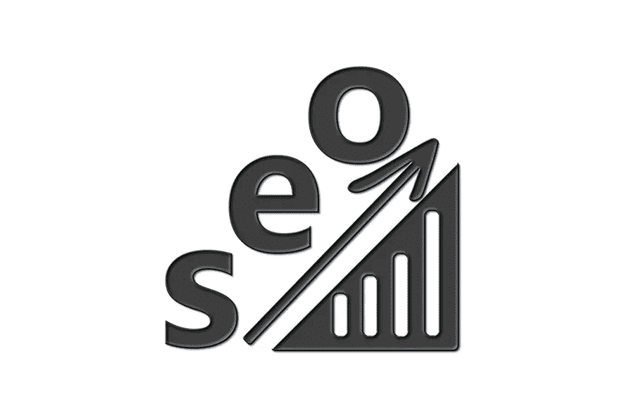

# 2021 年 7 个页面搜索引擎优化必需品

> 原文：<https://medium.com/visualmodo/7-on-page-seo-necessities-in-2021-f66af099b1ee?source=collection_archive---------0----------------------->

潜在的 SEO 陷阱有很多。一个网站不仅仅是吸引人的设计，它的反向链接配置文件和关键字优化的内容。每当一个人浏览你的网站时，页面上会发生很多事情，这可能会影响或破坏他们的体验，从而影响你的排名。如果你想确保你的网站在竞争激烈的数字营销世界中有一个战斗的机会，请密切关注今年以下 7 个页面搜索引擎优化必需品。

# 修复页面搜索引擎优化的必要性

关键词自相残杀经常被误解为仅仅是一个关键词的问题，但它也关系到一个页面的意图。如果你有相同的目的，你的关键字和主机多个页面，你会发现很难提高竞争关键字的搜索结果，因为搜索引擎将努力确定显示多个页面中的哪一个。例如，如果你试图为“数字营销机构布里斯班”这样的东西排名，但你的网站上有多个页面带有这个长尾关键词，这两个页面正在互相蚕食。

另一个消除关键词自相残杀的原因是，它不仅会使特定关键词的排名变得更加困难。这也可能会损害其他关键字在任何网页上的排名，降低网页的整体排名。

# 图像优化

Google 并不只是抓取、索引和评估你的博客内容来进行 SEO 优化。它也密切关注你的图片如何进行 SEO。这意味着浏览你的网站并确保图片有正确的相关名称是很重要的。利用描述性文件命名约定。尺寸和质量也是如此。尤其是它们的加载速度和在设备间的显示效果。你应该在网站的每一页都有一些主要的图片，这些图片可以有效地利用 alt 标签向访问者和搜索引擎描述图片。

# 关注页面搜索引擎优化的可读性

可读性是一个有点难以确定的指标，搜索引擎爬虫使用几种算法来量化一篇文章的可读性，但是你的可读性分数在很大程度上影响你的整体 SEO 分数。内容不仅仅是战略性的关键词优化，谷歌越来越多地根据“可读性”来判断你的内容。

无论你是想创建一个有全新内容的全新网站，还是想审核当前网站内容的可读性，都有免费的在线可读性测试供你测试文章。Yoast SEO，这是 WordPress 中最广泛的插件之一。在您创建新内容时为您提供可读性分数。

# 不要忽视你的网站地图

网站地图只是你网站的 URL 的集合，由你的主要内容组成。所以，这是为了确保搜索引擎正在抓取你想在索引上的所有东西。此外，它帮助搜索引擎不仅决定哪些页面需要审查，而且建立每个页面的规范版本。

谷歌将支持多种不同的网站地图格式，但 XML 是最常用的。你通常可以在 www.domain.com/sitemap.xml.找到你的网站地图。如果你正在使用 WordPress 网站，有插件可以帮助你，但是有很多网站地图生成器工具可以让这个过程变得简单。

# 摆脱多重 H1 标签页面搜索引擎优化的必要性

您的 H1 标签是页面的主标题，也是页面上最重要的标题，每页应该只有一个。如果你进行了一次网站审计，报告显示有超过一个 H1 标签的页面，去掉多余的部分。

网页有多个 H1 标签的主要原因是网站标志也是由一个。此外，确保您的 H1 标签包含页面的主要关键字目标。所以，请将它们保持在推荐的 60 个字符以内。