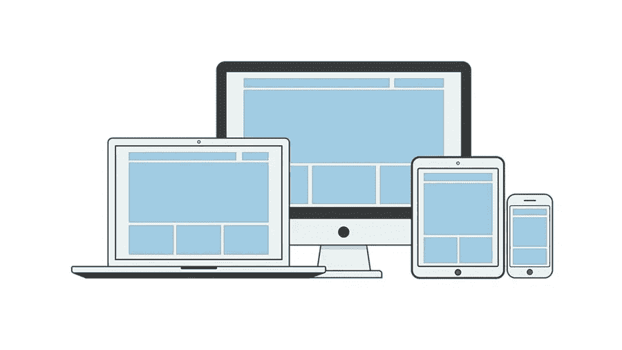

# 你应该使用高级 WordPress 主题的 7 个理由

> 原文：<https://medium.com/visualmodo/7-reasons-why-you-should-use-a-premium-wordpress-theme-9574c93a47?source=collection_archive---------1----------------------->

潜在客户经常问我，为什么他们应该选择高级 WordPress 主题而不是免费主题。以下是我告诉他们的 7 件事。

WordPress 是为每个人服务的，这一点从它所支持的网站数量就可以反映出来。人们知道他们需要 WordPress 来创建他们的网站。然而，他们可能没有完全意识到一个事实，即一个优质的 WordPress 主题可以帮助他们的网站处理大量的格式。你可能想知道，当你有机会获得免费的主题时，你究竟为什么要为它付费。这是一个合理的问题，但是事实上有很多原因可以解释为什么你应该为你的 WordPress 站点选择一个高级主题。我们将在本文中探究这些原因。

# 使用高级 WordPress 主题的 7 大理由

# 1.高级 WordPress 主题安全性

有这么多免费的主题，这似乎好得难以置信。在很大程度上，的确如此。事实上，大量可用的免费主题都打包了恶意代码。你可以通过从 WordPress 免费主题目录下载主题来避免安全问题。不幸的是，搜索那里的免费选项经常会给你带来新的问题。此外，大多数主题都是使用框架代码制作的。像每个软件一样，为了安全，它需要定期更新，高级主题总是更新它，不像免费的。这可能会使您的网站暴露在黑客和攻击之下。

# 2.高级和专业设计

人们喜欢访问和关注看起来专业的网站。他们不喜欢在非专业设计或维护的网站上阅读博客；不管这些信息和数据有多有用。此外，还强制要求改善外观，并在上面添加一些专业人才。高级 WordPress 主题总是帮助你看起来更专业。一旦你应用了这些主题，你的 WordPress 站点的整体外观将会立即自动改变。他们可以帮助你创建一个权威网站，人们可以信任和关注相关和准确的信息。

一个优质的 WordPress 主题会给人留下难忘的印象:没有人会和你的网站有相同的设计。

# 3.支持团队

这是我用来看任何主题的第一件事。当我开始使用 WordPress 时，我非常害怕编码和修改。主题支持是我一直缺少的东西，我不得不寻找其他的观点和答案。虽然好的一面是我不得不谷歌并学习大部分的东西，但在这个过程中，我犯了一些错误，我不希望你犯同样的错误。

每个主题都是独特设计的，它们的代码都是相同的，根据主题的不同而不同。有了高级主题，你会得到所有的支持，因为它的论坛，你会看到更多的回复。额外收获:大多数问题已经有人解决了，所以只需使用论坛的搜索功能，你就能找到答案。

# 4.SEO —搜索引擎优化

实际上，你不能忽视 SEO 或搜索引擎优化的重要性。WordPress 的免费主题对 SEO 并不友好。你必须安装一些额外的插件以及其他元素，使网站为搜索引擎优化工程和机器人抓取过程做好准备。然而，当你有 WordPress 的高级主题时，这对你来说不是问题。

这些主题已经有了你需要在你的网站上做 SEO 改进的插件和特性。这为你节省了大量的时间和精力。你可以在 SERPs 上优化你的网站或博客，每天获得大量的流量。

# 5.高级 WordPress 主题兼容性

高级 WordPress 主题的另一个优点是他们的开发者用更多的插件来测试主题。首先，因为他们的客户有需求。其次，因为它有助于可定制性和选项访问，最后，因为他们的客户有这样的要求。最后，提供每个人都喜欢看到的扩展兼容性。

# 6.更新

一些更新的主要问题是它会破坏一些主题和插件。这也是我在做任何更新之前至少等待 2-3 周的原因，除非它不是一个关键的更新。高级主题别无选择，只能更新他们的主题以匹配最新的 WordPress 版本和插件版本。这是你在选择主题之前必须要看的。它有助于您的网站安全和改进。

# 7.定制选项

作为网站或博客的所有者，您可能希望在同一网站上拥有一些定制功能，使其与众不同。因此，高级主题可以让你按照自己的意愿定制网站。这意味着你可以有一个更独特和专业的外观的帮助下，同样的。另一方面，当你使用 WordPress 的免费主题时，你可能需要一些额外的编码来使它们对你的业务有效。[高级主题](https://creativemarket.com/visualmodo)为您提供了大量选项，根据您的需求增强您博客的功能。

# 最后的想法

一个主题不能被认为是“优质”的，只要有人给它贴上价格标签。所以可以肯定的是，一些高级主题可能和免费选项一样糟糕。总之，这肯定是事实，这就是为什么你应该只选择最好的主题商店。