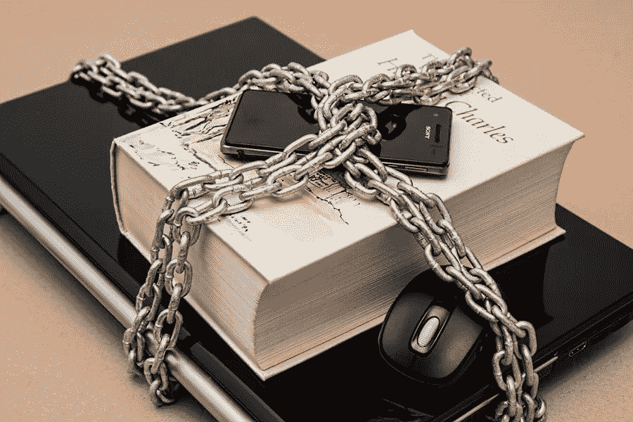

# 保护你的 WordPress 网站的 7 个技巧

> 原文：<https://medium.com/visualmodo/7-tips-to-secure-your-wordpress-web-site-96ff40544163?source=collection_archive---------1----------------------->

很容易认为 WordPress 是全球市场上最受欢迎的内容管理系统。无论你是网页设计专家还是正在寻找第一个 CMS 的博客作者，WordPress 都可以为你提供大量的定制和成长的可能性。然而，和任何数字技术一样，WordPress 容易受到恶意软件、网络安全风险和暴力攻击。让我们来看看几个提示和指南，它们可以帮助你保护你现在或将来的 WordPress 网站免受潜在的安全风险和破坏。

# 保护你的 WordPress 网站的好处

虽然原创内容、成熟的视觉设计和客户服务起着重要的作用，但是你的 WordPress 平台的安全性也同样重要。你的 WordPress 站点的安全性很重要，原因有几个，包括但不限于:

*   为你的 B2C/B2B 利益相关者提供安全感、安全感和信任感
*   吸引合作者、有影响力的人和社交机会
*   更好地控制您的网站，更轻松地管理数据
*   当前安全威胁和网络安全风险的最新知识
*   WordPress 站点安全性的时间和资源的高投资回报率

# 使用高级主机

确保你的 WordPress 网站安全的最好方法之一是从一开始就选择[高级主机](https://visualmodo.com/5-important-things-choosing-managed-wordpress-hosting/)。避免免费托管解决方案，如 WordPress 自己的免费博客域名，以保持对网站的完全控制。

高级托管也带来了许多定制选项，如高级插件、小部件、主题兼容性和其他生活质量的增加。由于高级托管服务提供的保护，它还将使第三方软件或黑客更难访问您的后端文件存储库。

# 使登录 URL 唯一

一旦 WordPress 站点被生成，文件和文件名的列表可以在它的文件夹中找到。这些文件指的是不同的活动、登录细节和命令，通常用于全新的 WordPress 安装。

为了防止外界访问你的网站，你应该重新命名你默认的 WordPress 文件名。你可以参考像[信任我的论文](https://www.trustmypaper.com/)这样的平台，来写一个适合你现有数据基础设施的命名系统。确保您的文件名是唯一的，并且只与您信任的人共享登录 URL 的详细信息。

# 选择优质主题

WordPress 主题根据他们的价格点，打包了额外的功能和定制选项。你的 WordPress 站点的主题通常是外部利益相关者识别你的公司和品牌的因素。

为了给人留下良好而持久的印象，你应该为你的 WordPress 站点使用[优质主题](https://visualmodo.com/wordpress-themes/)，尤其是在安全性方面。一个主题制作和策划得越好，你的网站就越能抵御潜在的恶意软件或第三方入侵。

# 控制数据

为了在内容发布和网站优化方面保持可控，你需要[监控你的 WordPress 网站数据的变化](https://visualmodo.com/use-wp-db-manager-to-implement-wordpress-database-management/)。你应该经常检查你的文件、发布的内容、评论、订阅提示和其他数据。

这将使你不断了解谁来你的网站，以什么身份，他们对你的业务、内容和/或产品有什么兴趣。任何来自第三方或让您不确定是谁做出的更改都应该立即解决。不要听天由命，将你的后端文件置于监视和控制之下。

# 启用两步授权

两步认证方法在现代互联网领域很常见。根据您允许用户创建帐户、登录、订购产品或发布内容的容量，您应该考虑该选项。

在前端用户端和后端管理登录尝试上启用两步授权。这将确保您在合法用户和恶意软件进行任何访问尝试时得到通知。

# 更新 WordPress &插件

WordPress 的开发在新功能、更新、漏洞修复和恶意软件防护方面进展神速。确保你的网站总是在当前的 WordPress 版本上保持最新，并且你的插件支持你的 CMS 版本以确保所有的安全。

不兼容的插件没有意识到最新的安全漏洞和恶意软件可能会导致你的网站出现大量的安全问题。检查你的 CMS 和任何插件，你可能已经采取了新的版本和补丁。

# 经常备份

不管出于什么原因，你的 WordPress 网站可能会在任何时候离线。无论是因为恶意软件还是停电，您都希望尽快让您的网站恢复在线并可供公众访问。

为了做到这一点，你应该总是保持你的 WordPress 站点的离线或离线备份，以备不可预见的事件。未能备份您的网站并面临恶意软件问题或其他问题可能会对您公司的在线形象造成灾难性的影响。花点时间经常备份你的网站，并准备一份副本以防万一。

# 概括起来

WordPress 网站安全是关于[保持对你后端文件的控制](https://visualmodo.com/online-security-essential/),以及人们如何以何种身份与你的网站互动。不要安装不必要的插件或过于奢侈的主题来维持你网站的加载时间和搜索排名。最重要的是，不要落入社会工程陷阱，跟踪评论链接、恶意邮件和其他旨在危及你的 WordPress 网站安全的可疑内容。

为了做到这一点，你应该总是保持你的 WordPress 站点的离线或离线备份，以备不可预见的事件。未能备份您的网站并面临恶意软件问题或其他问题可能会对您公司的在线形象造成灾难性的影响。花点时间经常备份你的网站，并准备一份副本以防万一。

# 概括起来

WordPress 网站安全是关于[保持对你后端文件的控制](https://visualmodo.com/online-security-essential/)，以及人们如何和你的网站互动，以何种身份。不要安装不必要的插件或过于奢侈的主题来维持你网站的加载时间和搜索排名。最重要的是，不要落入社会工程陷阱，跟踪评论链接、恶意邮件和其他旨在危及你的 WordPress 网站安全的可疑内容。