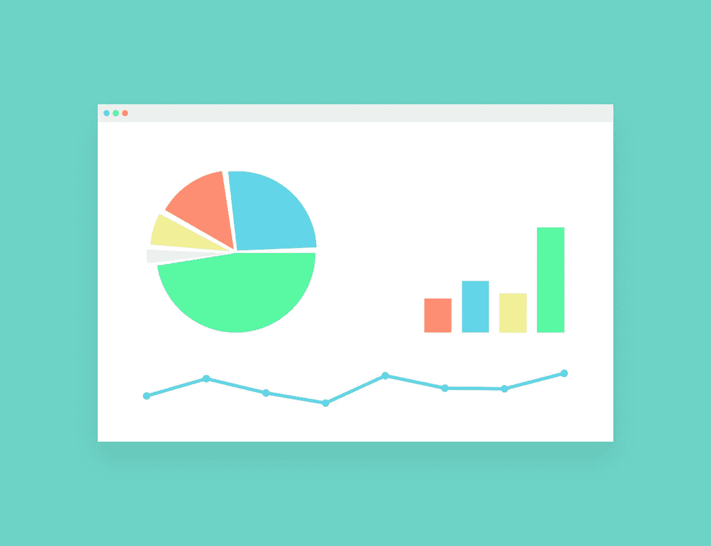

# 视觉效果影响投资回报率的 7 种方式，可能你都没有注意到

> 原文：<https://medium.com/visualmodo/7-ways-visuals-impact-your-roi-that-might-not-come-to-your-notice-c94fa3e17450?source=collection_archive---------0----------------------->

图片和颜色比简单的旧词更有吸引力。我们都见证了小孩子是如何更容易被彩色物体吸引的。你一定也注意到了一些吸引你视觉思维的东西会留下持久的印象。因此，在这个快节奏的社会中，企业正专注于尽快吸引消费者的注意力。如果你想知道一堆图片和统计数据如何将访客转化为客户，并增加你的投资回报率(ROI)，下面的内容将会让你一目了然。

视觉效果是对更广泛的观众产生即时影响的好方法。他们不仅有效，而且高效。信息一目了然。由于数据通常以简单的格式描述，因此易于理解，并且可以克服语言障碍。最重要的是，这一代人热衷于享乐。视觉材料相对来说更美观，因此带来更多的乐趣。

40%的客户对视觉信息的反应更好。企业现在在营销活动中使用更多的视觉内容。将文本信息转换成视觉呈现有助于产生更多的流量。图表、图形、剪贴画、电子图像、视频等元素。用来传达思想和信息。

# 视觉效果影响投资回报率的方式

# 1 —抓住人们的注意力

视觉内容的处理速度比文本快。你的商标通常是顾客接触到的第一个你的业务。一个专业的标志设计可以吸引人们到你的网站，并告知他们你的事业。此外，这也是给你的页面增加视觉趣味的一个简单方法。

更重要的是，即使没有阅读内容，访问者也会根据网站的设计、配色方案和布局形成对网站的看法。一个吸引人且干净的网站可以极大地改善客户的在线体验。顾客的所见所感与你的品牌直接相关。易于使用的设计有助于影响用户的决策过程，并增加销售线索转化为销售的可能性。

# 2 —与客户沟通

图片和图画是一种交流方式。这是一种与客户互动、建立品牌意识并影响其决策过程的方式。[视觉内容](https://visualmodo.com/wordpress-themes/)传达并激发一个人的情感。一旦你能影响一个人，球就开始滚动了。更多的浏览等同于更多的阅读、更多的点击、更多的分享和更多的链接。是的，这些都是促进企业发展的因素。

记住，参与越多，病毒传播就越强。越多的人浏览你的帖子，了解你的品牌，你的投资回报率就越高。

# 3 —一种快速简单的信息消费方式

阅读文本时，大脑需要处理字母，将它们连接起来形成单词，然后是句子，最后是段落。另一方面，大脑处理一幅图像只需要 13 毫秒。信息图是提供信息的一种简单、直接的方式。因此，在以饼状图、线形图、统计数据、彩色图标、醒目字体等形式向客户传递数据时，使用视觉优先。请记住，用户可以更好地回忆起他们所看到的，而不是他们所听到或读到的。人们只能记住他们读到的 20%和听到的 10%。然而，毫不奇怪，他们可以保留 80%的所见所闻。

# 4 —作为广告的视觉效果

显示在脸书、推特和 LinkedIn 等网站上的文章或帖子上方的图片可以充当广告。他们可以吸引观众点击和消费你分享的内容。这也是让人们清楚了解内容的一种简单方式。当一个人知道该期待什么时，它不仅省时省力，还能吸引读者的注意力。同样，视觉也可以用来[创造好奇心](https://awards.visualmodo.com/)。最初，它们有助于吸引和吸引浏览者，随着长期互动的继续，满意的访问者会转化为忠诚的客户。

# 5 —客户会记住你的品牌

人们倾向于将颜色和图像与权力和成功联系在一起。研究显示了大脑是如何将颜色与经历联系起来的。红色和黄色引发了“记住这个”的反应，而绿色创造了一种平静的效果，蓝色与成功联系在一起。令人印象深刻的视觉效果或突出的标志是人们容易记住的。如果有人忘记了你是谁，那就跟你不存在一样。在第一次互动中对公司有满意和难忘体验的客户将被鼓励再次购买或服务，从而提高投资回报率。

# 6 —号召客户采取行动

视觉内容是与观众和投资回报建立情感联系的好方法。当一家公司旨在吸引人们并与他们互动时，包含 CTA(行动号召)按钮以增加进一步互动的前景是至关重要的。无论是在网页上还是在博客上，CTA 的目的都是在用户注意力减弱之前，激励用户执行某个操作，如点击链接、发表评论或订阅。

同样，CTA 的设计、颜色和位置必须抓住用户的注意力，以继续他们成为客户的旅程。改善客户体验的要素将对业务产生积极影响。而且他们更有可能与他人分享这些。

# 7 —创造更多流量和销售线索

当大脑必须处理太多信息时，它会感到厌倦，失去兴趣。向顾客展示，而不是告诉他们事情，以一种更吸引人的方式来表达观点。它澄清了情况，同时简化了将信息传递到大脑的过程。事实上，大块的文本或者太小的文本是导致人们远离网站的一些原因。另一方面，好的视觉内容能够增加流量。利用值得分享的视觉效果有助于建立可信度，从而鼓励有良好基础的观众群。

如果你的网站吸引人，娱乐人，吸引人，更多的人会想看你的品牌并与之互动。随着订阅者和关注者数量的增加，销售额肯定会随之增加。

视觉效果对在线营销活动和投资回报率的影响是不可否认的。作为一名企业家，你不应该忽视在营销活动中实施它们的好处。应用正确的视觉效果是增加流量、扩大在线可见性和提高 B2B 业务转化率的伟大战略。

# 作者简介

> 安德烈·贝尔是自愿选择写博客的。她喜欢探索她周围的世界。她喜欢通过博客分享她的发现、经历和表达自己。
> 
> 在推特上找到她:@IM_AndreaBell