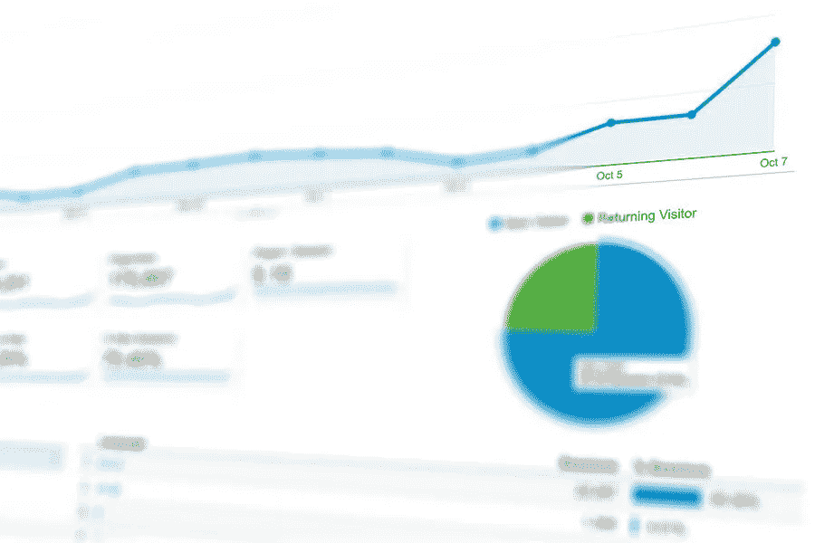

# 添加谷歌分析有益于你的 WordPress 网站的 8 个原因

> 原文：<https://medium.com/visualmodo/8-reasons-why-adding-google-analytics-benefits-your-wordpress-website-9316bac14754?source=collection_archive---------0----------------------->

了解 Google Analytics 如何通过其易于操作的各种分析工具来帮助您增加 web 流量。在这篇文章中，你会看到为什么在你的 WordPress 网站上添加 Google Analytics 好处的 8 个原因。

如果你有一个专门为商业而建的网站，你可能会对收集访问者统计数据来分析商业进展感兴趣。有几个网络分析工具可以帮助你做到这一点，毫无疑问，其中最好的是谷歌分析，尤其是如果你的网站是建立在 WordPress 上。

谷歌分析，免费和用户友好的界面，将为您提供详细而紧凑的报告。这将包括消费者行为、小工具的功能、游客体验以及大量可以帮助你做出明智决策的数据点。它将跟踪访问您网站的客户，并收集与您的业务相关的信息。反过来，这将帮助你根据期望的人口统计来策划你的业务。

以下是为什么在你的网站中使用谷歌分析会帮助你更好地了解访问者和他们的好恶的一些原因。

# 1)可以轻松定制报告

使用 Google Analytics，您可以为您的报告选择一系列模板。不仅如此，您还可以创建完全根据您的偏好和需求定制的报告。你可以定制对你最重要的指标，它们的尺寸会在网站上。

当考虑所有人时，仍然会有一些不太懂技术的人，他们希望详细了解如何将 Google Analytics 添加到 WordPress 中。Templatic 以最简单的方式分解了指令。

# 2)与其他工具混合使用添加 Google Analytics 的原因

数字化带来了一系列挑战。随着您的企业在各种数字营销流程中使用不同的工具，从宏观层面进行跟踪会变得很困难。这就是谷歌分析的亮点——它允许你将其他平台和工具集成到你的仪表盘上，比如谷歌 Adwords。因此，您可以从整体上宏观地了解您在不同渠道所做的努力。

有了谷歌分析，你将拥有一个便携式指标仪表板——你可以在你的桌面上跟踪手机或平板电脑上的数据。你可以将谷歌分析功能与 Adwords 等其他谷歌服务结合起来，帮助你开展 Adwords 活动。有许多免费插件你可以添加到你的 WordPress 仪表盘上，连接到谷歌服务。

# 3)了解不感兴趣的访问者的潜在原因

为了确定仅访问一个页面就退出网站的访问者比例，跟踪跳出率非常重要。这可能会引导你找出访客参与度低的可能原因，以及如何改善这种情况。

高跳出率可能表明你的网站登陆页没有足够的利润来进一步探索。类似地，它也可能表示一个复杂的用户界面，访问者在探索它时会有困难。谷歌分析可以为你提供跳出率的详细报告，这将有助于你提高网站的参与度。

# 4)获取详细的受众人口统计数据

谷歌分析中的受众部分可以给你一份关于访问者年龄、性别、兴趣和所用设备的全面报告。此外，它还显示了访问者访问您的网站的渠道。您可以使用这些数据根据访问者的偏好提供服务和内容。那些可能引起特定人群兴趣的。

# 5)获取转化率统计数据:添加谷歌分析的原因

你可能已经知道，网站转换意味着你的网站访问者执行了你想要的动作。无论是购买产品还是下载白皮书，转化率对你的业务增长都是不可否认的重要因素。

谷歌分析有一个很棒的功能，可以让你测量和监控你的转化率指标。比如卖出了多少。这可以帮助你调整你的营销策略，甚至在必要时调整你的登陆页面的外观。

# 6)帮助您生成内容

任何网站要想获得人气，内容是关键。完美的内容不仅会增加潜在的流量，还会提高在搜索引擎中的排名。谷歌分析的目标部分将跟踪最常访问的博客。您可以对其进行修改以获得更好的交通体验。

你会收到一份你的网站之间的综合比较。因此，行业平均水平可以让你更清楚地了解自己的进步。您可以将多项任务分配给自定义仪表板，作为您与访问者交流的媒介。例如，您可以调整指标，为每个访问者提供新闻简报订阅或购买服务。

# 7)了解你什么时候有最多的访客

你的网站什么时候流量最大？知道你的网站何时(日期和时间)有更多的访问者，可以让你相应地计划你的内容日历，并安排文章在什么时候通过吸引你的访问者到你想要的行动号召(CTA)来产生最大的影响。

# 8)它是免费的

与其他付费软件不同，谷歌分析是免费的。这意味着你将会收到所有的重要数据。这将有助于优化您的网站，而不必花任何钱。其他网络分析工具通常会有一个有限的试用期。之后会要求你支付月费或年费。

付费分析和谷歌分析一样好。然而，专家们更喜欢谷歌分析，因为它提供了更广泛的分析方法。此外，它是免费的。

# 添加谷歌分析最终想法的原因

如果你还没有在你的 WordPress 网站上使用网络分析工具。选择谷歌分析可以是一个很好的开始。您将观察流量指标并选择更好的策略。提高内容质量和用户友好性以及设备功能。想象一个朋友在关注你，给你有用的建议。所以，改善你的业务，不要求任何回报。