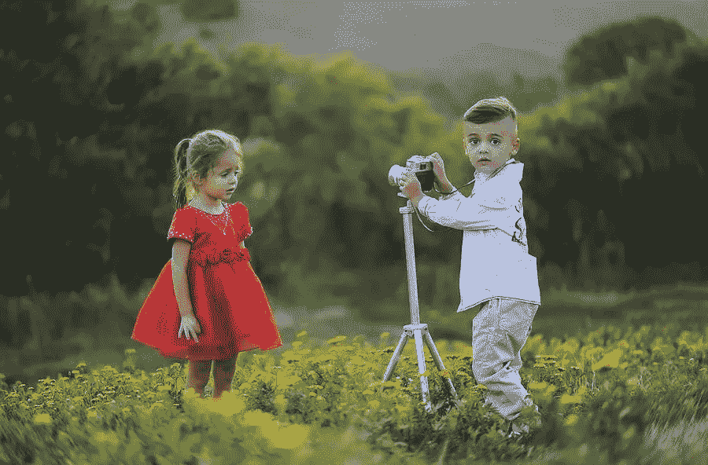

# 许多摄影师无法在网上销售服务的 8 个原因

> 原文：<https://medium.com/visualmodo/8-reasons-why-so-many-photographers-fail-to-sell-their-services-online-399a3ac4fc0b?source=collection_archive---------0----------------------->

摄影是一项非常有价值的技能，需求量很大。企业需要他们团队行动时的照片来传达品牌形象，情侣们想要让他们的大日子永垂不朽，公司需要他们产品的照片。然而，如此多的摄影师，即使是有才华的，也无法在网上找到固定的工作。在这篇文章中，我们将看到为什么如此多的摄影师无法在网上销售他们的服务的 8 个原因。

大多数时候，这一切都归结于他们不知道如何营销他们的服务。通过修正这些错误，他们将有更好的机会建立客户群并获得持续增长。让我们来看看摄影师无法在网上销售服务的一些最常见的原因。

# 摄影师无法在线销售服务的原因

# 他们不知道如何建立投资组合

这可能是你作为一个新手摄影师可能犯的最严重的错误之一。在一个极端，有些人根本不知道投资组合应该是什么样子，而在另一个极端，有些人则完全沉迷于此。

摄影作品集应该既简单，又引人注目和专业。这也是不需要海量设计技能的东西。事实上，你有像 Format 这样的服务，可以让你在很少甚至没有网页设计知识的情况下，立刻创建一个很棒的作品集。您可以从他们的多个主题中选择一个，选择字体，然后放下文件，从而建立一个格式摄影作品集。一旦一切都完成了，你将有一个美丽的投资组合网站，让你开始吸引客户。

# 他们廉价出售自己

刚开始时，打折提供服务可能是一个不错的策略，但它不能成为你的唯一策略。在一天结束的时候，如果你决定不断尝试以低价出售你的服务，你所做的只是吸引廉价的客户。不仅如此，买便宜货的人也不是最忠诚的，所以如果你想建立一个稳固的长期基础，这不是最好的策略。

不仅如此，提供太便宜的服务可能会吓跑一些客户。有些人会自动认为提供便宜价格的摄影师会提供同样便宜的服务，而这不是你想要的。相反，看看你的竞争对手为他们的服务定价多少，并努力建立声誉。

# 他们认为分散名片是一个可行的策略

你上一次在商店的柜台上看到摄影师的名片并想雇佣他们是什么时候？答案可能是永远不会。人们根本不是这样找到他们的摄影师的。

他们这样做要么是通过口口相传，通过进行搜索和查看评论，要么是因为他们能够看到摄影师的作品，并决定与他们合作。在其他一些情况下，他们可能会遇到一位摄影师，他提供了一些专业知识，并希望更多地了解他们。这些实际上都是有效的技巧，也是你应该花大部分精力和营销费用的地方。因此，摄影师无法在网上销售他们的服务。

# 他们认为营销实际上并不重要

的确，很多工作将来自客户将你推荐给其他人，但如果你不能在第一时间找到客户，你怎么能让客户推荐给你呢？此外，不要指望所有的公益和打折工作会给你带来大量的人。相反，你应该有一个明确的营销计划，并不断努力，这样你就可以开始建立一个基础。只有这样，你才能获得足够的口碑宣传。

# 他们试图只出售他们的摄影作品

这又是一个大错。你不要只卖摄影，还要卖你的知识。与其简单地展示你作为摄影师的才华，你应该试着成为你的目标群体的资源。例如，你可以给他们一些如何准备婚纱照的建议，或者给那些试图建立品牌形象的公司一些建议。通过展示你是一个权威，这可能会激起一些读者的好奇心，促使他们询问你的服务。

# 摄影师无法在网上销售:他们不发送宣传材料

许多摄影师也不擅长制作和发送宣传材料。如果你是一个商业或零售摄影师，你需要有一些你的材料的印刷形式，你可以物理船舶的前景。这可能是像迷你杂志或小册子一样的东西，取决于你的定位。

互联网是摄影师的天赐之物，但这并不是一切。拥有一些这样的作品将会让潜在的客户与你的作品建立更个人化的联系，并看到它在物理形态上的样子。零售摄影师可以使用明信片展示他们的一些作品。这些将比名片更有力量，会让人们近距离真正看到你的作品。

# 他们把所有的努力都集中在网上

是的，我们知道社交媒体是寻找客户和展示你能力的好方法。然而，Instagram 上到处都是像你一样的摄影师，他们正试图做你正在做的事情。你最终会被所有的噪音淹没，成为另一张照片。

如果你真的想在这个行业成功。你必须准备好出去跑腿。你必须让你自己在你的社区中为人所知。所以，走出去，看看你是否能帮助当地企业，或者与你所在地区的组织合作。在一天结束的时候，人们喜欢和他们认识和爱的人一起工作。如果你大部分时间都呆在家里的电脑屏幕前，你是不会做到这一点的。

# 摄影师无法在网上销售:他们没有正确使用社交媒体

然而，所有这些并不意味着社交媒体不起作用。问题是太多的人不知道如何正确使用它。

摄影师在使用社交媒体时犯的一个最大的错误就是发了很多帖子，但是没有吸引力。其他人与错误的人交往，浪费他们的时间。许多企业主犯的另一个主要错误是过度扩张自己。同时在太多的网络上花费他们的时间和精力。

实际上，你应该只花时间在少数平台上。不是大多数人想的那样。例如，出于某种原因，刚起步的摄影师倾向于把很多注意力放在脸书。但是人们不会登录脸书寻找摄影师；相反，他们会关注 Pinterest 或 LinkedIn 等平台。所以，不要选择显而易见的，如果你要用脸书。这样做主要是为了连接。通过积极参与客户社区，与你想合作的客户保持联系。

这些是摄影师无法成名的一些最常见的原因。如果你设法避免这些错误。你将增加建立稳固客户基础的机会，并获得稳定的合同。