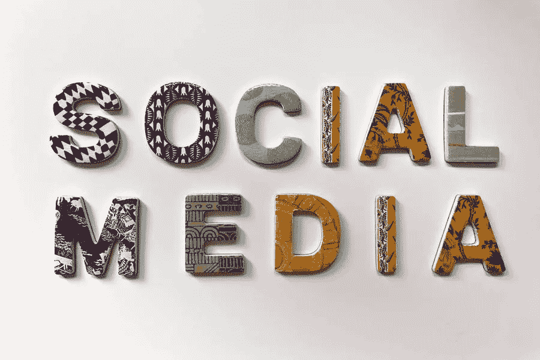

# 8 种社交媒体策略，为你的网站吸引更多流量

> 原文：<https://medium.com/visualmodo/8-social-media-tactics-to-attract-more-traffic-to-your-site-cb4058965641?source=collection_archive---------0----------------------->

你可能已经知道，社交媒体是你网站的主要流量来源。但是，让人们通过社交媒体访问你的网站是一个挑战，尤其是如果你的预算紧张的话。在这篇文章中，我们将分享 8 个社交媒体策略来吸引更多的流量到你的网站。

你在社交媒体上的地位越稳固，你的网站就越能获得稳定的流量。因此，如果你正在寻找一些可以帮助你增加网站流量的出色的社交媒体策略，看看我们列出的一些最有用的技巧，它们可以帮助你将访问者转化为潜在客户。

# 研究你的竞争对手

社交媒体是一个充满挑战的世界，所以在你开始发帖之前，尝试深入了解你的竞争对手是值得的。

你可以利用社交媒体分析工具来了解竞争对手的情况。试着找出他们最吸引人的社交渠道是什么，他们一天中什么时候最活跃，他们发布什么类型的内容，他们多久回复一次评论，等等。

进行竞争分析可以帮助你收集竞争对手帖子的关键绩效指标，并让你知道如何加强自己的社交媒体存在。

# 保持一致

一致性是建立忠实追随者的关键。你在社交媒体上发布的内容越一致，就越有可能被人看到。

使用社交媒体日历可以帮助你创建一个发布时间表，并清楚地了解你的发布策略和习惯。

此外，你应该确保你大致知道在每个社交平台上发布多少内容以及在什么时间发布。研究表明，这是最受欢迎的社交渠道上的最佳帖子数量:

*   脸书:一天一个帖子
*   Instagram:每天 1 到 2 个帖子
*   Pinterest:每天大约 11 个图钉
*   推特:一天 15 条推特
*   LinkedIn:一天一个帖子

# 关注视觉内容:吸引流量的社交媒体策略

说到社交媒体，第一印象至关重要。Buzzsumo 称，有图片的社交帖子比没有图片的帖子获得的参与度高 2.3 倍。

这就是为什么你需要花时间来创造视觉内容，充分展示你的品牌和产品。使用高质量的照片、精心设计的布局和鲜艳的颜色来创建讲述故事和传递要点信息的视觉内容。确保你的视觉效果是原创和独特的，它们不会被忽视。

# 永远不要停止参与

社交媒体管理的一个关键方面是让你的受众参与进来。统计数据显示，只有 11%的人在社交媒体上收到品牌的回复

三分之一的人会去参加你的比赛，如果他们觉得被忽视了。

当然，这并不意味着你必须全天候可用，但你必须努力提供良好的客户体验。通常，这仅仅意味着回应客户的问题和顾虑。

# 致力于你的搜索引擎优化:吸引流量的社交媒体策略

如果你想增加你的社交媒体流量，为 SEO 优化你的社交内容会有很大的好处。研究表明，平均而言，超过 70%的搜索会导致页面点击。当第二页和第三页的点击率不到 6%时，这个数字显著下降！

将 SEO 最佳实践整合到您的社交内容中，可以帮助您提高知名度，增加流量，加强品牌的权威性，并与您的受众建立联系。

SEO 优化(即更好的排名)也可以帮助你增加买家说服力。研究发现，近 90%打算购买产品的人在做出最终购买决定之前会转向搜索结果。

# 举办竞赛和投票

竞赛、赠品和投票是吸引社交媒体受众的有趣方式。除了让你的观众喜欢、分享、关注和谈论你，这些活动也让他们了解你的网站、产品和品牌。

Instagram 是当今联系你的观众的最佳平台之一。你可以上线，在你的故事中创建投票，使用标签。最重要的是，你可以创建链接到你的网站的链接。你也可以使用 Twitter 问答或 Twitter 民意调查与你的观众互动，了解他们的意见。

# 与有影响力的人合作:吸引流量的社交媒体策略

公司可以利用其影响力通过付费广告或其他营销策略来转化潜在消费者的日子已经一去不复返了。社交媒体改变了这一点，影响者营销的激增就是最好的证明。

今天，人们不再依靠品牌来告知他们需要或想要什么。相反，他们会向那些在某个特定领域或行业拥有专业知识和影响力的人寻求帮助。

原因很简单:当被直接提及时，人们的反应会更好。而不是由不知名的商家提供广告。因此，如果你想吸引更多的访问者，提高你的转化率，你需要利用影响者营销。

# 加入社区团体

社交媒体群是接近对你的企业感兴趣的志趣相投的群体的好方法，然后将这些群体转化为你网站的稳定流量。

有大量的社区团体迎合各种不同的需求，其中许多都有数千名成员。在群组部分搜索与你所在行业相关的关键词，你会发现许多你可以加入的伟大团体。

一旦你成为了一个成员，你就可以开始和其他成员交流了。然而，在你开始推广你的品牌之前，不要阅读这个团体的规则。即使你不能直接推广你的链接，你也可以宣传你的业务。通过参与对话和在评论区提供建议。

当你建立一个社区时，你会创造出忠实的追随者，他们会一次又一次地回到你的网站。

# 最后的想法

当你在每个网络上建立关系和参与时，社交媒体流量就会增加。社交媒体营销策略需要时间来生效，但如果你足够耐心，从长远来看，你肯定会受益。

遵循这 8 条建议将帮助你让人们访问你的社交资料，并最终访问你的网站。