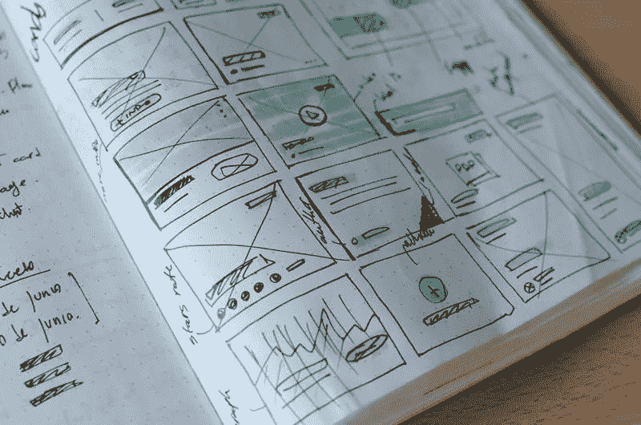

# 创建高转化率登录页面的 8 个技巧

> 原文：<https://medium.com/visualmodo/8-tips-on-creating-a-high-converting-landing-page-ca55f3e35698?source=collection_archive---------0----------------------->

如果你花了大量的时间和金钱试图增加你的网站或博客页面的流量，而没有将访问者转化为顾客，你就浪费了你的时间和金钱。数字营销人员使用转换登录页面有很多目的:建立电子邮件订户名单、销售产品或服务、敦促人们注册网上研讨会、提供折扣和许多其他目的。

尽管人们通常对登陆页面和其他网站页面之间的区别感到困惑，但重要的是要注意，登陆页面可以是任何网页、独立页面或您的主页，只要它服务于转换的目的。

然而，创建一个真正转换的登录页面不仅仅是将一些图像、任何背景颜色和文本以及一个行动按钮组合在一起。因此，你必须创建一个尽可能高转化率的登陆页面，并且以行动为导向，不要让访问者觉得他们被伏击了。以下提示将帮助你实现这一壮举。

# 创建高转化率登录页面

# 考虑你的内容选项

如果你想创建一个高转化率的登陆页面，你必须考虑你是使用纯文本的登陆页面、文本/图片登陆页面还是视频登陆页面来转化你的用户。许多数字营销人员使用纯文本登录页面来改善页面加载时间，这可能会影响他们的谷歌排名。此外，用户或访问者不必等待任何东西(视频或图像)加载，文本会很快出现在[的登陆页面](https://visualmodo.com/blog/)。

有时，如果文本和图像结合在一起，图像会吸引我们大脑的视觉部分，并增加用户体验和转化率。一个好的视频登陆页面也可以帮助激励人们在你的登陆页面停留更长时间，并让你要传递的信息深入他们的头脑。这些选项中的每一个都有不同的好处，这就是为什么您必须选择哪个登录页面内容将更有利于您的营销目标。

# 进行市场调查

要创建一个高转化率的登录页面，你需要收集关于潜在客户和目标市场的信息，以及来自现有客户的反馈。这可以用来为您的客户提供积极的用户体验。如果你是服务提供商，业务规模和 EssayOnTime 差不多，就不用雇昂贵的市场研究员。即使你的计划是一个低预算的市场调查，你仍然可以用合适的关键词创建一个吸引你的目标受众和他们心态的登陆页面。

# 登录页面上没有链接

良好的登录页面实践不鼓励在您的登录页面上使用链接。登录页面的目的是转换或实现一个特定的目标，因此，您应该尽量让潜在客户停留在登录页面上，直到他们点击 CTA 按钮。然而，即使您想添加链接到您的登录页面，建议您将它们设置为在新的选项卡中打开。

# 你的登陆页面设计很重要

仅仅将视频或图片和 CTA 放在登录页面上是不够的。你必须创建一个包含所有基本元素的登陆页面，比如清晰、有价值、有吸引力的标题，一个不仅支持标题，还提供背景、相关视觉效果、品牌标志、你的产品、服务或优惠的优势以及转化优化的行动号召的副标题。你也可以添加推荐书，因为人们非常关心同行的推荐。除了关键元素之外，一个好的登陆页面应该有清晰易用的用户界面和易读的字体来增强用户体验。

# 使用优化的行动号召

“行动号召”按钮是登录页面上最重要的按钮。它必须用正确的颜色引人注目，这将激发访问者点击它。你还必须用行动导向的文字创造一个定位良好的行动号召，如“现在订购享受八折优惠”、“今天就开始享受九折优惠”等。

# 使用正确的颜色

颜色可能看起来无关紧要，但人们发现它们会影响我们的心理和购买决定。对于一个高转化率的登陆页面，有必要利用营销色彩心理学。因此，您的登录页面背景颜色应该与登录页面的内容很好地融合，尤其是文本和行动号召颜色。

# 使用正确的登录页面设计工具

有几个登录页面设计工具，让您可以创建正确的登录页面，并在您的登录页面上捕捉线索和转换。其中一些登录页面设计工具包括 LeadPages、Landerapp、OptinMonster、Unbounce 和 OptimizePress。

# 视觉元素

由于大脑处理图像的速度比文本快，你可以用图像给登陆页面的访问者留下更深刻的印象。然而，不是所有的图片都应该放在你的登陆页面上，你的登陆页面上的图片的目的是展示你向访问者销售的产品或服务的相关性。你的形象必须与登陆页面试图转化的潜在客户相关。

最近的研究显示，观看视频代表了三分之一的在线活动。这是为什么呢？据 Unbounce 报道，许多人更喜欢看 5 分钟的视频，而不是阅读一篇文章。许多成功的数字营销人员在他们的登录页面上使用视频来帮助潜在客户了解他们的产品和服务，展示研究，甚至是视频推荐，这些肯定会转化比纯文本登录页面更多的内容。

# 结论

事实证明，让访客留在你的登录页面上很难，把他们转化为客户更难。然而，使用正确的颜色、设计、登陆页面设计工具、优化的行动号召和添加零导航链接可以带来很大的不同，增加你的登陆页面转化率。

## 作者:瑟琳娜·多夫

一位精通社交媒体的洛杉矶内容作家。她热衷于写作、个人发展和营销。在空闲时间，她阅读经典美国文学，学习瑞典语。你可以在推特上和她联系。