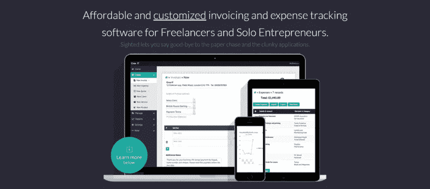
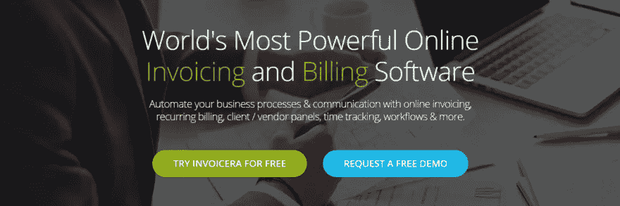
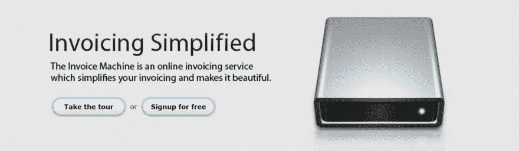
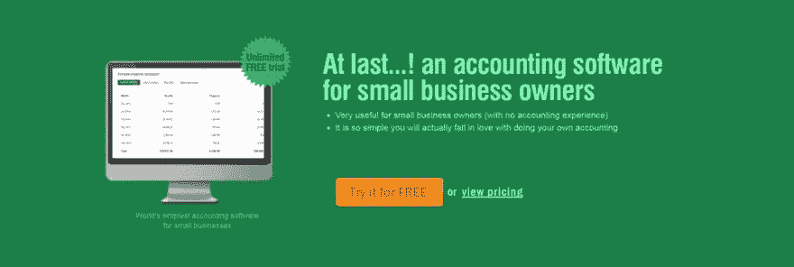
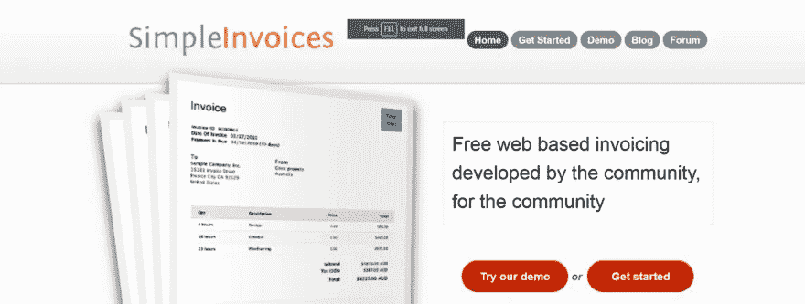

# 9 款免费发票软件，可以帮助您的企业

> 原文：<https://medium.com/visualmodo/9-free-invoices-software-that-can-help-your-business-cafb56105746?source=collection_archive---------0----------------------->

无论你是自由职业者还是小企业主，发票在你的工作中都扮演着至关重要的角色。它们不仅是你获得报酬的方式，还能帮助你组织重要信息，展现专业形象。你可以手动创建并发送发票，但使用免费发票软件通常是一种更快、更有效的策略。

幸运的是，有很多很棒的发票工具，不用花你一分钱。在本文中，我们将介绍 10 款免费发票软件工具，并介绍它们的主要功能。首先，我们将讨论计价工具的重要性，并解释如何选择最好的工具！

# 发票工具如何让您的企业受益

自由职业者和企业家有责任支付自己的报酬。最常见的获得报酬的方式是发送发票。这些费用可能是特定项目的一次性费用，也可能是持续服务的每月费用。无论哪种方式，如果你想保持你的收入流动，保持记录和及时得到准确的发票是必不可少的。

您可以手动处理发票，无需任何其他工具，并在文档或电子表格程序中手动创建发票。如果你只有一个或两个客户，这可能行得通。然而，随着您的成长，您会发现这并不是最佳的方法。也有一些免费的 WordPress 插件可以帮助你[进行你的开票](https://www.elegantthemes.com/blog/tips-tricks/how-to-create-manage-your-client-invoices-directly-in-wordpress)，但是过一段时间你可能需要一个更全面的选项。

使用专用发票软件通常是更好的选择，因为:

*   您可以加快甚至部分自动化这个过程，从而节省大量时间。
*   为特定客户创建模板更容易，因此您只需为每张发票填写特定信息。
*   它们有助于减少人工开具发票时出现的错误。
*   由此产生的发票通常具有更专业的设计。

一旦你决定使用免费的发票软件，你需要找到正确的选择。现在让我们来看看！

# 在免费发票软件中寻找什么

有很多工具可以帮助你进行[开票](https://visualmodo.com/)。有些很贵，但你甚至不需要额外付费。稍加搜索，你会发现大量的免费发票软件选项来满足你的要求。唯一的挑战是挑选最好的一个。

在为您的企业评估潜在的发票软件时，您需要确保它具有:

*   您想要的特定特性和功能。
*   优秀的用户评论和评分。
*   可靠的支持和文档。

鉴于此，可能需要一点时间来确定最佳工具。从好的方面来说，既然我们在谈论免费的发票软件，你总是可以尝试各种各样的软件，直到你找到一个你喜欢的。在这篇文章的剩余部分，我们将介绍一些突出的选项。

# 9 免费发票软件

以下十个工具都是完全免费的，尽管大多数都提供带有附加功能的 [premium](https://visualmodo.com/) 计划。这些不是唯一的选择，但它们是最好的选择之一——拥有大量有用的功能、优秀的用户评论和可靠的支持选项。

# 1.[发现](https://www.sighted.com/)

[瞄准了](https://www.sighted.com/)经营小生意的自由职业者和企业家。您可以使用多种货币创建发票，并通过各种选项(如每小时或项目)计算付款。一个有用的功能是能够将您的发票与支付网关(如信用卡或 PayPal)集成，这样客户就可以在线支付给您。

**主要特性:**

*   允许您为服务、项目、产品等创建发票。
*   允许您查看发票的付款状态。
*   提供对损益报告和其他有用财务信息的访问。

**定价:**有[两个高级选项](https://www.sighted.com/pricing)，每月 4.99 美元和 25 美元。较便宜的计划只是增加了您可以跟踪的发票、费用和客户的数量，而较高级别的计划提供了额外的功能，如发票跟踪器。

# 2.[发票忍者](https://www.invoiceninja.com/)

和 WordPress 本身一样，[发票忍者](https://www.invoiceninja.com/)是一个开源平台。这意味着您将获得一个经过广泛测试的、灵活的发票程序，如果您不愿意，您将永远不必为此付费。使用该工具，您可以快速创建发票，通过电子邮件发送给客户，并通过超过 45 个支付网关获得支付。

**主要特点:**

*   为您的发票提供十种模板设计。
*   提供实时 PDF 发票创建工具。
*   支持多种税收设置和各种货币。

**定价:**发票忍者的免费计划特别全面，提供无限量发票，最多 100 个客户端。然而，你可以升级到每月 8 美元或 12 美元的计划，并拥有一些高级功能，包括用户权限级别和删除发票忍者品牌。

# 3.[发票机](http://invoicemachine.com/)

每个免费发票软件都有自己独特的卖点，[发票机](http://invoicemachine.com/)也不例外。它以简单和用户友好而自豪，同时仍然产生专业的结果——它在这两方面都取得了成功。这个工具拥有您可能需要的所有特性，同时不会因为不必要的附加功能而使过程过于复杂。

**主要特点:**

*   允许您自定义发票的货币、运输、税收、语言等设置。
*   使您能够用颜色和徽标标记您的发票。
*   提供了一个可过滤的跟踪器，这样您就可以看到哪些发票已经支付以及何时支付。

定价:这款软件的潜在缺点是规模很小，每月只提供三张发票。然而，[高级计划](http://invoicemachine.com/pricing)提供每月 12 美元、24 美元和 48 美元，并分别提供 30、300 和无限发票。

# 4.[波](https://www.waveapps.com/invoice/)

如果您经常向相同的客户发送发票， [Wave](https://www.waveapps.com/invoice/) 是一个可靠的软件选项。它可以让你为回头客设置自动付款，甚至可以给他们发送电子邮件提醒。还有一个适用于 iOS 和 Android 的免费应用程序，可以让你从移动设备上管理和发送发票，这意味着你可以在旅途中处理机械任务。

**主要特性:**

*   提供了一个拖放编辑器和起始模板，因此您可以自定义您的发票。
*   自动同步发票和付款信息，因此它总是最新的。
*   允许您为每个客户端创建和保存重要详细信息的摘要。

**定价:**软件本身是免费的，没有发票金额或其他功能的限制。然而，公司*确实*提供[额外的服务](https://www.waveapps.com/pricing/)，包括信用卡处理和工资单，收取一定的费用。

# 5.[手帐](http://www.handdy.com/accounts/)

[handy Accounts](http://www.handdy.com/accounts/)是一款发票软件，适用于几乎没有会计经验的企业主。它简单明了，用户友好。有了这个工具，你可以保持你的发票井井有条，查看报告，让你深入了解你的业务是如何执行的，并坚持重要的税务信息。

**主要特点:**

*   以简单易懂的图形和表格显示财务信息。
*   跟踪所有发票的利润和损失。
*   让您轻松生成各种税务报告。

**定价:**这个软件提供两个简单的方案:[免费和高级](http://www.handdy.com/accounts/price-plans.html)。它们几乎是一样的，但是高级计划(每月 5 美元)允许你下载你的报告和查看你的历史记录。

# 6.[发票](https://www.invoicera.com/)

如果你正在寻找一个免费但功能合理的发票和账单工具，那么 Invoicera 可能正是你所需要的。它实现了大量的自动化，加上简化您的工作流程和跟踪您的生产力的功能。免费发票软件的主要好处之一是，它可以帮助你在工作日节省时间，这个工具在这方面尤其强大。

**主要特性:**

*   提供一个集中的仪表板来管理所有客户和支付信息。
*   允许您设置重复出现的发票和付款。
*   提供生产力跟踪器和工作流开发工具来简化您的流程。

**定价:**免费版的 Invoicera 规模相当小，只提供三个活跃客户端。然而，如果你发现这个软件有用并想扩展，有一个每月 15 美元的计划可以让你跟踪多达 100 个客户。

# 7.奥多奥

许多自由职业者和小企业主在工作完成后，会先向客户发送初步报价，然后再开具发票。Odoo 通过一个应用程序从报价中导入信息，并使用它来快速创建发票，从而使两者之间的转换变得简单。还有自动和在线支付选项，以及许多有用的分析功能。

**关键特性:**

*   使用模板或根据报价从头开始创建发票。
*   使您能够导入和调节银行对帐单，并跟踪发票本身。
*   提供可定制的仪表板，您可以在其中按产品、客户等查看分析信息。

**定价:**如前所述，Odoo 通过一个专用的 app 工作。你可以用免费计划创建一个这样的应用程序，或者用[的两个高级选项](https://accounts.odoo.com/pricing)添加更多。

# 8.[简单发票](http://www.simpleinvoices.org/)

[简单发票](http://www.simpleinvoices.org/)名副其实。该软件简洁明了，易于使用，对初学者来说很容易学习(但对高级用户来说足够灵活)。它也是开源的，由一个社区开发，确保它包含对真正的企业家最有用的功能。您可以选择在您的电脑或服务器上安装简单发票，或者让外部服务提供商托管该程序。

**主要特性:**

*   通过基于浏览器的应用程序工作，您可以在任何设备上使用该应用程序。
*   让您轻松跟踪财务信息和付款。
*   使您不仅可以创建发票，还可以创建收据、估价和报价。

**定价:**这个特殊的工具没有额外收费——它是一个完全免费的开源选项。

# 9.[比尔先生](http://www.mrbiller.com/)

[bill er 先生](http://www.mrbiller.com/)是一个可靠的免费发票软件选项——它拥有您可能需要的所有功能，甚至更多！您可以通过该计划发送发票并直接获得付款，通过一个组织有序的中央仪表盘管理您的所有信息和分析，甚至设置和跟踪[业务](https://visualmodo.com/wordpress-themes/)目标。此外，比勒先生没有在其发票上添加品牌，这是一个很好的接触。

**主要特点:**

*   提供可定制和贴牌的发票模板。
*   提供各种支付网关选项和自动支付提醒。
*   显示有用的统计数据，显示您企业的业绩和增长。

**定价:**除了标准的免费计划，还有一个每年只需 9.95 美元的高级计划，它提供你的信息备份和其他功能。

# 结论

开发票可能感觉像是一件苦差事，但它是你业务运营的一个重要部分。手工制作的潦草发票会让你看起来不专业，而且会占用你更多不必要的宝贵时间。另一方面，免费的发票软件工具使你能够不费吹灰之力地创建和发送发票，同时保持完美的组织。

许多免费发票软件选项提供了许多有用的功能。它们使您能够定制您的发票，将发票发送给客户，并在线接收付款。其他常见功能包括分析跟踪、自动提醒电子邮件和一个仪表板，您可以在其中管理您的所有发票和客户信息。然而，每个工具都有一点不同，所以你可能想尝试几个，直到你找到合适的。

**您是否使用过列表中的任何免费发票软件工具？如果是这样，请在下面的评论区告诉我们你的经历！**