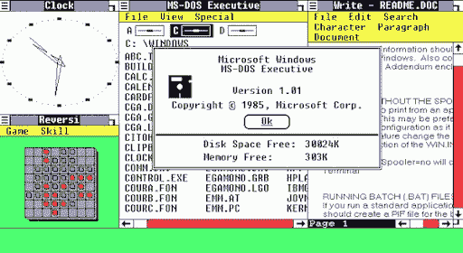
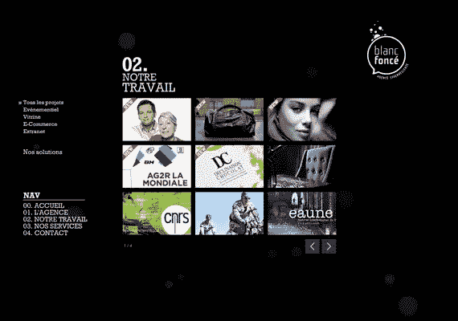

# 关于网页设计如何随着时间的推移而演变的迷人视角

> 原文：<https://medium.com/visualmodo/a-captivating-look-on-how-web-design-has-evolved-over-time-bea200eb673d?source=collection_archive---------0----------------------->

在过去的几十年里，网络有了显著的发展。自从第一代网站登陆互联网以来，时间还不算太久。尽管从那时起，从基本的网页到现在统治市场的复杂的网络应用程序的演变是惊人的。整个设计过程已经改变，现在，不同的设计语言被用来创建网站。就像其他行业一样，网站的发展也在意料之中。让我们来看看网页设计这些年来是如何发展的。

# 对网页设计如何随着时间的推移而演变的迷人一瞥

# 第一代

按照目前的标准，第一代网站的设计并没有真正考虑到美学。这项技术仍然非常年轻，设计师的主要焦点是实现功能。这就是为什么第一代网站只突出最基本的方面；链接、文本和导航。超链接带有下划线，并以蓝色与文本的其余部分区分开来。如您所料，文本的排列就像在文本编辑器中一样，不太强调格式。导航也是垂直的，页面滚动是设计中复杂的部分。

# 表格的引入

过了一段时间，为了包含更多的功能，有必要使网页变得更复杂。根据 Arstechnica 的记录，Windows [的第一个 GUI 系统出现在 1990 年，版本为 3.0](https://arstechnica.com/features/2005/05/gui/7/) 。这个系统也开创了网络图形用户界面的可能性。表格在 20 世纪 90 年代中期被引入 web，它们给网站带来了更多的功能。设计者能够创建以块为单位排列的文本。设计因此得到了显著的改进，由更丰富的结构组成的更复杂的网站变得很常见。

# 闪光时代

在很长一段时间里，基本设计主要集中在文本上，新的软件 Flash 在 20 世纪 90 年代末推出。这个软件使得网站设计者将多媒体融入网站成为可能。因为有了 Flash，有史以来第一个视频和音乐能够出现在网络上。该软件也有助于开发第一代动画。毫无疑问，Flash 标志着网络的一个重要转折点。今天你能看到的大多数新设计，包括 [Avast secureline](https://gobestvpn.com/review/avast-secureline/) 设计，都是因为闪存带来的可能性而变得复杂。

# 半铸钢ˌ钢性铸铁(Cast Semi-Steel)

层叠样式表(CSS)是一种在网络上广泛使用的编码语言。这种语言是在 20 世纪 90 年代开发的，但它的突出地位是在 21 世纪初。CSS 被认为是让网络变得更加复杂的语言。虽然 flash 能够给网站带来巨大的视觉吸引力，但整体设计仍然非常死板。CSS 能够消除这种僵化，并允许第一代社交媒体网站的发展。CSS 的开发重点是改进内容的表示。正是因为 CSS，模板开始在市场上变得普遍。

# 当前的网页设计风格

在 2010 年，我们已经能够体验到网页设计的完全成熟。将文本、图形和动画融入网络已经变得很正常。现在的重点已经转移到使设计简单和适应不同的环境。这就是为什么扁平化设计定义了这个时代。当前设计背后的想法是在一个美学上令人愉悦的设计中提供功能，同时也是极简主义的。极简主义已经成为必要，因为人们只是不希望被令人印象深刻的设计所震撼。相反，重点是实现功能。

# 展望未来

网页设计的未来不容易预测。考虑到过去三十年的发展速度，现在已经不可能说有些事情是网站做不到的。因此，未来更多的不是关于功能，而是关于每个网站应该做什么。仍有各种正在开发的技术可能会决定我们如何使用网络应用。因此，体验仍然是网页设计中最重要的问题。未来的网页设计企业将更加关注专业化和差异化。