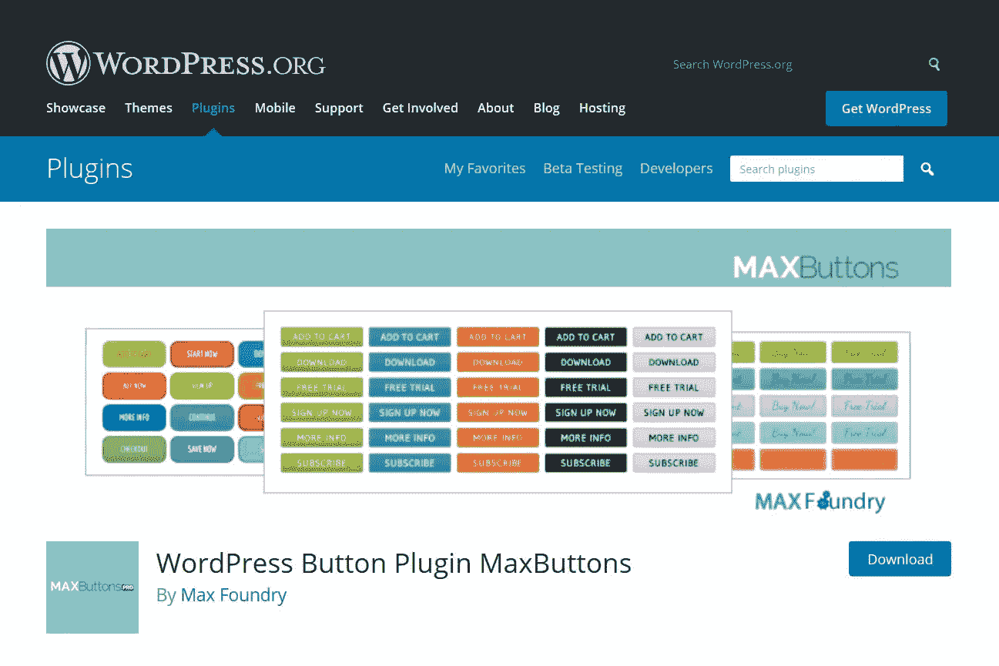

# 一个免费的博客文章按钮插件

> 原文：<https://medium.com/visualmodo/a-free-wordpress-blog-posts-button-plugin-363dc83e3518?source=collection_archive---------0----------------------->

纠结于如何为你的网站创建 WordPress 按钮？在这篇文章中，你可以看到一个免费下载的创建按钮插件。

WordPress 使得直接从 [WordPress](https://visualmodo.com/wordpress-themes/) 编辑器中插入普通文本超链接变得容易，但是它没有给你一个容易添加按钮的方法。出于这个原因，许多 WordPress 用户纠结于如何给他们的文章或页面添加按钮，需要一个插件。这就是为什么我们写了这个指南来使用按钮。

# 安装帖子按钮插件

首先，进入你的 WordPress 仪表盘，点击插件，然后点击添加新按钮。更多说明，你可以阅读这篇文章:如何安装 WordPress 插件。现在在搜索栏上输入“ [MaxButtons](https://wordpress.org/plugins/maxbuttons/) ”。然后点击“立即安装”按钮。现在点击“激活”按钮。在你的管理侧边栏中有一个新项目。

# 如何在 MaxButtons 上创建按钮

首先点击你的管理工具条中的“最大按钮”按钮。然后单击“添加新项”按钮。现在输入您的按钮名称、Url 和文本。此外，你可以改变你的按钮字体，颜色和其他东西。然后向下滚动你可以得到越来越多的选项为[定制](https://visualmodo.com/blog/)这个按钮。

在保存您的按钮之前，只需检查预览。确保你的扣子完全扣好了。是时候保存你的按钮了，只需点击“保存”按钮即可。

在背景部分，您可以调整按钮的常规和悬停版本的背景颜色。这些选项相当简单明了。唯一可能需要技巧的设置是使用渐变。启用渐变后，您可以创建从一种颜色“移动”到另一种颜色的多色按钮。

像您在边框部分看到的阴影选项一样，文本阴影部分允许您在按钮设计中的实际文本中添加类似的效果。文本阴影的工作原理与边框阴影相同，只是应用于按钮的不同部分:

# 用插件添加按钮

是时候把你的按钮添加到你的 WordPress 博客文章中了。这里有一个短代码，只需复制这个短代码并粘贴到编辑器中所需的位置。如果你愿意，你也可以点击“添加按钮图标”来添加你的按钮。

最后一步只是复制短代码，并将其粘贴到编辑器中所需的位置。或者，如果你愿意，你也可以点击“添加按钮图标”来添加你的按钮。

这是你在 WordPress 博客[帖子](https://awards.visualmodo.com/)上添加按钮的最佳插件。如果你对在你的 WordPress 博客文章中添加一个按钮还有任何困惑，那么就评论或者你可以通过电子邮件联系我们。

# 最后的话

现在你知道了！向 WordPress 内容添加按钮的两种不同方式。如果你精通代码，你可以使用你自己的 CSS 来创建 WordPress 按钮。但是如果你不是，或者如果你只是想要一个更快的方法来创建按钮，你可以使用 MaxButtons 插件为你做。