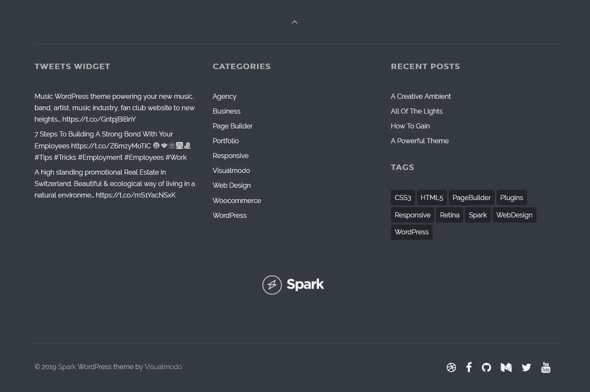

# 网站页脚设计指南

> 原文：<https://medium.com/visualmodo/a-guide-to-website-footer-design-1a3a43a636c4?source=collection_archive---------0----------------------->

经常被忽视的是，页脚仍然是一个网站的关键元素。这是一个重要的网站访问者想获得更多关于贵公司的信息。当你为你的网站设计页脚时，你面临的挑战是定义将包含在其中的元素，同时记住一个完美优化的页脚在帮助你达到商业目标的同时也方便了导航。想知道当访问者向下滚动到你的网站底部时他们期望什么吗？跟随这篇文章——我们收集了网站页脚设计的最佳实践和优秀网站页脚的例子。

# 一个好的网站页脚的好处

你的网站没有 100%的必要有页脚区，但是，不使用页脚区可能会让一些网站访问者很难找到关于你的网站或业务的具体信息。例如，页脚部分非常适合放置您的版权信息，以及指向您网站的重要页面的重要链接，如您的“关于”页面、联系页面、条款和条件页面、隐私政策页面、免责声明页面和 Cookie 通知页面等。

请注意，联系信息是一个非常受欢迎的信息。大多数人希望在页脚找到联系方式。除了改善网站的导航流程和用户体验，策划网站的页脚设计已经被证明可以影响一些品牌和企业的转化。也许对你来说也是。

# 网站页脚设计案例

在一次可用性测试中，UserTesting 发现将他们的转化率目标放在页脚部分有助于他们在两周内将转化率提高 50%。SmartInsights 还报告称，仅通过优化网站页脚，他们的销售转化率就增长了近 24%。

# 页脚示例

现在。我想和你分享一些我发现并非常喜欢的网站页脚设计。这有助于激发你创建自己的页脚设计。Web studio SparkBox 使用全角卡片式界面页脚设计，非常简单但非常有吸引力。他们的页脚区清楚地显示了联系信息、导航链接和社交媒体个人资料链接。

# 布里斯托尔档案记录的

它由克利夫顿吊桥的图形背景图像组成。他们的页脚部分提供了三个窗口小部件区域，分别链接到重要页面、版权信息以及他们使用的网站和个人资料的权威标识。太好了，我真的认为这对你来说已经足够了。现在，让我们看看页脚设计中需要考虑的 16 件事。让我们从我认为必不可少的项目开始:

# Zoyo 酸奶的

网站页脚是另一个我喜欢的外观。他们的页脚设计由联系信息、导航链接和一个简单但有吸引力的电子邮件联系表单组成。

# GiftRocket 的

美丽的页脚区是由一个预页脚区和一个主页脚区组成的，预页脚区用于展示来自知名品牌的客户评价，主页脚区包含所有重要的导航链接，链接到他们网站上的其他页面。

# BlogVault 页脚

网站页脚显示一个带有转换目标(让人们注册服务试用)的前页脚部分，随后是主页脚区，其中列出了最近发布的博客文章、导航链接、转换链接以及帮助和支持页面、隐私和政策页面的链接。

# 页脚元素

版权信息——清楚地表明你的网站内容是受保护的和受版权保护的，禁止抄袭！版权信息最好放在子页脚。

推荐——这是可选的，但是，我认为在线企业链接到他们的反馈提交页面或推荐页面是必不可少的。当然，前提是你有一个。

谷歌地图——如果你的网站是实体企业的在线门户，也许你经营一家宾馆、餐馆或当地活动中心——那么一定要考虑在页脚添加一些位置信息。这可能是一个简单的地址和邮政编码或当地的谷歌地图集成。

辅助导航—添加链接到您的“关于”页面、常见问题解答页面以及您认为会为网站用户提供额外帮助的其他重要页面。

# 联系信息和条款

联系信息——正如我前面提到的，大多数人倾向于向下滚动到页脚部分来查找联系信息。将你的链接添加到你的页脚是很重要的，尤其是如果你没有在主导航中包含你的联系页面的链接，而大多数网站都会有他们的链接。您的联系信息可以是邮寄地址、电话号码和电子邮件地址。

隐私政策——随着在线隐私法越来越严格，显示您的隐私政策页面链接至关重要。

服务条款——如果像我和许多其他人一样，你通过自己的网站提供服务或经营电子商务网站，你最不希望的事情就是你的顾客/客户对与你做生意的条款感到困惑。请确保在页脚清楚地显示您的服务条款页面的链接。

# 页脚的信息项

最新博客文章列表——你可能想在网站的页脚为你的最新博客文章添加一个提要，或者一个更好的策略是只链接一些最好的和最受欢迎的博客文章。不过，我给你的建议是保持最小化。四五个环节应该绰绰有余。

联系方式——如果你不想在页脚显示你的联系方式，尤其是你的电子邮件地址。为了降低收到垃圾邮件的风险，可以考虑添加一个简单的联系表单。在你网站的页脚区使用一个表单可以让你的用户更容易联系到你，而且几乎可以从你网站的任何页面联系到你。但是，请记住，表单可能会占用相当大的页脚空间。

使命陈述——如果你想向访问者展示你的网站或品牌代表什么，你的目标、愿望是什么，等等。考虑在你的页脚加一个简短的使命陈述。如果你有 MS 的扩展版本，你可以随时添加一个链接。

# 网站页脚的额外选项

生物——如果你的网站是一个个人品牌网站或博客，你也可以添加一个简短的个人简介，包括一张照片，以帮助你的网站增加一些人文元素。然后，您可以在“关于”页面上添加一个链接，访问者可以点击该链接了解更多信息。

[CTA](https://visualmodo.com/call-to-action-buttons-usage-guide/) —您是否有希望进一步推广的销售页面、畅销产品页面、代销商页面？在你的页脚锚文本中链接到它们怎么样？

社交证明和关注我们图标——如果你想炫耀你的社交媒体影响力或让人们在你最活跃的社交网络上关注你，考虑添加一些社交简档，或许在社交证明的页脚添加每个简档的订阅者/关注者数量。你甚至可以为这些创建一个预页脚区，如下所示！

电子邮件选择加入表单—提高电子邮件选择加入转化率的一个好方法是显示一个简单的注册表单。或者，如果注册表单太多，无法添加到页脚。考虑一个简单的行动按钮或链接到您的主要线索生成页面。

站点地图——站点地图本质上帮助搜索引擎更好地理解你的网站结构和内容。许多网站会选择在页脚中除了版权信息之外还有一个网站地图的链接。

社交分享工具——社交分享按钮也可以放在页脚。它让你的访问者更容易与他们的社交媒体朋友和追随者分享你的页面。

# 不要在你的网站页脚

太好了，那么那些不应该出现在你的网站页脚的项目呢？让我们来看看:页面查看计数器和流量统计部件。直接附属链接。嵌入式社交媒体源。广告。这真的取决于你用什么平台来建立你的网站。例如，对于 WordPress 用户来说，你可以尝试一些优质的页脚插件。

# 每页不同的页脚

一些网站在页面上使用不同的页脚来达到他们的转换目标。一些网站所有者喜欢在主页上只使用页脚部分。太好了。所以你已经看够了我对优化你的网站页脚设计的感受。现在我们来问问其他几位专家的看法。

# 网站页脚的专业想法

Andrew Lowen——“网站的页脚区应该帮助网站访问者浏览网站。我们喜欢包含重要的链接(如大多数/所有菜单项)、联系信息和版权信息。

页脚中的错误是添加社交媒体供稿或“加入我们的[时事通讯](https://visualmodo.com/free-newsletter-wordpress-mailchimp/)表单。当用户看页脚时，他们对你的社交媒体不感兴趣…他们错过了他们在你的网站主体中寻找的东西！如果你不能引导他们去更接近他们所寻找的地方，你将会失去潜在的转化机会。人们不会故意去页脚。他们去那里是因为他们的滚动动作偶然把他们带到了那里。通常是因为他们缺乏对细节的关注。你的页脚应该帮助他们找到他们需要的东西！".

**阿什利·福尔克斯**——“我用页脚标注一些通常不容易找到的关键东西。重要页面的公司详细信息(名称、地址、电话等)列表，这些页面要么不在主标题中，要么值得重复。(运输、隐私、条款和条件、关于公司等)。

最后，一个重要的行动号召:更多联系方式，电子邮件选择加入(时事通讯)。预订按钮、捐赠按钮等。是的，页脚经常被遗忘和利用不足，但它确实是一个非常有用的地方。"