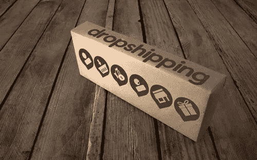
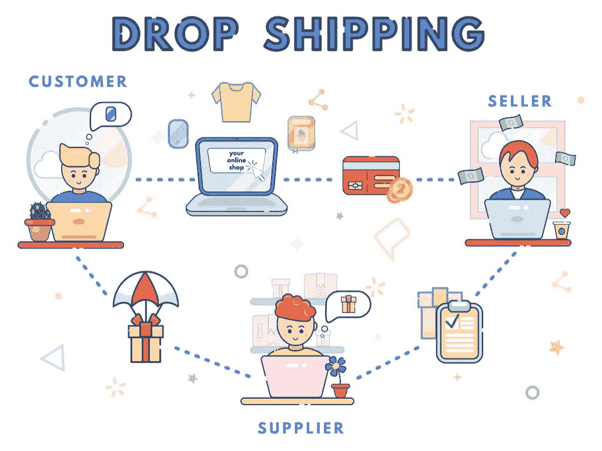

# 关于开展直运购物业务及其营销的综述

> 原文：<https://medium.com/visualmodo/a-review-on-starting-a-drop-shipping-shopify-business-and-marketing-it-ee24341d4930?source=collection_archive---------0----------------------->

大多数企业——Shopify 或其他——都有自己销售的产品库存。缺货和不能迅速补充对生意不利。相反，产品库存过多也同样糟糕，尤其是易腐物品。现在看到一个关于开始直运 Shopify 业务的分析。

这就是为什么一些 Shopify 企业采用了一种[直运模式](https://www.shopify.com/guides/dropshipping/infographic)，他们从第三方制造商那里购买产品，当作是他们的产品出售，然后直接运送给他们的客户。再也不用担心库存不足和库存过多。

但是，作为一个在 Shopify 上创业的新手，你该如何开始一个不直接发货的生意呢？又是如何成功营销的呢？

请继续阅读，了解更多信息。

# 出售你喜欢的东西，但同时确保从中获利

让你的直运商店[业务](https://visualmodo.com/)与你生活中的激情保持一致可能是一个不成功的过程。当你非常热衷于销售你喜欢的东西，但人们根本不相信你的噱头时，错过就来了。你可能不像他们那样看问题，但是人们可能会认为你卖的产品已经过时了，或者竞争对手做得比你好。

光有激情是不够的。因此，始终要通过在销售你热爱的产品和从中获取丰厚利润之间找到适当的平衡，让你的直运 Shopify 业务获得巨大成功。

# 为您的直运 Shopify 业务想出引人注目且一致的品牌

如果人们很容易忘记它的名字，你的直运 Shopify 业务可能根本不会流行。因此，在建立你的直运 Shopify 业务之前，你应该想一个你的潜在客户会记得的名字。只要确保想出一个独特的企业名称，不侵犯一个更成熟的品牌的商标。

您的直运 Shopify 业务的名称也应该反映在您网站的域名上。千万不要让你的企业域名与你挂在你的 Shopify [商店](https://visualmodo.com/wordpress-themes/)上的域名不同，因为这会让你的潜在客户感到困惑。

# 在社交媒体上宣传您的直运 Shopify 业务

如今，大多数人在网上花时间查看社交媒体。你可以优化你的直运 Shopify 业务，使其始终出现在谷歌搜索结果的第一页，但错过社交媒体推广会让你的所有努力都变得毫无意义。

因此，你必须利用社交媒体的优势，在那里宣传你的直运业务。只要确保为你的社交媒体营销活动留出足够的预算，这可能包括支付有影响力的人来推广你的产品，这样你就不必独自完成所有的工作。

维护产品清单是一项艰巨的工作；你可能会发现自己花了太多时间检查它，而不是专注于让你的 Shopify 业务增长。为了避免这种情况，你可以开始一个直运业务，并通过应用上面列出的技巧来进行营销。为了更好地了解如何运营你的直运 Shopify 业务并从中获利，你可以在线搜索“ [journalreview ecommerce](https://www.journalreview.org/) ”，找到更多关于在线业务的信息。