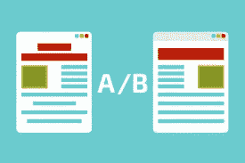
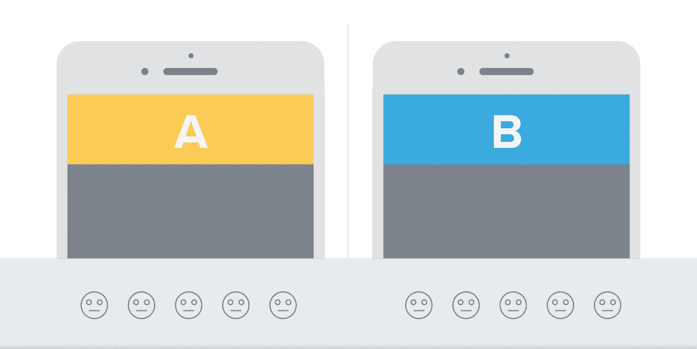
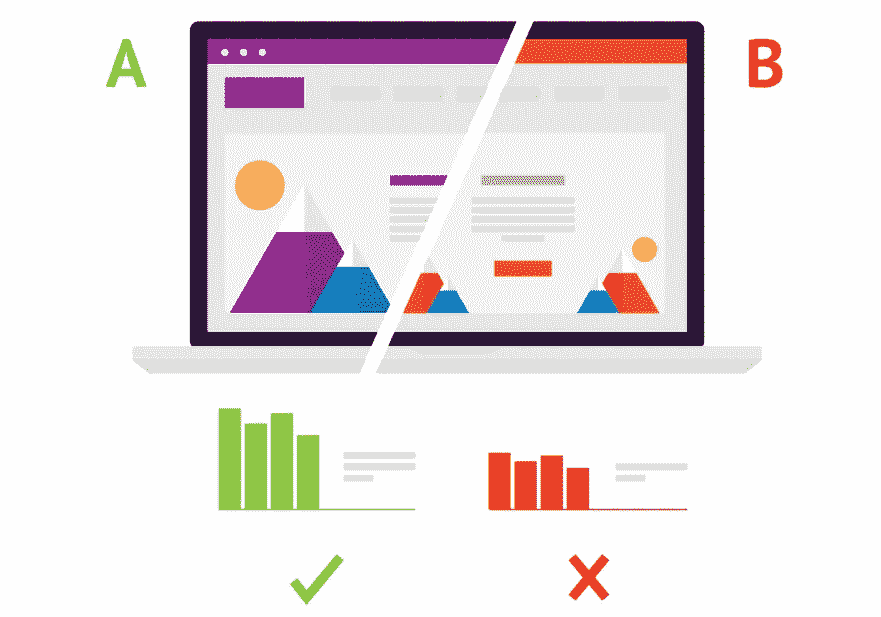

# AB 测试

> 原文：<https://medium.com/visualmodo/ab-testing-8f845eb8975b?source=collection_archive---------0----------------------->

## 时事通讯

在优化你的营销策略的整个过程中，AB 测试是一个很好的工具，你的时事通讯一定不能被遗忘。确保你的时事通讯对你的读者有附加价值，并且是高质量的。当然，总有需要改进的地方，你可以根据你的直觉进行改进，但是为什么不首先通过 AB 测试你的时事通讯来测试你的直觉呢？

在这篇文章中，我将深入时事通讯 AB 测试，解释你可以测试什么。测试实例我就不讨论了，但是我会告诉你测试的时候要注意哪些方面。

# 时事通讯 AB 测试

# 主题行

使用大多数电子邮件活动工具，您可以测试主题行。这意味着你可以给你的时事通讯添加许多不同的主题。如果您测试 2 个不同的主题行，通常 50%的订户会收到第一个变体，另外 50%会收到另一个变体。

A/B 测试你的主题行只与测试你的打开率有关，而与测试你的点击率无关。打开率是您的订阅者打开的成功发送的新闻稿的百分比。另一方面，点击率百分比可以让我们了解有多少成功发送的简讯至少注册了一次点击。主题行不会影响你的点击率，因为它不会影响你发送的邮件正文。也就是说，测试你的主题仍然非常重要，因为你希望尽可能多的人阅读你要说的内容。所以你希望你的订户打开你的时事通讯，对吗？

我们的朋友 Jordie van Rijn ( [一个伟大的电子邮件营销人员](http://www.emailmonday.com/email-marketing-consultant))教给我们的一套规则对我们帮助很大，那就是 C.U.R.V.E:

*   **好奇心**:通过向读者提问来激发他们的兴趣。
*   紧急:通过在有限的时间内提供或提供需要现在做的事情*来创造紧急状态。*
*   ***相关性**:确保你把与你的受众最相关的内容放在你的主题行中。*
*   ***价值**:通过提供独家内容(可以是独家产品，也可以是独家内容)来传达简讯的价值。*
*   *情感:使用标点符号，比如感叹号，来引起读者的情感反应。*

**

# *从名称*

*另一件你几乎可以经常测试的事情是你的*名字*。这正是它听起来的样子:显示电子邮件发件人的名称:*

*同样，这只会影响你的打开率。然而，这是人们容易忘记的一个方面，因为这是一件需要改变的小事。然而，形式*名称*可能非常重要。这是你的邮件到达时人们看到的第一件东西，所以最好是好的。测试这个就能确定了。*

# *发送时间*

*我不确定是否所有的电子邮件[活动](https://visualmodo.com/)工具都提供这种 A/B 测试选项，但是 MailChimp 提供了。您可以测试什么发送时间(MailChimp 称之为“交付时间”)最适合您的受众。但是，您需要在此之前做一些工作，因为您必须自己决定变体何时发布。*

*所以，试着找出你的大部分邮件是什么时候被打开的，或者至少你的大部分听众是醒着的。尤其是如果你的电子邮件发给像我们这样的国际群体，这可能是一个很好的测试。在正确的时间发送你的电子邮件可以让更多的人看到你的时事通讯并投入其中。*

# *内容*

*内容才是最重要的。在这里，你可以全力以赴，测试你喜欢的任何东西。电子邮件内容部分的所有内容都可以被测试，这就足够了。你必须考虑你想要测试什么，并像对待其他测试一样对待这些 A/B 测试。我们已经写了一篇文章来解释这一点:首先假设，然后测试。在任何情况下，在同一时间只测试一个方面是至关重要的。否则，你无法判断你的 A/B 测试的哪个部分导致了更高的点击率。*

*我总是喜欢从这个开始，因为它离订阅者接收、打开和阅读时事通讯的过程最远。我首先测试内容，因为我不想优化我邮件的一部分(比如主题)，而读者接下来看到的(比如邮件内容)可能会撤销我之前做的所有[优化](https://visualmodo.com/)。*

*当你想测试你的邮件内容时，你可以考虑一些想法:*

*   *您的电子邮件的标题；*
*   *总结你的电子邮件的索引；*
*   *更多(或更少)的图像；*
*   *不同的语调；*
*   *更多的按钮而不是文本链接；*
*   *乔迪博客上的更多想法。*

# *测试前*

*当您开始测试时，大多数电子邮件营销工具会为您提供两个选项:*

*   *将您的变体发送到您的完整列表，或者*
*   *将您的变化发送到列表中的某个百分比，宣布获胜者，然后将获胜者发送给尚未收到简讯的其他人。*

*我强烈建议你使用第一种选择。让我告诉你为什么。首先，给你的名单中的一个样本发送多个变量意味着你减少了“回答者”。当您将它发送到完整列表时，您将拥有更多数据。这意味着你的结果会更可靠。*

*然而，如果你的列表足够大，这可能没多大关系。我仍然选择第一个选项的原因是，使用第二个选项，获胜的变体会在几个小时(甚至几天)后发出。特别是对于时事通讯，这可能会有问题，因为，嗯，在这一点上，它不再是真正的“新闻”了。使用第二个选项也意味着你不能确定邮件发送的准确时间。而且，正如我已经说过的:发送时间可能非常重要。*

*如果发送邮件的时间不太重要，而且你有很多订阅者，你可以选择第二个选项。在这种情况下，你名单上剩下的人将总是赢家，这可能是有益的。*

# *结果*

**

*因此，你已经想出了一些精彩的变化，你的通讯的内容，其主题，从名称或发送时间。是时候发送简讯了！一旦你发送出去，你就不能再做什么了。你只需要等到第一批成果慢慢(或大量)到来。确保你注意到结果的不同。哪个版本的[打开率最高](https://visualmodo.com/)？哪个版本的点击率最高？*

*比较结果的时候，点击率永远是我优先考虑的。毕竟，高点击率意味着你的读者可能最终会在你的网站上，在那里你有更多的销售机会。然而，我们也总是在简讯的所有链接上使用定制活动。由于我们已经在谷歌分析中设置了电子商务跟踪，我们可以看到哪个版本的简讯产生了最多的收入。如果你有生意要做，这可能是你希望看到增长的指标。*

*除非你在你的电子邮件活动工具中设置了某种电子商务跟踪，否则这个指标不会出现在他们的结果中。所以不要太看重这些工具的结果。确保你专注于对你的业务重要的事情，并检查这些指标。*

*还有:不要太快下判断。我通常会等上几天，最多一周，然后再下结论，因为几天后很多人仍然会打开你的电子邮件，并与你的电子邮件进行[互动。](https://visualmodo.com/)*

# *测试愉快！*

*你认为我们为自己设定的步骤和规则怎么样？你有类似的想法吗？或者完全不同的东西？请在评论中告诉我们！*