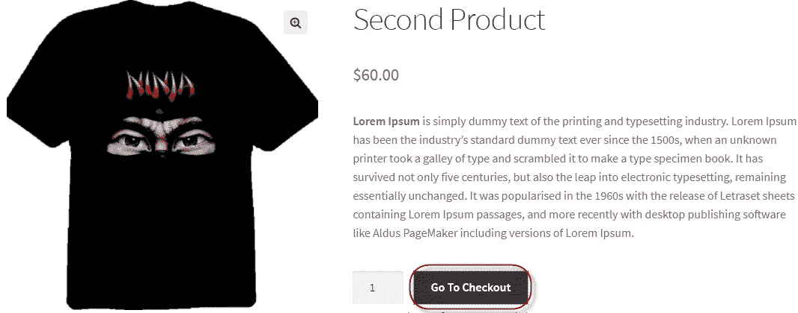

# 在 WooCommerce 中直接将产品添加到收银台

> 原文：<https://medium.com/visualmodo/add-products-directly-to-checkout-in-woocommerce-40569b4d756a?source=collection_archive---------0----------------------->

通常，使用 WooCommerce WordPress 插件，当你想购买一些产品时，你需要将其添加到购物车页面，查看购物车，然后才能加载结账页面，有些人认为这是一个漫长的过程，参见本文中如何在 WooCommerce 中将产品直接添加到结账页面并跳过购物车页面。

WooCommerce 的开发者经常抱怨要经过几个屏幕才能看到他们工作结果的漫长过程。常见的工作流程是绕过购物车页面，直接进入结账页面。这大大缩短了[开发](https://visualmodo.com/)过程，并允许开发者和用户立即看到开发过程的结果。

# 在 WooCommerce 中直接添加产品到结账？

在 Woocommerce 中，跳过购物车页面直接进入结账页面的过程从以下步骤开始:

进入 **WooCommerce >设置>产品>展示**

在该屏幕上，取消选中**添加到购物车行为**部分的两个选项。

该过程的下一步是向**functions.php**(位于主题文件夹中)添加一个代码片段。该代码片段添加了一个直接重定向到结账页面的过滤器:

`add_filter('add_to_cart_redirect', 'cw_redirect_add_to_cart');
function cw_redirect_add_to_cart() {
global $woocommerce;
$cw_redirect_url_checkout = $woocommerce->cart->get_checkout_url();
return $cw_redirect_url_checkout;
}`

一旦添加了代码，点击动作将重定向到[结帐](https://visualmodo.com/)页面。因此， [WooCommerce](https://docs.woocommerce.com/documentation/plugins/woocommerce/getting-started/sell-products/core-payment-options/) 产品中按钮的标签应该从“添加到购物车”改为“去结账”。为此，我将在**functions.php**中添加以下过滤器:

`add_filter( 'woocommerce_product_single_add_to_cart_text', 'cw_btntext_cart' );
add_filter( 'woocommerce_product_add_to_cart_text', 'cw_btntext_cart' );< function cw_btntext_cart() { return __( 'Go To Checkout', 'woocommerce' ); }`

# 结论

我在本教程中讨论的基本问题是相当长的一系列屏幕，开发人员和用户都希望跳过这些屏幕，直接进入结帐页面。解决方案非常简单，只需向[函数](https://visualmodo.com/) .php 添加代码片段。如果你需要帮助，请留下评论。