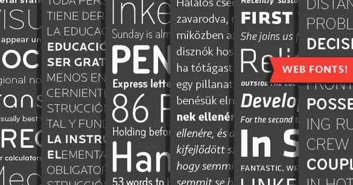
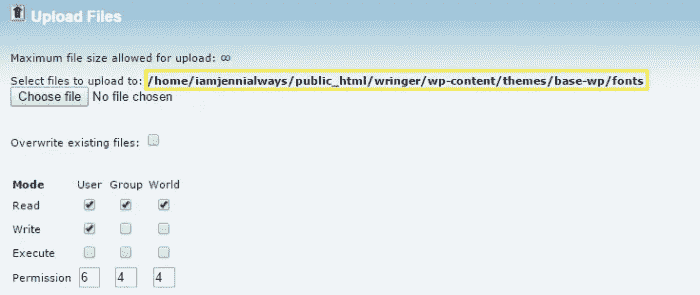
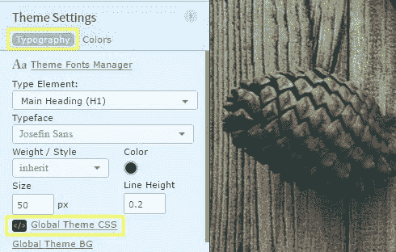
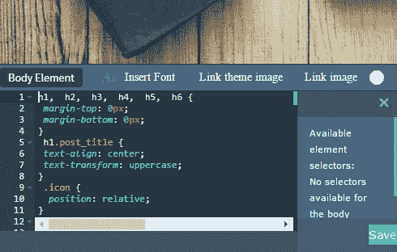

# 向 WordPress 添加自定义字体

> 原文：<https://medium.com/visualmodo/adding-custom-fonts-to-wordpress-3f8c7d15fd52?source=collection_archive---------2----------------------->

无论你是创建一个新的 WordPress 主题还是简单地自定义一个，自定义字体都可以帮助你的网站风格焕然一新。点击这里查看如何上传自定义字体！

虽然浏览器有内置的默认字体，你可以在你的 *style.css* 文件中调用这些字体，但是使用其他人都使用的字体会显得有点乏味。

幸运的是，使用 CSS3 `@font-face`规则，添加自己选择的字体相对容易。所有需要做的就是上传一个字体到你的服务器，然后用一些 CSS 的小片段把它添加到你的主题中。

让我们看看如何为你的 WordPress 主题以及我们的[前期](https://premium.wpmudev.org/projects/category/themes/)主题框架做这件事。

# 查找字体

有很多地方可以免费找到很棒的网页字体，比如 [FontSquirrel](http://www.fontsquirrel.com/) 或 [Adobe Edge 网页字体](https://edgewebfonts.adobe.com/)。只要确保你选择的字体符合你的需求。

并不是所有的免费字体都可以用于商业目的，但是你可以从很多地方买到商业用的优质字体，比如 [Typekit](https://typekit.com/) 。

还有两种主要的字体:衬线字体和无衬线字体。衬线字体边缘有卷曲，而无衬线字体没有。

左边有趣的图片可能会帮助你记住这两种类型的区别。

一旦你选择了你的新字体，你需要下载它的文件。请记住，有不同种类的字体文件，它们并不都兼容大多数主流浏览器。

以下是不同类型字体及其文件扩展名的快速总结:

*   **TrueType 字体(TTF)** —兼容 Internet Explorer 及以上版本，Chrome 从 4.0 开始，Firefox 从 3.5 开始，Safari 从 3.1 开始，Opera 从 10.0 开始
*   **OpenType 字体(OTF)** —与 TrueType 字体具有相同的浏览器兼容性
*   **Web 开放字体格式(WOFF)** —支持 Internet Explorer 及以上版本，Chrome 从 5.0 开始，Firefox 从 3.6 开始，Safari 从 5.1 开始，Opera 从 11.1 开始
*   **Web Open Font Format 2.0(woff 2)**—从 36.0 版本开始，仅支持 Chrome，从 35.0 版本开始支持 Firefox，从 26.0 版本开始支持 Opera
*   **嵌入式 OpenType 字体(EOT)** —仅适用于 Internet Explorer 及以上版本。

Web 开放字体格式已经成为标准，因为字体被压缩以消耗更少的带宽并包含额外的元数据。不幸的是，它们并不总是可以下载。

如果你很难找到这种文件，TrueType 和 OpenType 字体更容易下载，仍然是很好的选择。

# 上传您的字体

一旦你找到了你想要使用的字体，并按照你的源文件的指示下载了文件，就该把它上传到你的服务器了。在此之前，最好在进行任何更改之前备份整个网站。

关于创建完整备份的细节，请查看我们的其他帖子:[如何使用快照备份你的 WordPress 网站(和多站点)](https://premium.wpmudev.org/blog/backup-with-snapshot/)和 [7 顶级高级和免费 WordPress 备份插件回顾](https://premium.wpmudev.org/blog/premium-freemium-wordpress-backup-plugins/)。

最好添加到你主题的文件夹里，可以在**WP-content>themes>your-theme**下找到。你可以选择创建一个“Fonts”文件夹来存放你的文件，以保持有序，特别是如果你打算添加一种以上的字体。

解压打包的文件并将内容上传到你的主题文件夹。

在 cPanel 中，点击主页面**文件**下的**文件管理器**按钮。如果弹出窗口打开，选择您站点的位置，然后按 **Go** 按钮。导航到你的主题文件夹，点击页面顶部的**上传**按钮。

在**上传文件**页面点击**选择文件**按钮，从您的电脑中选择字体文件。选择并打开后，文件将自动上传，无需单击此页面上的其他按钮。

无论你把字体文件放在哪里，你都需要记住它的路径。在此页面上，它将以粗体显示在**选择要上传到**的文件之后。

# 将字体添加到主题中

为了让你上传的字体真正出现在你的主题中，你需要在你的 *style.css* 文件中调用它，你可以在**WP-content>themes>your-theme**下找到它。

理想的做法是先创建一个子主题，这样当你的主题更新时，你的更改不会丢失。

如果你正在从头开始创建一个主题，这通常不是一个问题，但是如果你正在编辑一个已经存在的主题，你可以看看我们的其他几篇文章，[如何创建一个 WordPress 子主题](https://premium.wpmudev.org/blog/how-to-create-wordpress-child-theme/)和[如何在 WordPress](https://premium.wpmudev.org/blog/easy-child-themes/) 中自动创建子主题，了解如何创建子主题的细节。

在 cPanel 中，选择文件，然后单击页面顶部的**编辑**按钮。如果您之前没有禁用弹出窗口，将会出现一个弹出窗口。如果是这种情况，点击底部的 **Go** 。

将以下代码复制并粘贴到文件中，最好是引用字体的地方。确保每个 CSS 块和您输入的代码之间有一个换行符。

@ font-face { font-family:font name；src:URL(public _ html/your-site/WP-content/themes/your-theme/fonts/font name-regular . TTF)；字体粗细:正常；}

不要忘记用你上传的字体名称替换字体名称，并更新代码以反映正确的文件路径。

额外添加相同的 CSS 代码来定义粗体、斜体、标题文本等，确保更新文件名和路径以反映字体的用途。

最后，定义你的字体在 CSS 中的使用位置，如下例所示:

p { font-family:font name；}

在本例中，所有段落文本都将使用新的(虚构的)字体。一旦您将代码更新为您自己的规格并保存文件，您的新字体将在您的站点上可见。

# 提前添加自定义字体

前期是我们自己的无限可定制的主题框架，您可以从许多预设的预制主题中进行选择，您可以根据自己的意愿进行定制。你可以[预先下载一个主题](https://premium.wpmudev.org/projects/category/themes/)，然后安装并激活它，这样你就可以添加自己的字体了。

添加自定义字体的步骤与上述步骤类似，但还是有一些关键的不同，有一点是不会改变的，那就是在添加任何新字体之前备份整个站点是很重要的。

一旦你备份了你的站点，你就可以开始添加你的字体到你的站点了。

## 上传你的字体

你仍然需要上传你的字体，但不是上传到你的主题文件夹，你应该在 **wp-content** 目录下创建一个名为 **fonts** 的新文件夹。你的字体应该被上传到这个新的文件夹，但是你上传它们的方式和前面描述的一样。

## 添加您的字体

当使用提前，你不需要创建一个子主题，因为有一个部分，你可以添加自定义 CSS 和任何你添加到它不会被删除，当你更新。

提前打开你的主题，进入左侧的**主题设置>排版>全局主题 CSS** 。分段部分应该在页面底部打开。

如果您需要添加一些与字体有关的内容，并且您在**主题设置**中看不到该选项，您可以向编辑器添加任何自定义 CSS。

虽然点击编辑器中的**插入字体**按钮可能很诱人，但是这个选项只添加 CSS 中预先存在的 Google 字体。

相反，把你的代码添加到前置全局主题编辑器中，就像你给一个 *style.css* 文件添加字体一样。

类似于前面显示的`@font-face`例子，你可以用同样的方式将你的字体添加到前置编辑器中。唯一的区别是你将链接到你放置在[*www.your-site.com/wp-content/fonts/your-font*下的字体。](http://www.your-site.com/wp-content/fonts/your-font.)

@ font-face { font-family:font name；src:URL(http://www . your-site . com/WP-content/fonts/font name-regular . TTF)；字体粗细:正常；}

确保用你想要添加的字体的真实名称替换`FontName`，并且把 URL 替换为你的字体的真实路径。你也可以为你需要的每种字体粗细添加`@font-face`规则。

不要忘记将新字体应用到页面中需要显示的元素上，并且也应该将它包含在**全局主题 CSS** 编辑器中。您可以定义您希望字体出现的位置，方法与下面的示例类似:

p { font-family:font name；}

将 FontName 改为你的字体的实际名称，然后你就可以开始了——嗯，在你点击编辑器底部的**保存**之后。

# 结论

有了这些指导，你应该能够添加新的字体到你的主题中而不会出错。不过，如果你喜欢更简单的解决方案，有许多插件可以帮助你添加字体，而不需要任何编码。

事实上，我们已经在我们的帖子[中列出了最好的自定义字体插件](https://premium.wpmudev.org/blog/top-wordpress-custom-fonts-plugins-reviewed/)。如果你想要一个选择正确字体的便捷指南，我们也有一个帖子:[你对 WordPress 字体设计的大部分“了解”都是错误的](https://premium.wpmudev.org/blog/what-you-know-about-wordpress-typography-is-wrong/)。

关于在 WordPress 中使用字体的更多信息，请查看 Codex: [使用字体](http://codex.wordpress.org/Playing_With_Fonts)。如果您在添加字体时遇到困难，[打开一张支持票](https://premium.wpmudev.org/forums/forum/support#question)，我们的支持英雄可以快速回答您的问题。

**你最喜欢的字体是什么？你是如何把它们添加到你的网站上的？请在下面的评论中告诉我们。**

来源[https://visualmodo.com/](https://visualmodo.com/)