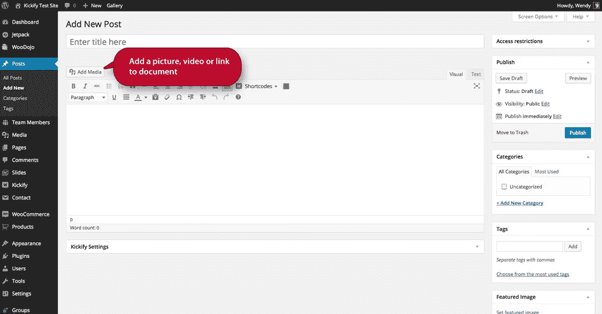
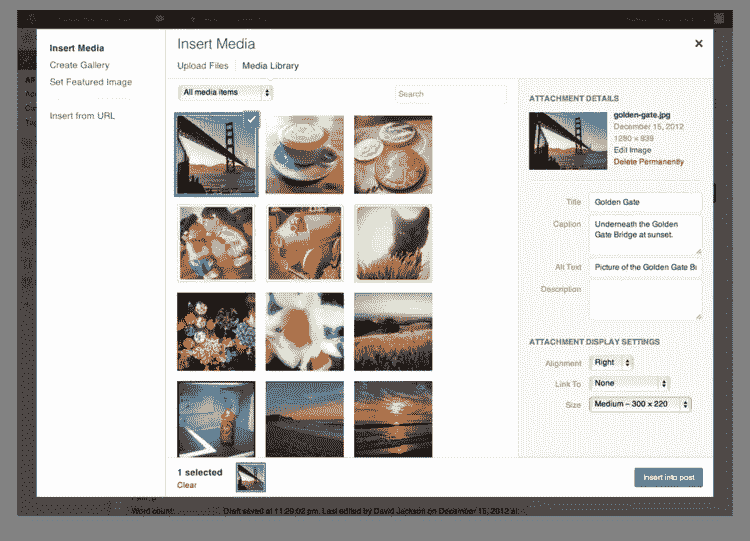
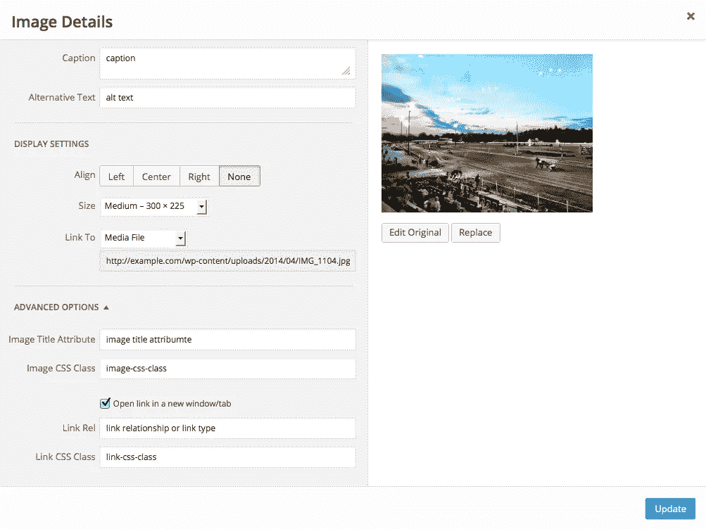

# 向帖子或页面添加 WordPress 图片

> 原文：<https://medium.com/visualmodo/adding-wordpress-images-to-posts-or-pages-756e479dcd50?source=collection_archive---------0----------------------->

使用图像、照片或插图等视觉元素是美化帖子或页面内容的好方法。在这篇文章中可以看到如何上传图片到你的文章或页面。

# 添加 WordPress 图片

1.确定你想在帖子中插入图片的位置。单击此区域将其选中。

2.在帖子编辑器[工具栏](https://visualmodo.com/)上方，你会看到一个**添加媒体按钮**。点击添加媒体按钮，您将看到**插入媒体框**。

3.你的网站使用媒体库来存储你所有的媒体，比如图像和视频。在此框中，您可以选择上载新文件或使用媒体库中的现有文件。要上传图像，点击**选择文件按钮**。找到您想要使用的图像，然后点按“打开”。

4.现在您的图像已经上传，您会看到它已被添加到媒体库。在此框的右侧，您将看到此页面的附件详细信息。在这里您可以更改**标题**、**标题**、**替代文本**和**描述**。您还可以选择图像的**对齐方式**(如居中、左对齐或右对齐)、插入图像应链接到的位置、图像的实际 [**URL**](https://visualmodo.com/wordpress-themes/) **以及图像的大小。**

5.确保图像有复选框，并点击**插入帖子按钮**。现在，您将看到您的图片已被添加到您的帖子中。

6.如果你点击这个图片，你会看到两个框出现在图片的左上角。首先是图像图标。如果您单击该图标，您将看到另一个打开的框，用于编辑图像的细节。在这里，你可以根据百分比改变图像的大小(这是一个方便的调整大小的工具)，或者你可以更新标题、替换文本、标题和链接 URL。您也可以选择不链接任何图像或链接到实际的图像文件。

7.如果您单击“高级设置”选项卡，您将看到图像文件在您的网站上的 URL、图像的实际宽度和高度(以像素为单位)、CSS 类、样式和图像属性(在图像周围添加填充)。

8.返回到您帖子中的图片。左上角的下一个图标将删除帖子中的图片。

9.如果再次点击 [**添加媒体按钮**](https://visualmodo.com/wordpress-themes/) ，您会看到相同的插入媒体框。在该框的左侧，您将看到创建图库和设置特色图像的选项。一旦您在我们的媒体库中有了更多的图像，您就可以将整个图像库添加到帖子中。

帖子的特色图片有时会被你的 WordPress 主题使用。继续选择这张图片作为我们的特色图片，然后返回到帖子编辑器。现在，您可以预览帖子，并看到我们的图像已被添加。

# 视频指南