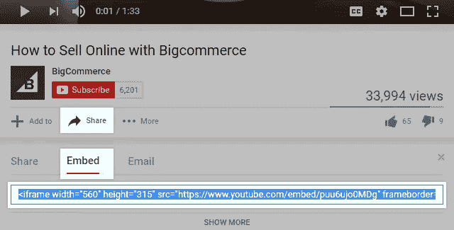

# 将 YouTube 视频添加到 WordPress

> 原文：<https://medium.com/visualmodo/adding-youtube-videos-to-wordpress-dc387a705f69?source=collection_archive---------1----------------------->

YouTube 视频是活跃网站的好方法。以下是如何在你的帖子和页面中，以及在你的小部件区域中轻松使用它们。

YouTube 是迄今为止最受欢迎的视频分享平台，每分钟有 300 小时的内容上传*。 [WordPress](https://visualmodo.com/) 让你轻松驾驭这个令人难以置信的内容来源，直接在帖子和页面中展示 YouTube 视频。在本帖中，我们将向你展示你需要知道的一切。*

# *选择您的 YouTube 视频*

**

*在您的网站上显示 YouTube 视频之前，您需要找到您想要添加的视频。*

*然后你需要点击**分享**并复制视频[网址](https://visualmodo.com/)(如上图所示)。如果您选择的视频是播放列表的一部分，您可以选择仅显示当前视频(取消选中播放列表框)、整个播放列表，以及是从播放列表的开头显示还是显示当前视频。*

# *向 WordPress 帖子或页面添加 YouTube 视频*

*现在去你的 WordPress 仪表盘。您可以创建新的帖子或页面，或者编辑已经创建的帖子或页面。文章和页面的过程是一样的，所以你用哪个都没关系。*

*您的视频需要在新的一行上，所以如果您要将 YouTube 视频添加到现有内容，请在您想要视频去的地方点击 return。*

*在新的一行中粘贴您刚刚复制的 YouTube 视频 URL。URL 不需要是超链接(链接 URL 会阻止视频播放)——实际上你只需要从 YouTube 上复制的链接。*

*如果你安装了免费的 Jetpack 插件，你会得到视频的即时预览。否则，将你的文章或页面保存为草稿(或更新已发布的内容),你将获得完整的预览显示。发布或更新你的文章或页面，你就大功告成了！*

# *手动视频嵌入*

**

*如果将视频神奇地粘贴在一行上不起作用，或者你想对 YouTube 的视频播放器进行更多的控制，你需要手动嵌入视频。*

*幸运的是，WordPress 让这变得很容易。*

*再次，在 YouTube 上找到你想要嵌入的视频。不过，这一次，选择视频下方的**嵌入**选项卡，然后**显示更多**。现在，您可以定制一些额外的选项:*

*   *视频播放器的宽度(从预设中选择或使用自定义尺寸)。*
*   *当视频结束时切换显示建议的视频。*
*   *切换 YouTube 播放器控件。*
*   *切换显示视频标题和右上角共享链接。*
*   *打开隐私增强模式。*

*您也可以手动定制参数。谷歌显示了[这里所有可用的选项](https://developers.google.com/youtube/player_parameters)。*

*一旦你完成定制任何选项，复制嵌入代码(你会发现它从`<iframe...`开始)。*

*现在你可以将嵌入代码粘贴到你的文章或页面中。这一部分和粘贴 URL 有点不同:你需要在 WordPress 编辑器上进入**文本**模式。这让您可以添加一些 HTML，包括 YouTube 嵌入代码。*

*再次找到您想要添加视频的位置，但这次添加两个换行符，这样您将在显示视频的位置的两侧各有一个换行符。将嵌入代码粘贴到中间行，并切换回**可视**选项卡。现在，您将看到视频预览。更新或发布你的文章，你就大功告成了！*

# *添加非常好的视频内容*

*将 YouTube 视频添加到你的网站是一种非常有效的方式，可以让访问者更好地参与进来，并在你的网站上停留更长时间。有了这里显示的两种方法，我们就能让你做到这一点。*