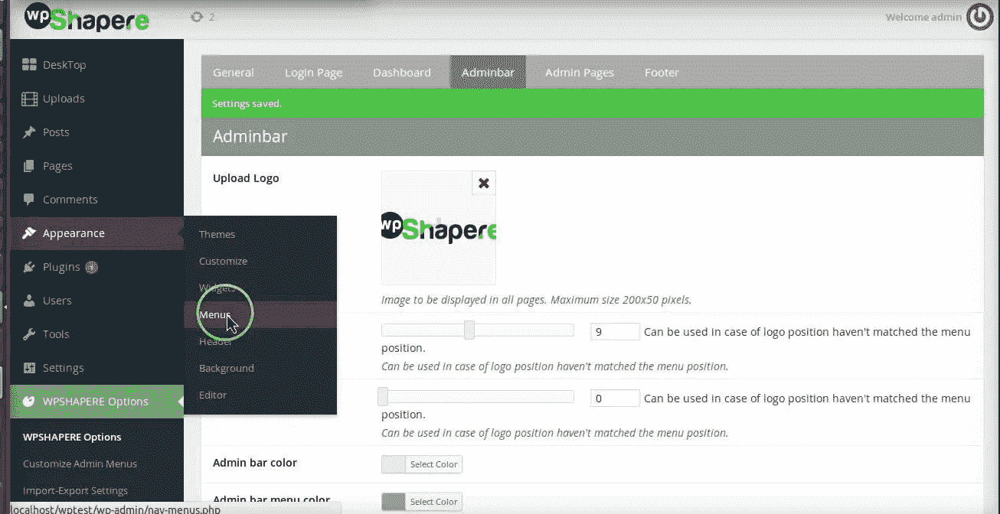

# 管理面板定制 WordPress 插件

> 原文：<https://medium.com/visualmodo/admin-panel-customization-wordpress-plugin-e9a21796950b?source=collection_archive---------0----------------------->

使用这个 WordPress 插件，你将能够以你想要的方式定制你的 WordPress 管理面板，这样你就可以给它一个你的业务需要的外观。

在今天的文章中，我们将讨论如何定制 WordPress 管理面板——也称为 WordPress 仪表板。具体来说，我们将分享 [WordPress 管理主题——WP shapere](https://codecanyon.net/item/wordpress-admin-theme-wpshapere/8183353?ref=wpexplorer)插件，并探索它的一系列特性，这些特性使我们能够定制我们的 WordPress 仪表盘的各个方面。

如果你曾在数字机构工作过，或者是一名自学成才的数字营销专家，你可能对定制 WordPress 仪表盘背后的*原因*很熟悉。如果你想找到症结所在——可以直接跳到插件评论。

不过，如果你对*了解*定制背后的原因很好奇，以下几段话适合你。我们试图回答的问题很简单:

为什么数字机构更喜欢 WordPress？WordPress 是一个 CMS，为将近 20%的互联网提供动力。它是这个星球上使用最多的 CMS。难怪大多数数字机构选择 WordPress 作为他们客户的首选 CMS。

以 Mindsize 为例，Mindsize 是一家专门从事电子商务的数字机构，总部位于伊利诺伊州的布鲁明顿。Mindsize 的任务是改造克林顿电子公司的在线商店，目标是提高网站性能和页面加载速度。

在这个案例研究中，我们使用了一个带有 WooCommerce 支持设置的 WordPress，它由 WordPress 支持，由最新版本的 PHP 7 驱动。中型企业最终获得了极快的加载速度。具体来说:

> 通过使用 PHP 7 迁移到专用的现代托管环境，实现了 60%的性能提升！

**那么，我们为什么要谈论使用 WordPress 的数字机构呢？我们大多数人都已经知道了！嗯，作为一家数字代理公司，在获得客户之前，有各种各样的战略决策需要考虑。**

*优秀的*机构通常会避免一刀切的方法。每个客户都被视为一个特例——解决方案通常根据*客户的*需求量身定制。

这些战略决策之一包括**白色标签**他们的解决方案。这个想法是提供一个简单可行的解决方案。所有复杂的内部功能都隐藏在一个机构品牌解决方案的*直观、*定制仪表板后面。由于 WordPress 的商业友好、开源代码以及它在 CMS 市场的霸主地位，大多数数字机构选择了 WordPress。

这就是 WordPress 的白色标签出现的地方。向客户提供代理品牌解决方案的最简单方法之一是**定制**WordPress 仪表盘(或管理面板)，使其看起来像代理的软件解决方案。我们将讨论一个插件来帮助你做到这一点！

# 管理面板定制 WordPress 插件

要开始使用，您必须安装最新版本的插件。只需在 Codecanyon 购买一份，然后使用 Envato Market 插件，确保您不会错过任何更新。一旦安装并激活，所有的插件设置都位于**下。**

现在让我们深入了解 WPShapere 必须提供的特性！这些特性有助于改进你的 WordPress admin [dashboard](https://visualmodo.com/wordpress-themes/) 的整体外观。

# 自定义 WordPress 登录主题

你想为你的客户定制的第一件事就是 WordPress 登录主题。因为这是你的客户访问 WordPress(也就是你的解决方案)管理面板时看到的第一样东西。

确保网站图标得到更新，并且登录主题与您客户的品牌标识相匹配。

要开始定制，导航到***WordPress Dashboard>WP shapere 设置>登录选项***

登录页面设置面板有大量的定制选项。此外，该面板本质上是直观的。我花了不到一分钟的时间为登录页面配置了新的背景，更改了徽标，添加了一些页脚文本等等。

您可以打开/关闭个别选项，如*返回博客*或*记住我*链接。你也可以完全禁用整个自定义登录页面，恢复到基本的 WordPress 登录主题。

# 管理菜单定制

WPShapere 允许您自定义位于仪表板左侧的管理菜单的名称、图标和可见性。要访问这些设置，请前往***WordPress Dashboard>WP shapere>自定义管理菜单***

在本例中，我将*仪表板*菜单项重命名为*控制面板*，并为其分配一个地球仪图标。

图标可以从 Dashicons 或字体 Awesome 中选择，并带有搜索功能。

在**可见性**方面，你可以重新安排管理菜单选项的顺序。您还可以对不同的用户组隐藏某些菜单项。默认情况下，所有管理员用户都可以看到所有菜单项。

# 仪表板小部件

另一个可以在 WordPress 管理面板中定制的很酷的东西是**默认的仪表盘部件**，它会在你每次登录时出现。只是这次使用 WPShapere，您可以定制这些小部件的内容。您可以定制四个部件，还可以隐藏不需要的部件。选项在: ***下可用***

例如，如果你是一个自由职业的网站开发者或代理人，你可能想在这些小部件中发布你的公司信息或支持细节。

如果您碰巧有一个博客，您可以使用 RSS Feed 小部件将您博客的内容放在您客户的网站上。

# 管理栏自定义

你可以在位于 WordPress 仪表盘顶部的管理菜单栏中包含自定义菜单项。要设置这个选项，创建一个菜单从: ***仪表盘>外观>菜单***

一旦你建立了菜单，在菜单设置中选择**显示位置**下的**管理栏菜单**。这将把菜单放在 WordPress 管理栏的顶部。

您还可以更改徽标，从菜单中删除预先存在的元素，如 WordPress.com、网站名称等。从位于 ***的 WPShapere 选项面板***

# 自定义 WordPress 管理仪表板主题

WPShapere 为 WordPress 管理仪表板提供了 16 种内置的颜色方案。要配置这个选项，进入***WordPress Dashboard>WP shapere>导入主题***

选择十六个主题中的任意一个，点击**导入主题**就大功告成了！

# 页脚自定义

页脚定制选项非常简单。替换默认的“感谢您使用 WordPress 创建”在你的管理面板底部，简单地导航到 ***WordPress 仪表盘> WPShapere >页脚选项***

然后添加所需的文本，并单击保存更改。

*   **强大提示:**在文本中包含额外可见性的链接！

# 外发电子邮件定制

WPShapere 还允许你自定义 WordPress 发送的所有邮件的名称和电子邮件地址。例如，如果一个新用户在你的网站注册，一个定制的“发件人姓名”和电子邮件地址会给人留下很好的第一印象！这些设置位于: ***WordPress 仪表板> WPShapere >电子邮件选项***

# 常规定制

WPShapere 的“常规选项”选项卡为您提供了一些非常独特的选项，包括:

*   禁用 WordPress 的自动更新，包括关于自动更新的电子邮件提醒和 WordPress 更新通知。
*   完全隐藏特定元素，如前端的管理栏，屏幕选项按钮等。

你可以从***WordPress Dashboard>WP shapere>通用选项*** 访问这些设置

然而，我不建议禁用[更新通知。更新到 WordPress 的最新版本是一个严格的安全要求。如果你很难管理多个 WordPress 站点，你可以使用像 ManageWP 这样的解决方案！](https://visualmodo.com/blog/)

# 用户权限

我们想要介绍的 WPShapere 必须提供的最后一个强大选项是基于用户权限的选择性视图*。如果你不希望你的非技术通用户在一个实时的 WordPress 部署中四处窥探，这是非常有用的。*

您始终可以创建具有较低权限的新用户，*或*您可以将查看权限分配给具有相同*访问权限的特定用户(即管理员)。*

在本例中，只有 *Sourav* 可以访问所有管理菜单链接。用户 *greensdk* 即使是管理员也没有访问权限。在我忘记之前，**菜单定制选项**在通用选项下可用(与上一个位置相同)。

# 更多到管理面板

WPShapere 在多站点安装上表现出色，并且兼容流行的插件，包括 Contact form 7、Visual Composer、WP Super Cache、WP Total Cache 和 WooCommerce。这对你的 WordPress 网站的前端来说是非常好的。

但是也许你想让你的管理面板更加实用？给[管理员专栏 Pro](https://www.admincolumns.com/) 一个尝试！我们最近在管理专栏专业版的内容管理指南中介绍了所有令人惊叹的功能，这使您(和您的博客作者)更容易创建、编辑和组织内容。

具体来说，您可以创建定制的列集来显示特定的用户角色——也许是与您的定制仪表板设计的一个很好的组合？Admin Columns Pro 也能很好地与 multisite 一起工作，使它成为你的客户工作或更大的 WordPress 站点网络的优秀工具。(注:我们没有亲自测试这两个插件的兼容性，但我不明白为什么他们不会玩得很好)。

# 遗言

好了，伙计们 WPShapere 插件的完整演示(加上一些额外的提示),以任何你认为合适的方式定制你的 WordPress 管理面板！我们错过了什么功能吗？让我们知道！

一如既往，我们希望收到您的来信。你使用 WordPress 的 while label 品牌解决方案吗？如果有，是 WPShapere 吗？如果没有，你是否考虑转行？