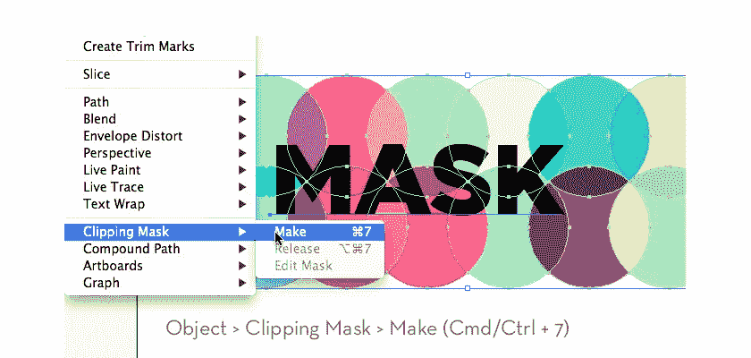
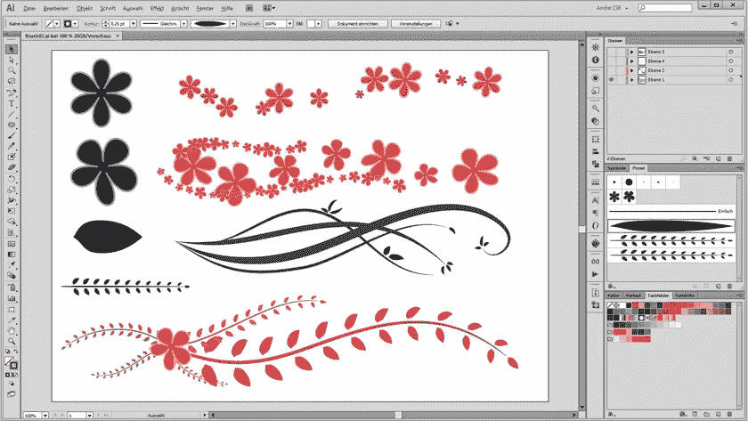

# Adobe Illustrator 提示

> 原文：<https://medium.com/visualmodo/adobe-illustrator-tips-7fa491acc9f9?source=collection_archive---------0----------------------->

## 对于初学者

如果你以前从未使用过 Adobe Illustrator，这个程序一开始可能会让人不知所措。事情太多了，你从哪里开始呢？如果你来自另一个图像编辑工具，比如 Photoshop，那就更是如此。这些顶级提示和工具将帮助您充分利用使用 Illustrator 的时间，并帮助您创作出优秀的作品。

# Adobe Illustrator 初学者提示

# 1.不要害羞；使用钢笔工具

许多初学者回避钢笔工具，因为它看起来比 Illustrator 提供的任何其他工具都复杂。然而，事实上，你可以很容易地掌握它，并用它创造出令人惊叹的艺术。如果你不确定从哪里开始，试着在网上寻找练习。他们会告诉你如何使用它，很快你就可以充分利用这个工具。

# 2.使用颜色抄送

创造[专业](https://visualmodo.com/)外观艺术的一个方面是挑选彼此搭配的颜色。Illustrator 已经内置了一个工具，可以帮助你做到这一点，称为颜色 CC。“这个工具可以帮助你从一个色轮中挑选颜色，”来自《最佳英国散文》的初级设计师安吉拉·赫顿说。“我用它来选择我的颜色，然后将它们保存到调色板中，这样更容易再次找到它们。”

# 3.掌握贝塞尔曲线

贝塞尔工具帮助你创建看起来自然的点和曲线，这可以为你的插图增加很多。同样，如果你想知道如何使用它，查阅教程是个好主意。另一个好主意是使用快捷方式使使用这个工具更加容易。例如，按住 shift 键会将下一个点捕捉到 45 度角。

# 4.尝试使用剪贴蒙版

剪贴蒙版是一种工具，可以使你的工作变得更加容易，每个初学者都应该使用它们。它们是一种工具，将任何模式或[设计](https://visualmodo.com/)限制在一个预先确定的区域。如果你能正确使用它们，它们可以节省大量的时间。

# 5.使用在线工具

还有其他在线工具可以帮助你每次都创作出优秀的插图。看看这些照片，自己看吧。

EnvatoTuts+ :这个网站提供了很多关于 Adobe Illustrator 的帮助，包括教程。

[英国服务评论](https://ukservicesreviews.com/):这里有很多例子，你可以用它们来学习 Illustrator。

[Adobe 支持](https://helpx.adobe.com/support.html#/top_products):如果你在 Illustrator 上遇到任何问题，这里是你的最佳去处。

[写作状态](http://stateofwriting.com/):这个网站是一个交流工具，你可以用它来改善你插图中的交流。

# 6.利用探路者

简单地说，Pathfinder 可以帮助你用其他形状制作形状。如果你想要的形状不是现成的，你可以用这个工具来制作。一旦你有了基本的东西，这是一个很容易掌握的工具，它会比你想象的更有用。

# 7.熟悉“描边”面板

当您在 Illustrator 中使用钢笔工具或形状创建形状时，将会对其应用自动描边粗细和定义。Reviewed 的专业设计师杰里米·艾利森(Jeremy Allison)说:“一定要了解笔画面板并加以利用。“这有助于你充分利用你画的每一个形状，并为你的[设计](https://visualmodo.com/)增添一些个性。”

# 8.制作自己的画笔

很多人不知道，其实用 Illustrator 也可以自己制作画笔。如果你发现基本的工具不是你工作所需要的，你可以创造它们。同样，你可以在网上搜索好的教程，或者你可以在网上定制工具。

# 9.练习使用图层

作为一名插画师，图层面板是你必须习惯的一个面板，尤其是如果你打算出售你的作品。即使你不是，在工作时开始组织图层也是一个好习惯。当您对图像进行编辑时，保持标记并移除不需要的图层会有所帮助。

# 10.继续练习

给你的最重要的提示是坚持用 Illustrator 练习。你用得越多，你就会越习惯它。很快，你就可以用这个成像工具创造出令人惊叹的东西。你会得到你所投入的，所以继续努力。

当你开始的时候，记住这 10 条建议。当你熟悉了 Illustrator，你就可以用它创造出各种令人惊奇的东西。

**不断练习，不断学习，你就能创造出真正脱颖而出的图片。**