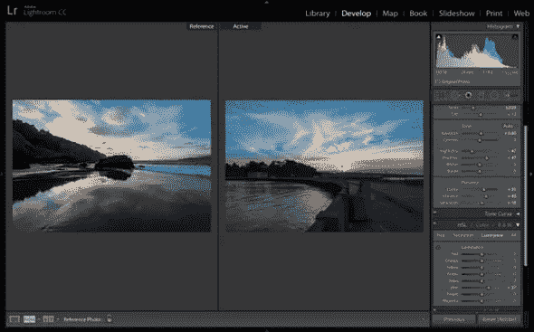

# Adobe Lightroom 指南

> 原文：<https://medium.com/visualmodo/adobe-lightroom-guide-94c229d8d39c?source=collection_archive---------0----------------------->

如果您是 Adobe Lightroom 的新手，不知道从哪里开始，或者想过使用它，但感到不知所措，那么请知道我感受到了您的痛苦，并知道您来自哪里。我写了这本 Lightroom 初学者指南来帮助你，我希望我刚入门时也有这样的东西。它旨在帮助您完成一些基本步骤，从首次打开 Lightroom，进行两次基本编辑，到导出(保存)图片的最终版本。

Adobe Lightroom 是专业人士和业余爱好者的绝佳工具。虽然摄影师是 Lightroom 的主要用户，但它对网页设计师也有一些好处。Lightroom 的主要优势之一是能够组织您的整个照片库。作为一个网页设计师，你可以用它来组织客户的照片。

Adobe Lightroom 的另一个好处是，您可以快速有效地编辑照片，这在处理数百张需要以一致的方式编辑的照片时可以节省大量时间。

如果您刚刚开始使用 Lightroom，学习如何有效地使用它是改进和加快工作流程的一个好方法。在本文中，我们将分享 Adobe Lightroom 的 18 个提示和技巧。

# Adobe Lightroom 指南

这里分享的技巧既适合初学者，也适合已经熟悉 Lightroom 的人，会帮助你更快地编辑照片。

# 了解 Lightroom 快捷方式

像所有其他 Adobe 应用程序一样，Lightroom 附带了许多快捷方式。学习快捷方式将节省你几个小时的时间，让你更快地编辑照片。

其中一些我们已经提到过了，但是你可以通过点击**帮助>模块名称快捷方式**找到每个特定模块的更多快捷方式。或者，按键盘上的 CMD /或 CTRL /来访问它们。

# 尝试独奏模式

下一次你在编辑模式下编辑照片时，右击任何打开的面板并选择 Solo 模式。启用独奏模式后，每次你打开一个面板，其他面板就会关闭。不再需要在无尽的面板中滚动来找到你需要的！

# 使用智能预览

如果您将照片存储在外置硬盘上，您将会爱上智能预览功能。该功能会创建一个较小版本的照片，即使断开硬盘连接，您也可以继续编辑它。它还有助于提高 Lightroom 的性能，因为智能预览文件比原始照片小。

要启用智能预览，请转到**首选项>性能**。然后，选中使用智能预览而不是原件进行图像编辑旁边的框。

# 在调查模式下比较照片

如果你的客户在他们的网站上给你一大堆相似的照片，调查模式可以帮助你挑选最好的。只需突出显示所有照片，然后按键盘上的 N 键。你将能够并排比较它们，并决定哪些值得保留。

# 利用预设

Lightroom 预设允许您通过将同一组[样式](https://visualmodo.com/blog/)应用到每张照片来显著加快工作流程。你可以在网上找到数百个免费和付费的预置，也可以自己制作。

如果您想更高效，可以考虑根据预设的功能将它们组合在一起。例如，您可以将几个控制亮度和饱和度的预置组合在一起，并将控制锐度、镜头校正等的预置组合在一起。要将预设组合在一起，请将它们拖放到预设面板上。

# 创建您自己的预设并在导入过程中应用它们

说到预置，如果你已经有一个既定的工作流程，你可以把这些编辑变成你自己的预置。你所要做的就是编辑一张照片，然后点击预设面板中的 **+** 图标。在弹出的窗口中，检查所有你想包含的设置，命名预置，点击 **OK** 按钮。然后，您可以右键单击该预置并选择**在导入时应用**。

# 添加元数据后，使用 CAPS LOCK 自动前进照片

使用键盘快捷键，您可以快速将元数据添加到图库模块中的照片。p 和 X 键将允许您标记照片为挑选或拒绝，使用数字允许您添加星星和旗帜，以便更好地组织。在您标记了当前照片并添加了所需的元数据后，Lightroom 将与 CAPS LOCK 键配合使用，自动前进到下一张照片。

# 组织您的工作空间

默认情况下，Lightroom 会在屏幕的右上角启用几个模块。这些模块包括图书馆、开发、书籍、幻灯片、地图等，但你可能不会一直都需要它们。只需右键单击任何模块名称，取消选中您不想看到的模块。这将帮助您在模块之间快速切换，而不会浪费时间。

# 快速重置滑块

如果您发现自己不喜欢使用各种滑块后的结果，您不必手动将它们移回零。双击滑块名称，它将重置为默认值。您也可以按住 ALT 键将滑块的名称更改为重置链接。

# 设置水印

如果您的客户想要在照片上添加水印，您可以在 Lightroom 中轻松添加。为此，点击 **Lightroom >编辑水印**。在加载的屏幕上，您可以应用图像或设置文本水印。您还可以调整不透明度并控制水印的位置。

# 将一张照片的设置应用到目录中的其他照片

编辑完图像后，即使您尚未创建预置，也可以应用这些更改和设置。选择您编辑过的图像，然后突出显示目录中的所有其他图像。单击同步按钮。将会打开一个窗口，您可以在其中选择要应用于其余图像的特定设置。点击**同步**，更改将立即生效。

# 使用熄灯模式聚焦

如果你想专注于一幅图像，并确保你没有做太多的编辑，按下键盘上的 L 键。屏幕的其余部分将变暗，使您的图像聚焦，这样您就可以看到自己在做什么。你甚至可以通过再次点击 L 键完全关闭 Lightroom 的屏幕，并通过第三次[点击](https://visualmodo.com/blog/)将其重置为正常。

# 利用智能收藏

我们已经提到过，Lightroom 提供了一种整理照片的好方法。您将在“收藏”面板中看到按月份和年份组织的文件夹，但是，您可以根据自己的偏好创建智能收藏。

首先，确保你在图库模块中，点击收藏面板中的 **+** 键。选择**创建智能收藏**。将会出现一个对话框，您可以根据评级、标志、图像大小、拍摄日期等设置自己的规则。

定义完所有规则后，点击**创建**。你可以用它来组织客户和我的项目的照片，当然还有你自己的个人和专业照片。

# 继续在 Photoshop 中编辑

如果需要应用更高级的操作，您可以继续在 Photoshop 中编辑照片。在> Adobe Photoshop 中点击**照片>编辑。你也可以右键点击照片，选择**编辑在>编辑在 Adobe Photoshop** 。**

您可以将照片导入为智能对象、图层等。一旦您选择了导入照片的方式，Lightroom 将询问您是否要编辑照片，是否要在 Lightroom 中进行更改。

选择所需选项后，当前照片将在 Photoshop 中打开。进行必要的调整保存更改，这些更改将反映在 Lightroom 中。

# 提高 Lightroom 的性能

除了使用智能预览，如果您发现 Lightroom 变得有点慢，还可以尝试其他一些调整。转到**首选项>性能**并执行以下操作:

*   取消选中使用图形处理器
*   优化您的产品目录
*   将相机原始数据缓存大小增加到 20GB 或更高

# 将照片导出为图库

完成修改后，您可以将所有照片导出为网络画廊。为此，请转到 Web 模块并选择一个模板。如果找不到您喜欢的模板，您可以在线下载其他图库模板。

在右侧，您可以设置版权信息并输入 FTP 信息，以将图库自动上传到您或您客户的网站。

# 在 Adobe Lightroom 和 WordPress 之间同步照片

使用类似 [WP/LR Sync](https://wordpress.org/plugins/wplr-sync/) 的插件，你可以将你的 Lightroom 库、关键词和元数据与你的 WordPress 站点同步。您在 Lightroom 中所做的任何更改都会立即显示在您的博客上，您甚至可以将之前导入的图像链接到 Lightroom。请记住，您还需要下载相应的 Lightroom 插件。

# 通过在导入时应用预设来节省时间

作为我们的最后一个技巧，你可以在导入过程中对你的照片做很多事情。一旦您选择了所有想要编辑的照片，您就可以给它们重新命名、指定它们应该放在哪里、应用预置等等。