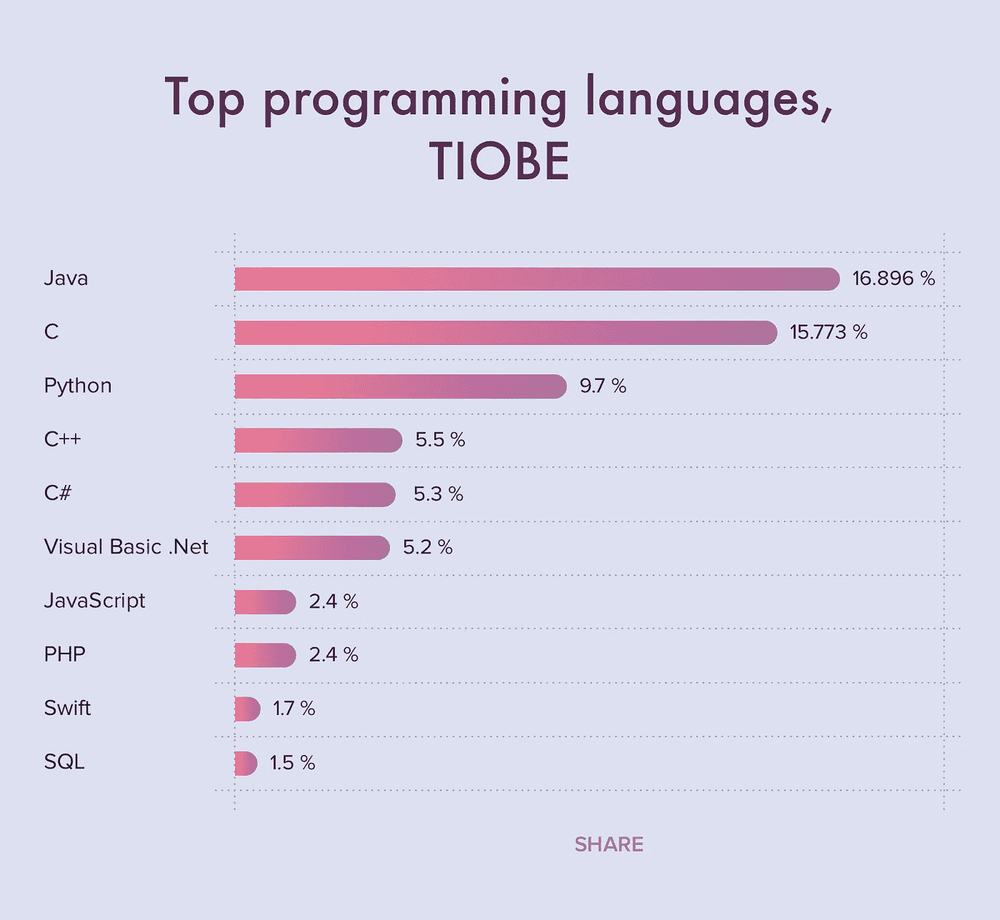

# 网站建设者的优势

> 原文：<https://medium.com/visualmodo/advantages-of-a-website-builder-2610ab06f7d8?source=collection_archive---------0----------------------->

在一个网站建设者的帮助下，你不需要有任何早期的编码或配置经验。这些醒目而吸引人的修改格式为客户提供了一个用户友好的工具，以他们的方式创建网站。站点设计工具是可靠的，并且被许多协会和金融专家信任来构建和处理他们的站点。这种工具的一个例子是网站构建器。使用此工具，您可以有效地将图片添加到预制区域，以获得您想要的结果。所以，突出你的视觉效果，网站设计师通过他们的服务提供超过 17，000 张图片，帮助你用最先进的渠道编辑你的照片。你也可以链接到你的社交媒体渠道，比如 Instagram 或者脸书。在这里看到一个网站建设者的优势。

你可以创建个人博客、网络杂志或公司网站。这些工具、插件和插件有许多应用领域。我们将看看一小部分可能的领域。

# 网站建设者的优势:创建自己的博客或杂志

对许多人来说，网络博客是与世界各地的读者分享想法、想法和兴趣的机会。从网络日志的可能性开始——类似于网络日志的在线日志——现在已经得到了最好、最广泛的传播。博客作者通常不是私人作者。他们是特定主题的发起人、影响者和专家。

很多博客都是基于 WordPress 的，很好用，有很多功能。你可以添加图片，组织文章，包括视频等等。有很多[主题和插件](https://visualmodo.com/wordpress-themes/)可用。

如果你想创建一个时尚博客、美食博客或观光博客，你已经迈出了第一步，并找到了主题。除了像杂志文章一样的博客文章，你还可以建立一个问答区，或者通过评论与你的读者互动。

一个包含博主个人信息、他的激情和兴趣的子页面对于获得信任和吸引读者的注意力非常重要。

简而言之:你可以用一个网站构建器来做这件事:

*   首先，建立一个问答区
*   其次，使用注释部分
*   最后，一个带有子页面的站点结构

这些方面对于私人博客和公司分享他们的新闻、知识和一般信息是很重要的。

# 创建没有编程知识的网站

如前所述，如果你想创建一个网站，并不需要深入了解 HTML、CSS 和 JavaScript。当然，这些方面的基础知识从来都不是一个坏主意，但是许多工具可以弥补这些领域中的知识缺乏。你必须决定网站应该有什么样的结构，收集信息，并把它们放在一起。

最新的 TIOBE 指数列出了 2020 年的顶级编程语言:

这说明，如果你有足够的时间，看看总是好的。

使用 WordPress 或其他平台，你不必是一个程序员。所以，看看专业开发者最想要的平台就知道 WordPress 不是重点。但是许多公司和博客也使用 WordPress，因为它很简单。网站建设工具也是如此。它们对用户友好，易于使用。

只有 2.6%的程序员认为 WordPress 是他们最想要的平台。值得一提的是，并不是每个人都想创建博客或在线杂志。出于这样的目的，WordPress 和相应的网站建设者是完美的选择。许多提供网站建设服务的公司也提供 WordPress 托管服务。集所有功能于一身，操作简单、舒适。

# 适用于移动和桌面版本的适应性设计

用户使用不同的设备访问网站。此外，一个网站需要适应这一点，并以一种反应式的设计来运作。这使得用户可以使用任何设备访问网站，并且没有任何可用性限制。此外，图片和文本会根据屏幕的大小进行缩放并与之相适应。因此，用户现在可以决定他们是想使用网站的移动版本还是通过智能手机访问桌面版本。

如果你建立一个网站，你不得不考虑这一点。有了网站生成器，这可以自动化。

# 没有任何设计知识设计一个网站

你所需要的是一台电脑和一个互联网连接来创建你自己的网站。所以，你不一定要成为设计师。网站建设者包括各种设计和布局。此外，这可与 Microsoft Office 程序中的设计模板相媲美。挑一个你喜欢的，加上你的内容就行了。

# 网站建设者的优势总结

网站建设者有几个优势:

*   首先，你可以节省时间，因为你不必学习 HTML，Java，或其他。
*   其次，你可以省钱，因为你不必支付外部网页设计师。
*   实现许多不同的媒体和。
*   客户支持始终是服务的一部分。
*   你可以创建个人博客或公司网站。
*   用户友好和直观的布局和设计。
*   用响应式设计创建网站。
*   最后，在没有设计知识的情况下设计一个网站。

还有更多！请随意尝试！您的网站只需点击一下！