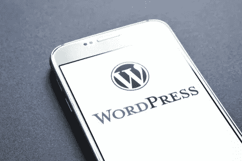

# 新西兰联盟营销:你的网站策略

> 原文：<https://medium.com/visualmodo/affiliate-marketing-nz-strategies-for-your-site-94d3989533a?source=collection_archive---------0----------------------->

如果你有一些严肃的写作技巧——考虑到你有一个功能正常的 WordPress 网站，你可能已经有了——并且你想围绕内容开展在线业务，那么新西兰联盟营销可能是你正在寻找的一个。

# 新西兰联盟营销

随着越来越多的人逐渐意识到拥有这样一个网站在提高品牌知名度和扩大业务范围方面的重要性，WordPress 不再仅仅是一个个人日记。最重要的是，WordPress 正变得越来越重要，因为当它以联盟计划的形式与联盟营销整合时，它提供了许多好处。联盟营销最适合定期发布新内容的博客和网站，如 WordPress 网站。这两个强大的在线工具的结合，WordPress +联盟营销，会给你 WordPress 联盟计划，允许你使用你的 WordPress 站点，社交媒体账户，和/或电子邮件列表来推广你的产品。

如果你想利用你的 WordPress 网站进行联盟营销，那么和我一起讨论有效的策略，让你开始这个旅程。

# 发布高质量的内容

“内容为王”——你可能已经听过和读过很多次了。营销你的网站是一回事，但制作内容迫使用户点击你的链接并向你购买是完全不同的另一回事。你的内容应该是最高质量的，你应该定期发布，不能出错。博客网站总是最好与高质量的内容配对，尤其是如果你使用的是巨大的和有声望的 WordPress。你必须确保你的博客是有价值的，吸引人的，写得好的，并且按照博客文章的标准正确地格式化。也就是说，不要为了数量而发布任何内容。请记住，无论你在营销世界的哪个位置，质量总是比数量重要，尤其是在内容生成方面。

# 明智地选择你的产品

在你的 WordPress 网站上推广产品时，只有正确和最好的产品才会胜出。当然，你可能会注意到，在 WordPress 上推广的极其廉价和低质量的产品似乎做得很好——也许在一开始，但肯定不会长久。推销“劣质”产品可能会让人们对你的企业失去信任——这绝对不是好事。如果你不想要短暂的成功，就只营销[高质量](https://visualmodo.com/blog/)的产品——有价值并能解决人们问题的产品。你会惊讶地发现，人们愿意花多少钱来买到物有所值的东西。你也会赢得一个好名声，作为一个值得信赖的人，用不了多久你就会得到一个强大而稳定的追随者。

# 推广你的 WordPress 联盟网站

当你有值得骄傲的高质量内容时，推广你的网站将会很容易。尽你所能吸引访问者到你的网站。只要确定你没有使用不道德的策略；否则，谷歌可能会因此处罚你的网站。不仅要在网上推广你的网站，也要通过线下的方式，比如平面广告、直邮、广告牌等等。

# 利用联盟营销工具

幸运的是，我们生活在一个可以利用各种现成在线工具的时代。也许联盟营销最大的好处之一就是你可以在任何网站上使用它。有了 WordPress，你可以使用多种工具来最大化你的联盟营销努力，并帮助你有效地管理和发展你的网站。这些工具大部分是作为插件使用的，好消息是附属插件允许你保持对你的网络的完全控制和所有权。因此，给你的 WordPress 添加一个优秀的联盟营销工具是获得成功的一个可靠途径。一些最好的营销工具是 Yoast SEO、Google Analytics for WordPress 和 AffiliateWP。

# 结论

创建和运营一个 WordPress 联盟网站似乎对你来说太难了。事实上，你不能用它一夜暴富。赢得这场商业冒险需要时间、努力和耐心。也就是说，请放心，如果所有那些成功的高收入联盟网站都是可靠的，这种商业模式是完全可行的。现在就查看新西兰联盟营销。他们提供一些被许多公司使用的世界顶级联盟计划。