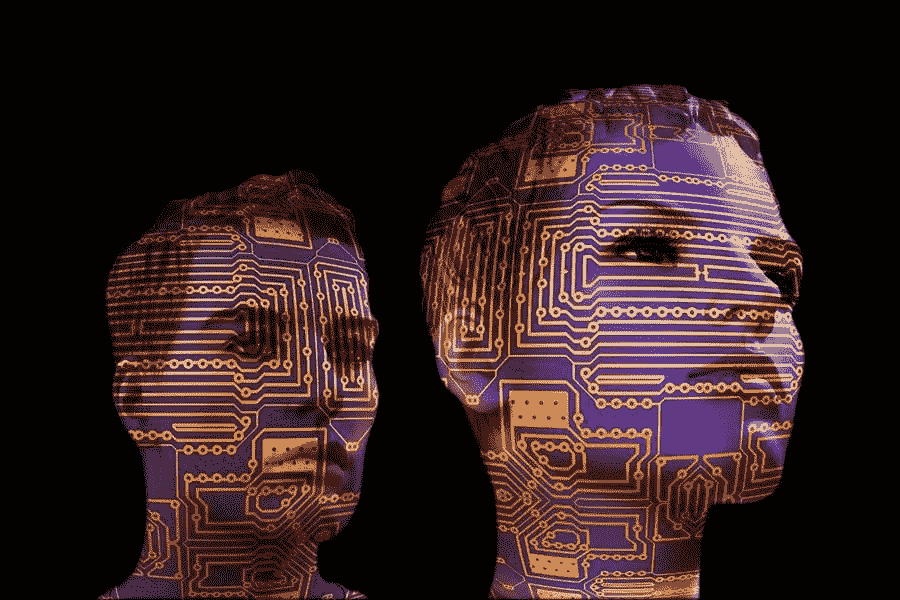

# 人工智能将改变销售线索生成流程

> 原文：<https://medium.com/visualmodo/ai-will-transform-the-lead-generation-process-e7e9b164ff43?source=collection_archive---------0----------------------->

潜在客户的产生经常被营销人员认为是最大的挑战。然而，由于人工智能技术渗透到营销的方方面面，事情正在发生变化。在一项调查中，80%的受访者表示，到 2020 年，人工智能将彻底改变营销。同一份报告还指出，实施人工智能的企业的销售额增加了 59%，收入增加了 58%，流量和参与度增加了 54%，转化率提高了 52%。在今天的文章中，我们将看到人工智能将改变和革新线索生成过程的 4 种方式。

难怪人工智能正在迅速整合到 B2B 和 B2C 营销人员的工作流程中，以自动化线索生成和客户细分活动。据 Salesforce 称，自动化销售线索挖掘可以将销售效率提高 14.5%。

# 人工智能和不断变化的数字营销世界

人工智能无处不在，对于领导一代也是如此。从聊天机器人到 Siri 和 Alexa 这样的个人助理，人工智能技术越来越普遍。各行各业都能找到应用，尤其是数字营销。

以下是基于人工智能的应用程序改变营销核心方面的四种方式，包括产生和培育线索:

## 1.智能聊天机器人正在促进实时交流

雇用人工代理来回复个人电子邮件和查询是成本密集型和耗时的。令人欣慰的是，对话聊天机器人可以全天候回答常见问题，同时大大减少响应时间和参与每个线索的总成本。

# 在您的工作流程中集成聊天机器人的好处

*   减少等待时间。当顾客被迫等待时，你就失去了他们的兴趣。有了聊天机器人，你可以 24/7 全天候支持客户，大大减少了联系的时间。大量的询问会降低您的支持团队的效率，并造成积压。然而，聊天机器人是一种机器，可以同时与多个客户交谈。他们永远不会感到疲倦或沮丧——这导致了更快更好的服务。聊天机器人可以处理高达 80%的客户咨询，并与您的销售和服务团队一起翻译和回答问题，同时从任何新的互动中学习。
*   让顾客在销售漏斗中下移。除了通过语义分析根据上下文解释用户的查询并分享适当的响应来吸引用户，聊天机器人还可以引导您的客户进入销售漏斗的下一步。他们根据 IFTTT 程序，通过模仿人类对话来做到这一点，并毫不拖延地向客户提供他们想要的东西。因此，人工智能将改变线索生成流程。
*   个性化内容。聊天机器人可以帮助个性化网站内容，增加客户参与度，从而提高转化率。一些虚拟助理还采用预测建模来衡量用户可能感兴趣的优惠或内容。因此，他们可以预测您的用户的需求，甚至在他们要求之前就向他们提供他们想要的，从而有效地将他们转移到销售漏斗中。
*   与其他软件集成。大多数聊天机器人平台与您现有的客户关系管理、电子邮件提供商和其他数据源合作，提供高度个性化和自动化的客户服务。您也可以使用聊天机器人，通过问一系列预先确定的问题来确认您的销售线索。这不仅可以创建更好的客户细分，还可以为流程中涉及的每个人(包括您的客户)节省时间。

## 2.人工智能改变了销售线索的生成:通过机器学习来个性化客户体验(ML)

ML 技术使机器能够根据过去的流程和行为进行学习和发展，帮助营销人员个性化客户体验。营销人员可以使用 ML 来自动化诸如线索生成和广告定位之类的过程，从而释放他们宝贵的时间来关注业务中更具创造性的方面。因此，人工智能将改变线索生成过程。

用户对他们互动的品牌的定制信息和[体验寄予厚望。因此，营销人员必须将他们的广告和其他活动建立在购买者角色的基础上，而购买者角色是根据从每个访问者那里收集的数据创建的。使用机器学习算法的人工智能分析通过比人类更好地发现行为模式，使这一过程更快、更准确。很快，这类系统将处理大数据集，以创建高度准确的买方角色，同时还生成定制的副本，以匹配各种配置文件中用户的偏好。](https://visualmodo.com/5-tips-start-successfully-ecommerce-brand/)

## 3.使用人工智能创建个性化内容

Wordsmith 是企业用来生成自动内容的新人工智能程序。在一篇新闻文章中，Wired.com 报道说，媒体公司，如美联社，使用“软件生成关于公司盈利报告的新闻故事。”甚至福克斯也在其网站上自动生成各种体育新闻摘要，雅虎使用类似的技术为其用户创建定制的体育报道。这是通过从 CSV 文件中输入人工智能程序数据，并根据 IFTTT 程序用文本填充预设模板来实现的。对于营销人员来说，这在创建和分发高度个性化的内容时节省了时间和成本。

## 4.利用人工智能来改变销售线索的产生

如今，人工智能技术有助于吸引和培养潜在客户。复杂的基于人工智能的程序也能够根据你以前的偏好和数据为你的业务产生线索。例如，人工智能可以快速筛选大量的交易和用户数据。从各种来源来确定你的理想客户，以及员工。这种软件还可以自动发送电子邮件和安排会议，以简化您的日程，为每个人节省时间。

# 人工智能改变领先一代的力量:

智能和创新地使用人工智能技术有能力改变你的线索生成过程。所以，它会显著影响你的利润。除了缩短响应时间和向访问者提供个性化内容。营销人员还可以利用人工智能应用的行为洞察。此外，预测分析，以建立有效的数字营销活动和支持线索生成过程。

你如何看待 AI 在数字营销中的未来？请在下面的评论区分享您的观点；我们希望收到您的来信。