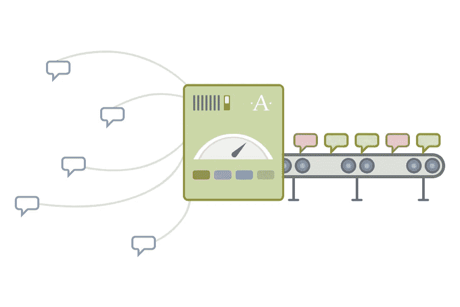

# Akismet WordPress 插件免费安装教程

> 原文：<https://medium.com/visualmodo/akismet-wordpress-plugin-free-setup-tutorial-daf052063e2f?source=collection_archive---------0----------------------->

如果你有一个 WordPress 网站，你肯定会收到一些不必要的评论，这些评论可能会伤害你的内容或读者。为了防止这种情况发生，你需要确保你有垃圾邮件防护。本文将介绍最好的反垃圾邮件插件之一 Akismet Anti-Spam，并解释如何做免费的 WordPress 安装教程。

# Akismet WordPress 反垃圾邮件插件到底是什么？

一旦你的 WordPress 站点上线，安装一个反垃圾邮件插件是必要的。该工具将删除垃圾邮件，并阻止它出现在您的页面上。它过滤所有收到的信息，并删除包含垃圾信息的信息。

很多插件都可以帮你完成任务，那你该去找哪个呢？在所有反垃圾邮件工具中，Akismet 反垃圾邮件是我们的首选。原因如下:

1.  高级统计—它还提供您站点的垃圾邮件活动的数据。它将显示每天到每年的垃圾邮件图表，误报，和错过的垃圾邮件。
2.  可靠的是，到目前为止，该插件已经阻止了超过 4.83 亿条垃圾评论。有了如此庞大的数据库，它越来越能区分哪些回复是垃圾邮件。
3.  Jetpack 和 Contact Form 7 集成—通过结合这两个平台，Akismet 可以进一步提高您网站的安全性，并阻止来自 Contact Form 提交的垃圾邮件。
4.  价格实惠:Akismet 的单个网站每月 5 美元，无限网站每月 50 美元，确实物超所值。甚至有一个免费版本也有不错的垃圾邮件防护。

既然你已经理解了 Akismet 有多棒，是时候学习如何把它添加到你的网站上了。

# 视频教程

首先，访问 Akismet WordPress 设置注册页面，选择第一个计划(个人)。这里 Akismet 会要求你交一些钱来开始。但这不是必须的。可以设置为 0 美元/年。现在输入您的电子邮件地址、姓名和网站 URL。检查这些盒子。然后点击“继续个人订阅”按钮。

Akismet WordPress 安装程序会向你的电子邮件地址发送确认码。复制并粘贴代码。然后点击“继续”按钮。Akismet 会发给你一个 API 密匙。去你的邮箱里复制代码。现在进入 WordPress 仪表盘>插件>已安装插件，点击 Akismet 反垃圾邮件下的“设置”。