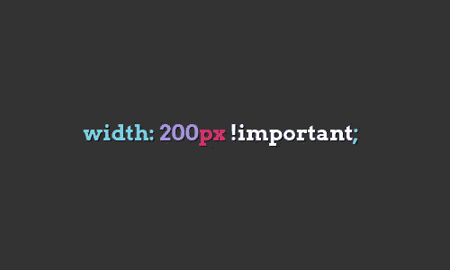
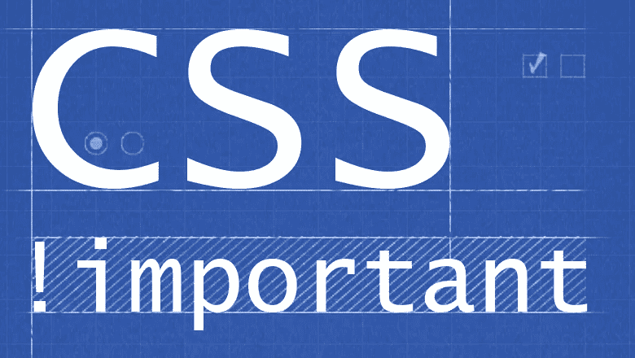

# 所有关于！重要的 CSS 规则

> 原文：<https://medium.com/visualmodo/all-about-important-css-rule-5b2707fd0b1a?source=collection_archive---------0----------------------->

CSS 规则就是用来被打破的，或者至少这是*背后的想法！重要。*这个！重要的 CSS 规则使得覆盖分布在多个样式表中的其他先前的样式成为可能。！重要本质上定义了某事重要(想象一下！)，忽略后续/冲突的规则。它使 CSS 样式与！重要的指定是最重要的，其他的都无效。[本质上是](https://visualmodo.com/)，它赋予 CSS 值比正常情况下更多的权重。

！重要的是，在 20 世纪 90 年代中后期，CSS1 规格推出。从此，！重要的基本上保持不变(在 CSS2.1 中只有一个变化)，它要么是一个祸根，要么是一个福音，这取决于你是使用它还是调试它的使用。

# 利用！重要的 CSS

就使用而言，重要是相当简单的。以下示例代码片段可以帮助您理解格式:

`p {
font-size: 12px **!important**; }`

！important 位于 CSS 声明之后，结束分号之前。分号前的一个空格不会断掉它，只要！重要的就放在这一行的末尾。

# 排序和覆盖 CSS 规则

！重要影响根据重要性和来源排序。根据 [W3C](https://www.w3.org/TR/CSS2/cascade.html#cascade) ，优先级的升序顺序为:

1.  用户代理声明
2.  用户普通声明
3.  创作普通声明
4.  创作重要声明
5.  用户重要声明

困惑了吗？你不是唯一一个。至此，是(！)重要的是还要注意局限性。浏览器支持！重要的存在于 IE5.5+，Firefox 1+，Safari 3+，Chrome 1+上。

覆盖 CSS 规则是复杂的。

更具体的 CSS 规则倾向于覆盖不太具体的 [CSS](https://visualmodo.com/) 规则。例如基本的，*不如*具体:

被*否决了更具体的*:

`#container h2 {
font-size: 14px; }`

当然，如果你申请的话！对前者很重要的是，它可以推翻后者。

在两个 CSS 声明具有相同的权重、顺序和规范的情况下，后者优先于所有其他的。

再者，根据[砸杂志](https://www.smashingmagazine.com/2010/11/the-important-css-declaration-how-and-when-to-use-it/)的说法，如果！在速记属性上使用了 importance，这为速记属性表示的所有子属性增加了“重要性”。

# 该不该用！重要吗？

[CSSTricks](https://css-tricks.com/when-using-important-is-the-right-choice/) 为使用做案例！这对实用程序类很重要，但是反对在几乎任何其他情况下使用它。

！重要在伦理上可以作为紧急问题的临时解决方案，尽管它不应该是项目的结束。一旦紧急问题得到解决，应该努力挖掘代码并在不使用 CSS 声明的情况下修复它们。或者，浏览器检查器工具可以帮助您确定并修复问题，而无需使用！[重要的](https://visualmodo.com/)。

的最终用例可能性！重要在于需要独特风格的页面或博客帖子。与提高可访问性的情况一样，这种解决方案只会影响某些部分，而不会影响网站的整体版本。

使用的主要问题！重要的是，它使得调试 CSS 问题变得困难，尤其是在将代码从一个开发人员传递给另一个开发人员时。如果你曾经因为搞不清楚到底是什么造成了一种特定的风格而准备拔头发，那很可能是懒惰使用！重要。

大部分开发商都公开反对！[重要的](https://visualmodo.com/)，但是它的私人使用最终导致了这些众多的调试问题。更多的时候，而不是找到问题的根源，额外！实现了重要的规则，这进一步混淆了代码。说到！重要的是，你是愿意成为引发和延续问题的人，还是解决问题的人？