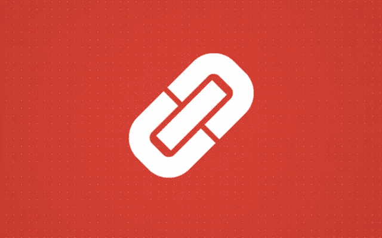
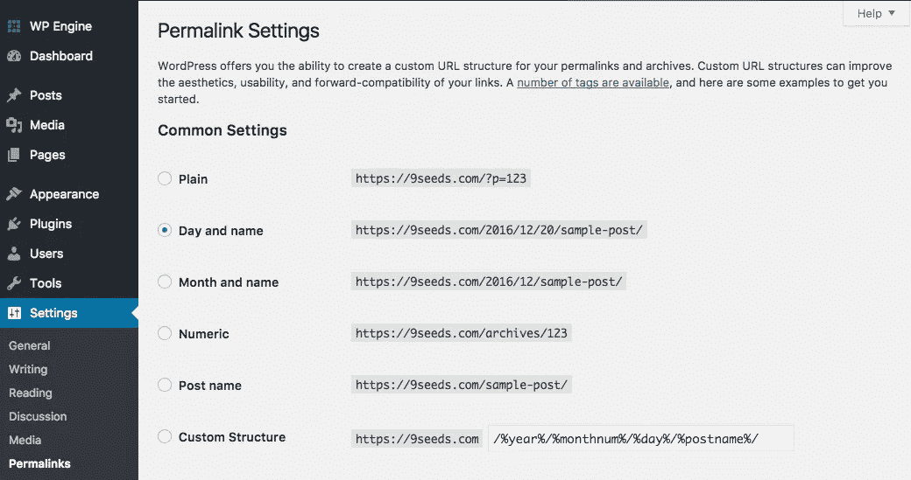
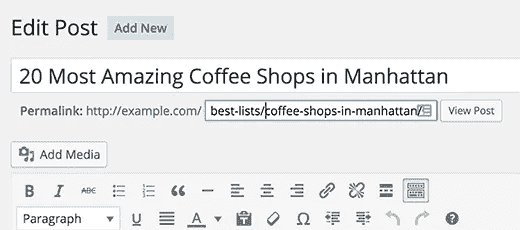

# 关于永久链接你需要知道的

> 原文：<https://medium.com/visualmodo/all-you-need-to-know-about-permalinks-3cb1d6a8d12c?source=collection_archive---------0----------------------->

永久链接是你的个人网页和博客文章的永久网址，以及你的类别和标签档案。永久链接是用来链接到你的内容的网址。

永久链接是你在网站上看到和使用的任何文章、页面或其他内容的完整网址。这是一个永久的链接，因此得名永久链接。永久链接可以包括你的域名(www.yoast.com)和域名后面的一段 URL。这可能包括一个日期或一个类别或任何你喜欢的东西。一个简单的永久链接使 URL 易于理解和分享。在这篇 [SEO](https://visualmodo.com/) 基础文章中，我们将仔细看看 permalink。

# 关于永久链接你需要知道的

永久链接是你网站的重要组成部分，因为搜索引擎和访问者都使用这些 URL 来索引和访问你的网站。你选择的永久链接的类型会影响这两方看待和评价你的网站的方式。一个结尾充斥着难以理解的胡言乱语的 URL 比一个简短的 SEO 友好的 URL 更缺乏可分享性和吸引力。永久链接的一个例子是:

`[https://www.you.com/category/post-name](https://www.yoast.com/category/post-name)`

也可能是这样的:

`[https://www.you.com/10/10/2017/post-name](https://www.yoast.com/10/10/2017/post-name)`

或者

`[https://you.com/post-name](https://yoast.com/post-name)`

默认情况下，WordPress 使用了一个对 SEO 不友好的永久链接结构。这些看起来像这样:

`[https://you.com/?p=101](https://yoast.com/?p=101)`

你看到的数字是 WordPress 为这篇[特别的](https://visualmodo.com/)文章准备的 ID。这是你网站数据库中的第 101 篇文章。虽然谷歌仍然理解该页面上的内容，但像这样的 URL 对你的 SEO 没有任何帮助。它没有描述页面提供什么样的内容，也不是用户愿意分享的内容。我们有没有提到它看起来不太专业？如果您的 URL 包含相关的单词，这将为用户和搜索引擎提供比 ID 或参数更多的页面信息。

# 永久链接的注意事项

确保你选择了一个符合你目标的永久链接结构。如果您有一个新闻网站，在 URL 中添加文章的出版日期可能是有意义的。然而，如果你打算写经得起时间考验的杀手级内容，不建议在 [URL](https://visualmodo.com/) 中使用日期，因为这可能会使内容看起来“陈旧”。

我们建议使用简单明了的永久链接结构。对于大多数网站来说，在域名后面加上文章名称是有意义的。所以在 WordPress 中，这将是/ *后缀/* 选项。在某些情况下，类别将有助于在 URL 中创建层次结构。请记住，这也可能导致过长的网址。

# SEO 插件和永久链接

Yoast SEO 是一个必备的工具，使 SEO 对每个人都可用。这是一个易于使用的工具，可以帮助你制作一个完美的网站。例如，如果你安装了 [WordPress](https://visualmodo.com/) 并且没有改变默认的永久链接设置，Yoast SEO 会敦促你改变它。Yoast SEO 有几个其他选项可以帮助你清理这些永久链接，比如剥离类别库(通常是类别)。

如果你改变一个永久链接或者删除一个页面，我们会阻止用户登陆 404 错误页面。Yoast SEO Premium 有一个出色的重定向管理器可以帮助你做到这一点。如果你改变页面的永久链接，它会自动创建一个 301 重定向。除此之外，如果你删除一个页面，它会问你是否想创建一个 301 重定向。只需输入你想让你的访问者去的网址，你就大功告成了！

# 最后，提醒一句

明智地选择你的永久链接结构。不要为了改变永久链接结构而改变它。不正确地将你的旧网址重定向到新网址可能会导致问题，并可能让你从排名下降。请考虑你的永久链接结构，然后再推出你的网站。如果你需要改变你的永久链接，你可以找到更多关于如何改变你的永久链接结构的信息，或者访问[谷歌关于移动你的网站的页面](https://support.google.com/webmasters/topic/6033102)。