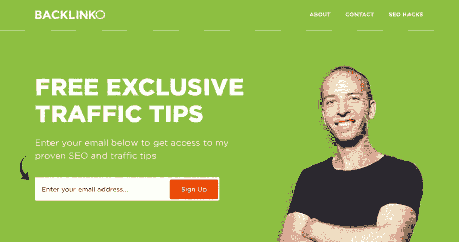
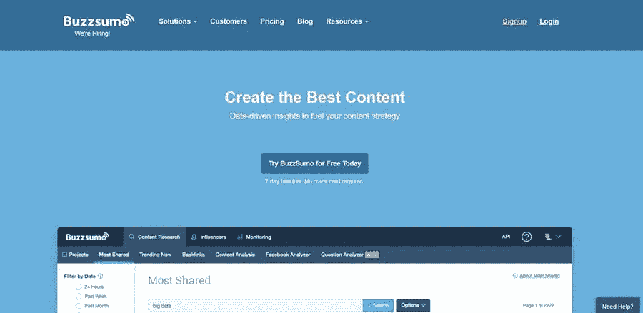
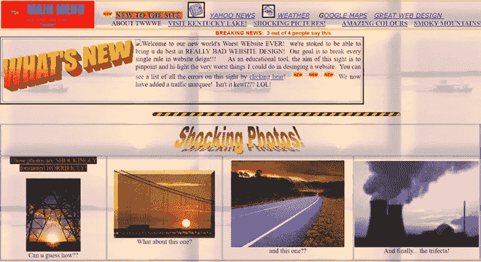
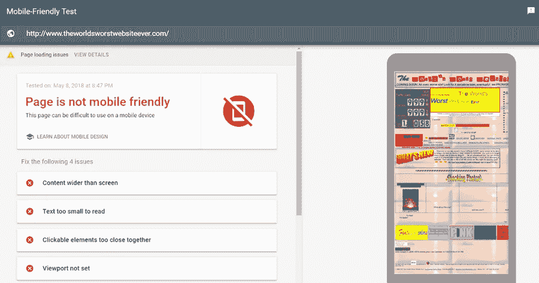

# 剖析一个黑仔网站

> 原文：<https://medium.com/visualmodo/anatomy-of-a-killer-website-c90c0f9c89ab?source=collection_archive---------0----------------------->

## 那会给你带来大量的销售

内容管理系统和各种网站建设者可能已经使非开发人员创建网站成为可能，但这并不意味着你可以到处走走，把一些页面元素拼凑在一起，然后抱最好的希望。

创建一个能有效实现你的在线目标的网站仍然需要一定程度的技巧和数字营销的敏锐度。

对于大多数转型到网络世界的品牌来说，通常都是为了完成更多的销售或产生更多的销售线索。不幸的是，这些目标需要的不仅仅是一个有大量视觉效果的浮华网站。

在本帖中，我们将剖析一个擅长将访问者转化为订户或付费客户的网站。

让我们直接开始吧。

# 1.面向用户的设计

网站以用户为导向意味着什么？

记住，作为一名网站开发者，你创建的网站不是为你自己或雇佣你的客户。你这样做是为了*的目标受众*，他们最终会访问这个网站并利用它的资源。

也就是说，你的首要任务是确保你选择的布局对[你的访问者想要做的事情](https://www.collectiveray.com/web-design/opinion/real-ux-design-how-to-separate-the-wheat-from-the-chaff-in-5-simple-ways.html)有意义。

他们是来学习新东西的吗？他们会来到你的网站期待完整的博客文章还是一个数字店面？

通过回答这些问题，您可以确定哪些页面元素必须在您的网站上突出显示，例如:

*   你的行动号召
*   选择加入的表格
*   解说视频
*   定价表

你或许可以在其中注入一些品牌形象，但你需要做的是最大化转化元素的可见性——同时以一种能引起目标受众共鸣的方式呈现它们。

例如，像布莱恩·迪恩这样的营销思想领袖也遵循整洁的网页设计规则:

另一个例子是 BuzzSumo 网站，它没有任何分散注意力的空间，并且直接切入他们的价值主张:

这里的要点很简单— *识别用户需要*才能前进的元素 *和*让他们成为焦点*。否则，你可能会选择这样的方式:*

# 2.移动友好

现在是 2018 年——你应该已经知道，更多的互联网用户来自移动设备，而不是个人电脑。但即使你没有，你也可能摆脱困境。

移动互联网的主导地位促使网站平台支持比以往更多的响应主题。这些功能通过自动调整、重新定位和缩放页面[元素](https://visualmodo.com/)来匹配不同的显示尺寸。

然而，一个响应式的主题有时不足以给移动用户带来引人注目的体验。你还需要优化你的移动网站内容，让体验像黄油一样流畅。

例如，宽高比的图像在桌面浏览器上可能看起来不错。但是在移动设备上，看这些照片感觉不太自然。

更好的策略是加入长格式的*信息图*，以利用智能手机和平板电脑的垂直显示屏。用户只需要上下滑动屏幕就可以查看他们提供的所有信息

要获得更多关于如何改善网站移动体验的详细资源，唯一可靠的方法是通过[谷歌移动友好测试](https://search.google.com/test/mobile-friendly)运行您的网站，以获得可以改善的内容的完整分类。

# 3.信任驱动的内容

不管你喜不喜欢，绝大多数用户不会在第一次访问时就改变主意，不管你拥有的是世界上最令人印象深刻的网站——移动网站还是桌面网站。

别担心，对任何不熟悉的品牌持怀疑态度是消费者的天性。这就是为什么你需要首先通过向他们展示*信任驱动的内容来赢得他们的信任。*

顾名思义，这可以是任何有助于建立你的品牌在你的观众眼中的可信度的东西。常见的例子包括客户评论、证明、认证和其他形式的用户生成内容或 UGC。

当然，当试图在你的网站上呈现信任驱动的内容时，没有一个放之四海而皆准的解决方案。

对于创意机构或自由职业者来说，你的专业作品集通常是你需要说服潜在客户转化的唯一信任驱动的内容。为了让您了解这是如何工作的，这里有一个来自信息图表设计机构的示例组合:

将目标受众可能熟悉的品牌联系起来也是一个好主意。例如，营销专业人士倾向于展示他们曾经出现过的所有网站的列表:

最后，信息丰富的博客文章应该在任何网站的内容策略中占有一席之地。他们不仅会帮助你建立你作为信息源的权威，他们也会对你的网站的排名价值产生积极的影响——只要你持续发布相关的内容。

需要炮制一个内容策略？除了 BuzzSumo，以下是其他内容研究工具，可以帮助你开始:

*   [谷歌趋势](https://trends.google.com/trends/)
*   [Ubersuggest](https://neilpatel.com/ubersuggest/)
*   [勺。It](https://www.scoop.it/)

# 4.网站加载性能

如果你真的想要最大的转化率，你需要看看网站本身没有的因素。

例如,*加载速度,*可能是网站转换性能的最大瓶颈之一。

谷歌最近的一项研究显示，如果一个网站的加载时间超过 3 秒，那么高达 53%的移动用户会冷酷地放弃这个网站。对于桌面用户来说，这个统计数据减少到只有 40%,但这仍然是一个相当大的损失，尤其是如果你想一想你的网站获得流量有多难。

就网站加载速度而言，能让任何网站受益的最佳策略之一是利用内容交付网络或 CDN。

简而言之，CDN 由全球分布的服务器网络提供支持，以托管和传输内容。每当某个特定位置的用户试图访问您的站点时，最近的网络或“存在点”会传送该站点的数据，从而有效地消除了长距离可能导致的任何延迟。

大谷歌也有一个方便的工具，可以在你试图找到加快网站速度的方法时握着你的手。

使用 PageSpeed Insights，您只需输入您网站的 URL 即可进行全面分析。然后，该工具将检测影响网站加载时间的具体问题，然后向您显示“优化建议”，帮助您解决这些问题。

# 结论

这就对了，一个转换就绪网站的剖析——或者我应该说是一台运转良好的转换机器。

当然，上面分享的策略都不能保证一夜成名。这些可能经过了时间的考验，基本上被所有其他成功的品牌所证明，但是你仍然需要对它们有耐心。

记住，最好的成就需要时间。所以，准备好付出，直到你的努力最终开花结果。