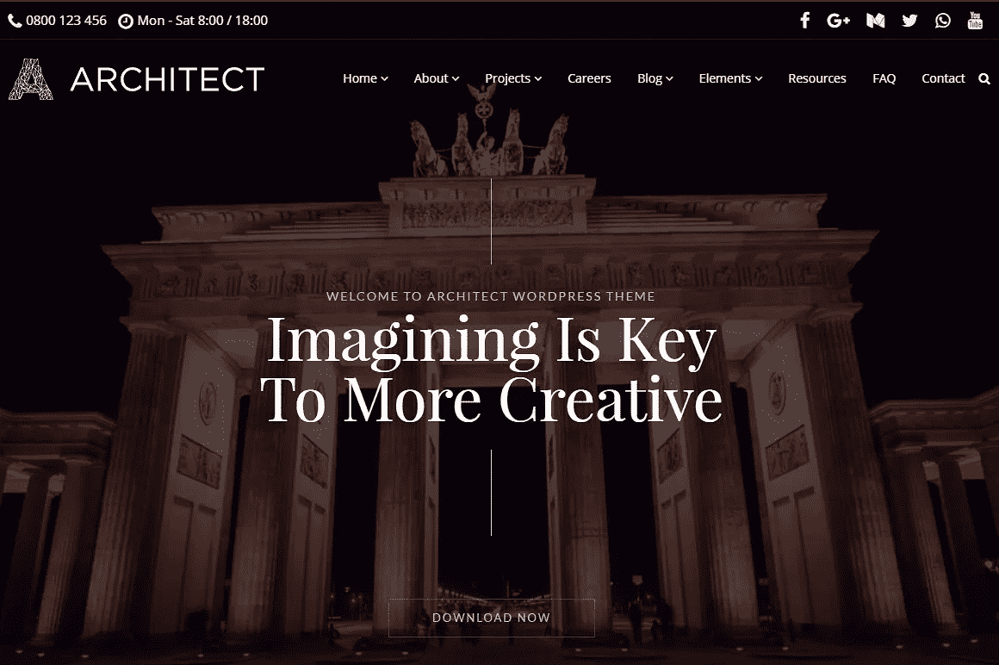
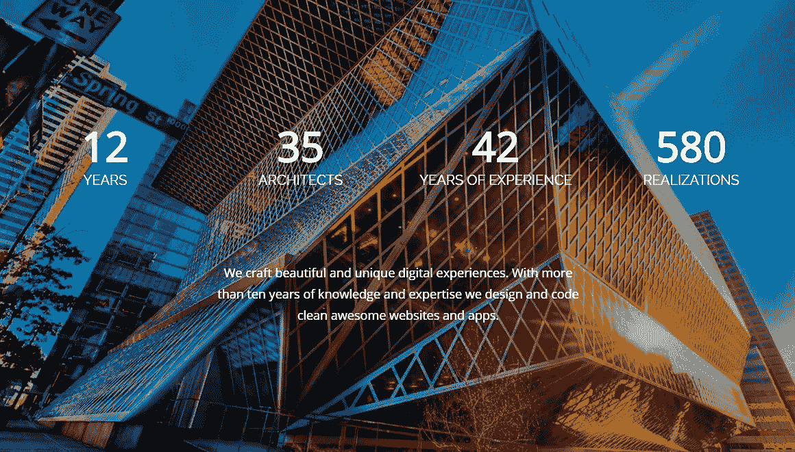
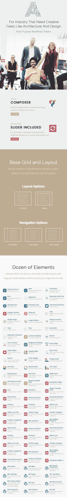

# 建筑师主题:一个新的室内设计模板

> 原文：<https://medium.com/visualmodo/architect-wordpress-theme-a-new-interior-design-template-8855da84a400?source=collection_archive---------6----------------------->

Visualmodo 于 2010 年开始创建 WordPress 主题，现在在 [MOJO Marketplace](https://www.mojomarketplace.com/) 上有很多选择。在这篇文章中，我们提供了一些关于他们如何设计主题的信息，以及他们最新的主题[建筑师的特色。](http://www.mojomarketplace.com/item/architect/demo)

# WordPress 主题开发的 Visualmodo 方法

Visualmodo 主题是设计人员、开发人员和团队的专业选择。我们使用最先进的编程技术，为每个人开发清晰、有效、用户友好的 WordPress 工具包。

我们的主题旨在帮助您构建一个更好的高性能网站，无论您的经验水平如何。我们提供无限的布局选项，并且每天都在改进我们的产品。我们热爱我们的工作！

我们相信每个网站都是从一个想法开始的。我们的框架只是提供设计、特性和支持来实现这个想法。

我们最新的 WordPress 主题项目叫做 [**架构师 WordPress 主题**](http://www.mojomarketplace.com/item/architect) **。这是一个高级 WordPress 主题，专为需要简约、创意和现代外观的工业企业而设计。**

建筑师是设计与建筑，室内设计，房地产，建筑，城市化，家居设计的想法，是一个伟大的主题。

通过最少的设计和对展示你的项目的关注，建筑师将使你的作品看起来更令人印象深刻和更有吸引力。你甚至可以用这个主题来创建一个时尚、干净的个人网站或作品集。

现在，让我们来看看一些特性！

# 架构师 WordPress 主题的特点和亮点

# 包含可视化编辑器页面生成器

Visualmodo 客户可以使用不可思议的 100%前端拖放页面生成器，可视化编辑器。Architect 主题附带了 visual composer(价值 34 美元的免费软件)和 Visual Composer 的终极插件(价值 20 美元的免费软件)。想象一下你希望你的页面是什么样子，然后简单地拖放！

# 视觉元素插件

使用独有的视觉元素插件扩展您的页面构建体验和可能性，该插件将为您的视觉合成器添加令人惊叹的新内容元素。这里只是其中的一些元素。还有很多，包括 [WooCommerce](https://wordpress.org/plugins/woocommerce/) 元素。

# 建筑师是搜索引擎优化

任何网站的一个重要部分是搜索引擎优化，或 SEO。我们专注于 SEO，同时建立我们的主题，我们实际上有数据支持它。

**架构师**是为了帮助你的站点排名而建造的。请放心，从功能性标记到最新的语义 HTML5 元素，一切都将与最好的 WordPress SEO 插件兼容性一起工作，帮助您获得更多的有机流量。

# 无限制的标题和菜单布局

Architect 让你为你的网站选择完美的标题和导航风格。将菜单居中，将其移动到左侧或右侧，将菜单移近徽标，远离徽标。创建全角、宽、方框、垂直菜单、水平、居中徽标与菜单对齐、居中徽标与边缘菜单对齐等布局。

你可以在功能强大的主题选项面板中一键完成所有操作。

# 高性能智能装载机

与其他 WordPress 框架和页面构建器不同，**架构师**正在尽最大努力只加载**必要的资源**。这会让你的网站超级快。

我们花了相当多的时间调整主题的每个方面，以发挥其绝对的最佳性能。所有的查询都经过手动检查以达到最佳，所有的图像和资源都经过仔细压缩以使站点加载速度极快，所有的脚本都经过分析和修改以高速运行。分数 **A+** 。

# 自定义帖子类型

有了**Architect WordPress Theme**，你就有了一些很棒的帖子类型，可以通过我们的作品集、团队成员和知识库来优化你的内容，并且让你可以根据你的项目、工作或想法自由构建你自己的帖子类型。标准职位类型包括:

*   图像
*   走廊
*   声音的
*   录像
*   引用
*   环

# 定期主题更新

我们的首要任务是保持建筑师的主题处于最佳状态，并为每个客户完美地工作。Visualmodo 团队很快解决了错误修复，并增加了新的功能来改进主题。

当我们进行更改时，您可以使用我们的一键式自动更新系统轻松更新主题。

# 专业和快速支持

我们的支持团队迫不及待地想帮助您。只需在我们的支持论坛上提交一张票，我们的一位高度专业且训练有素的顾问就会在那里伸出援手。

我们的[帮助中心](https://visualmodo.com/help/)指南、教程和[在线文档](https://visualmodo.com/docs/architect-wordpress-theme-documentation/)可以告诉你更多关于使用 Architect 的信息。如果您对新功能有任何问题或建议，请联系我们，当我们推出产品的重大变更时，我们会在 MOJO Marketplace 博客上为您提供最新信息。

如果你需要一般的 WordPress 帮助或支持，我们推荐注册 [WP Live 点播 WordPress 支持](https://www.mojomarketplace.com/wp-live)。他们不仅会帮助你，还会教你建立、发展和维护网站所需的知识。

最后但同样重要的是，如果你喜欢你在这里看到的，[也可以在 MOJO Marketplace](https://www.mojomarketplace.com/store/visualmodo) 上看看我们其他的 WordPress 主题！

来源:[https://blog . mojo market place . com/architect-a-new-industry-focused-WordPress-theme-from-visual modo/](https://blog.mojomarketplace.com/architect-a-new-industry-focused-wordpress-theme-from-visualmodo/)

[https://visualmodo.com/](https://visualmodo.com/)