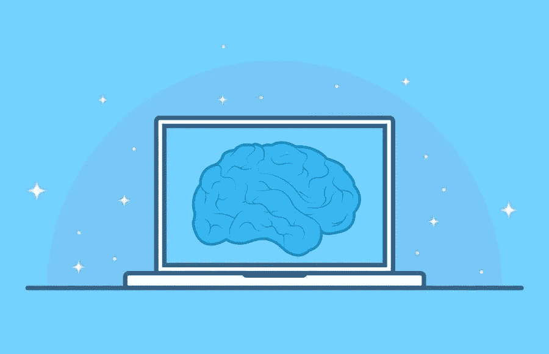

# 人工智能营销工具促进业务发展

> 原文：<https://medium.com/visualmodo/artificial-intelligence-marketing-tools-to-boost-business-7ddf5dbc755b?source=collection_archive---------0----------------------->

如果你熟悉市场营销，你会意识到市场营销涵盖了广泛的任务、平台和内容风格。市场营销的工作范围很容易膨胀，我们中的许多人发现自己忙着从一周到下一周完成所有的事情。幸运的是，有许多人工智能营销工具可以帮助减轻负担，此外，以各种形式促进你的业务。

# 促进业务发展的最佳人工智能营销工具

人工智能对数字营销的影响是巨大的。Smart Insights 的一项研究显示，在来自不同行业的 100 名高级营销人员中，55%的公司正在实施或已经考虑在营销实践中使用人工智能。这是为什么呢？

# 墨水

首先，INK 是一个新的人工智能写作助手，可以优化您的网页内容，以便您可以获得更好的读者参与度和更高的搜索引擎排名。这是一个内容智能工具，可以让任何人自我优化他们的数字内容进行搜索。

其次，墨水研究你的竞争对手阅读其内容，并提出建议，以改善您的写作和内容优化的努力。它实时提供针对您的文章和竞争对手的独特建议。

最后，无论你是有搜索引擎优化经验，还是刚刚开始你的商业内容营销之旅。墨水是最好的人工智能营销工具之一，可以帮助你提升你的营销活动。

# IBM Watson 个性洞察

IBM Watson Personality Insights 服务从社交媒体、企业数据或其他数字通信中获得关于个性特征的见解。

此外，运用语言学分析和人格理论。该工具通过提供对人们如何以及为什么以他们的方式思考、行动和感受的洞察，帮助营销人员构建深入的受众人物角色。

# 人工智能营销工具:语法

Grammarly 可能是数字写作世界中最流行、最有用的内容创作工具。该工具结合了自然语言处理和单词用法，为用户校对内容。

此外，它还提供关于拼写、语法和单词用法的反馈。因此提供了拷贝改进和更快的编辑过程。总之，使用语法的营销人员通常写得更好更快。

# 阿里莫

Arimo 是一款行为人工智能营销工具和软件，可以跟踪在线购物者的点击活动，以预测他们的下一步行动和购买的可能性。这使得营销人员可以创建个性化的激励和产品推荐，以提高转化的机会。

这些预测性的见解可以为几乎无穷无尽的用途打开大门。因此，帮助企业检测和防止欺诈，通过预测未来成本来节省资金，等等。