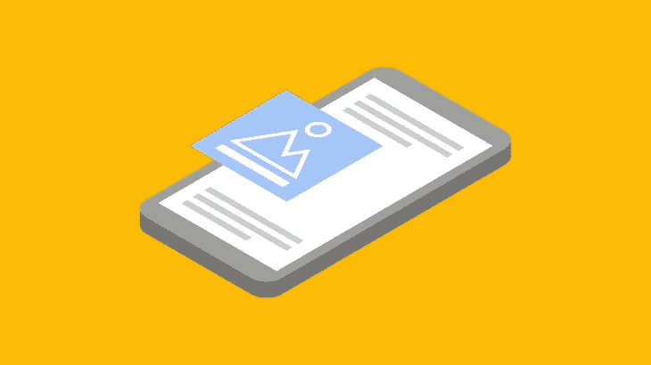

# 汽车广告快速指南:谷歌广告

> 原文：<https://medium.com/visualmodo/auto-ads-quick-guide-google-adsense-82155e894f18?source=collection_archive---------0----------------------->

AdSense 自动广告是在你的网站上开始展示广告的一种简单方式。该功能允许 AdSense 决定自动投放广告的位置、数量和大小。作为发布者，您只需设置一次，就不用再单独手动处理每个广告了。

[2018 年 2 月 21 日](https://adsense.googleblog.com/2018/02/introducing-adsense-auto-ads.html)，AdSense 团队为大家推出了 Google 自动广告。这是 AdSense 团队近期最大的创新之一。事实上，汽车广告有望改变你一直以来使用 AdSense 的方式。大多数 AdSense 发布者最关心的问题之一是广告投放、广告优化和保持愉快的用户体验。

谷歌自动广告正在利用人工智能为出版商自动管理广告投放和广告优化。然而，作为发布者，你可以管理全局设置:应该显示什么广告。基于域的设置:配置什么广告应该显示在一个特定的域或子域。目录设置:配置在特定目录上显示的广告种类。例如，在分页页面或存档页面上，您可能不希望显示匹配的内容广告，您可以从 AdSense 设置面板进行配置。这项功能称为高级 URL 设置。[你可以在这里了解更多信息](https://support.google.com/adsense/answer/7479535)。

到目前为止，用户对自动广告的评价褒贬不一。然而，我对 AdSense 汽车广告的未来持乐观态度，因为它将消除广告优化的痛苦，博客可以专注于构建内容，而 AdSense 则负责其他一切。谷歌 AdSense 一直是一个即插即用的广告程序，但现在它是完全自动化的。感谢人工智能。

# AdSense 汽车广告

对于任何使用过 Google AdSense 的人来说，自动广告都不是问题。然而，在你开始设置自动广告之前，有几件事你应该知道。这也将在你开始[整合](https://visualmodo.com/) it 之前回答你的问题。

如果你的博客上已经有 AdSense 广告，你可以决定不删除它。AdSense 自动广告将自动检测这些广告，并相应地放置更多的广告。或者，已经在使用主播或插页广告了？汽车广告包括锚定广告和插页广告以及更多的附加形式，如文本和显示广告、馈入广告和匹配内容广告。请注意，所有使用页面级广告的用户都将自动迁移到自动广告，而无需向他们的页面添加任何代码。然而，首次登录您的 AdSense 帐户并设置自动广告的全局设置是一个好主意。

# 自动广告启用流程

如果你想通过观看视频来学习，在本教程的末尾有一个详细的 Google AdSense 自动广告视频指南。下面是这些步骤的快速演练:

1.  登录您的 Google AdSense 帐户
2.  进入我的广告>自动广告
3.  点击“设置自动广告”
4.  配置您的全局设置
5.  启用“自动在底部获取新格式”。
6.  点击保存。
7.  现在把广告代码放在你的博客/网站的每一页上。我用谷歌标签管理器来做同样的事情。你可以使用任何适合你的技术。如果你已经在使用页面级广告，你不需要做任何事情。
8.  你可以通过进入我的广告>自动广告并点击统计数据上的来检查谷歌自动广告的性能。

# 结论

总的来说，看到谷歌自动广告[在未来如何运作](https://shots.visualmodo.com/)将是令人兴奋的。到目前为止，我们得到的评价褒贬不一。ShoutMeLoud 论坛的一位用户抱怨他的一篇文章上有七个广告！但正如我之前所说，随着时间的推移，这将是每个人都会适应的事情，而且由于它使用了机器学习(人工智能)，它只会随着时间的推移而变得更好。

请告诉我们您使用 AdSense 自动广告的体验。你已经实施了吗？如果没有，计划什么时候实施？欢迎提问，分享经验。还可以在 ShoutMeLoud 论坛上和其他用户互动。