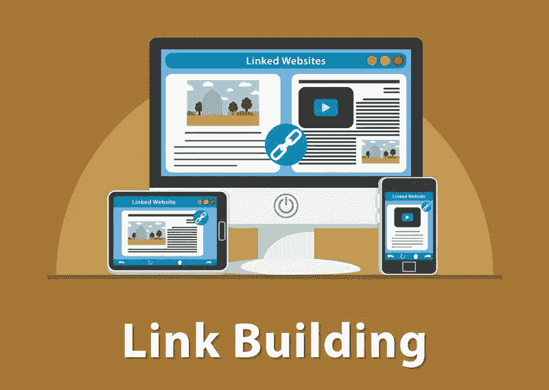

# 反向链接课程:回顾:搜索引擎排名数字营销的好处

> 原文：<https://medium.com/visualmodo/backlink-course-review-the-benefits-of-a-search-engine-ranking-digital-marketing-92f810cb7ffc?source=collection_archive---------0----------------------->

链接建设仍然是搜索引擎排名不可或缺的一部分。如果你想让你的网站位于搜索结果的顶端，反向链接是必不可少的。然而，搜索引擎并不像现在这样严格。如果以前网站可以摆脱垃圾和低质量的链接，今天就不是这样了。搜索引擎现在对高质量反向链接网站的评价要高于低质量反向链接网站。现在看到反向链接课程，它的 nenefits。

# 为什么你应该采取反向链接课程？

当你知道自己在做什么时，你可以更快地达到目标。在生活的其他方面，放弃计划，顺其自然是很有趣的。然而，当涉及到数字营销时，你采取计算好的步骤来获得成功是至关重要的。

数字营销课程比阅读各种博客或观看大量视频更有帮助。一门课程会给你实际的应用，而不仅仅是基于理论的提示。你也可以避免垃圾邮件反向链接的负面影响。

参加搜索引擎排名数字营销反向链接课程不仅能提高网站排名，还能让你受益匪浅。以下是你将从这种培训中学到的一些东西:

# 你可以建立你品牌的可信度

信誉是一些企业比其他企业更成功的原因之一。如果你有一个可信的品牌，你会被视为你所在领域的专家。如果你在搜索引擎结果中排名靠前，这意味着你已经建立了相当多的反向链接。

记住，你不能仅仅为了拥有 10，000 个反向链接而在你的内容中包含随机的反向链接。如果你建立的反向链接档案甚至与你的品牌无关，这对你没有任何好处。

现在，搜索引擎在分析你的反向链接资料时变得更加智能。如果你提供高质量和相关的内容，你可以期待别人自然会给你反向链接，因为他们认为你是一个可信的来源。

# 你可以给你的网站带来更多的流量

付费搜索不是很有回报，尤其是如果你花的比你从中获得的多。此外，当你可以有机地为你的网站带来流量时，你为什么要为推广付费呢？

流量不仅仅是有机搜索带来的。当人们点击链接将他们引向你的站点时，你也可以获得访问者。

如果你已经建立了一个令人印象深刻的反向链接档案，你可以在你的网站上获得更多的点击率，甚至不需要付费，特别是如果你在你的领域有一个好的声誉。你有越多的反向链接，你就能获得越多的转化或销售。

如果人们留在你的网站上也会有帮助。偶然的点击对你没有好处。一个优秀的网站设计也能帮助人们在你的网站上停留更长时间。

# 你可以获得更多的网站曝光率

当人们点击你的链接时，他们会认为你的品牌是你利基市场的可靠来源。假设有人正在阅读 webmarketing123.com 的[客座博文，他们觉得它的内容很有趣。当网站访问者看到一个链接，这个链接可以追溯到你的网站，这是一个很好的机会，他会点击它，并认识到你的品牌。](https://www.webmarketing123.com/)

更多的反向链接意味着更多的人会浏览你的网站。你将能够建立关系，因为你有高质量的反向链接。只要不是垃圾邮件，你的反向链接可以让你在搜索引擎结果中排名靠前。

为了保持相关性，你需要适应搜索引擎的变化。如果你那时过得很轻松，不要认为现在也会这样。毕竟，技术在不断变化。当然，事情变得复杂了，久而久之。营销曾经是分发小册子或制作商业广告。现在，一切都是数字化的。当谈到数字营销和在搜索引擎上获得更高的排名时，你可以采取很多策略，反向链接是你可以建立更高搜索可见性的方法之一。