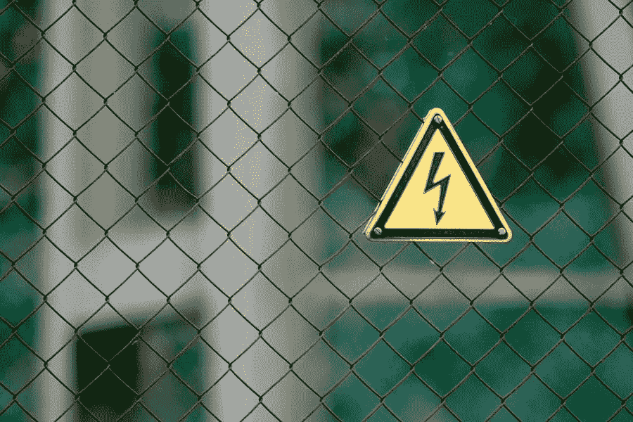

# 初学 WordPress 的错误和使用错误

> 原文：<https://medium.com/visualmodo/beginner-wordpress-mistakes-and-usage-errors-8267690801fd?source=collection_archive---------1----------------------->

在今天的文章中，我们将探索 WordPress 初学者最常见的错误，并解释如何避免和解决它。

我们都会犯错，因为没有人是完美的。无论是现实生活还是 WordPress，错误无处不在。犯错误不是犯罪，但是，不从错误中吸取教训并且不试图再犯就绝对是。每个人都从自己的错误中学习，但是从别人的错误中学习要好得多。

# 初学 WordPress 的错误和使用错误

# 许多 WordPress 插件

WordPress 知识库中有超过五万个插件，所以你有很多选项可以选择。这使得为你能想到的每一件小事安装一个插件变得非常诱人。但这不是没有代价的。

你不仅需要更新所有的插件，而且还有其他的风险。太多的插件做花哨的东西可能会减慢你的网站，这意味着你可能会以一个缓慢的网站结束。所以，在你安装一个新的插件之前要仔细评估。从技术上来说，一个插件就可以毁掉你的整个网站。所以这不仅仅是关于插件的数量，也是关于小心你添加到你的网站上的东西。

# 儿童主题初级 WordPress 错误

当你第一次安装你的 WordPress 网站时，你会得到一个默认的主题。也许这个主题不适合你的需要。所以你在寻找新的主题。

你已经找到了一个新的主题，安装了它，它工作得很好。但是，过了一会儿，你意识到你想改变一些事情。在深入研究如何更改主题之前，您应该创建一个子主题，并在子主题中进行更改。通过这样做，你可以确保当你的初始主题看到一些更新时，你不会丢失所有的修改。

如果您按照上一段中的链接，您可以学习如何自己创建孩子主题。但是，就像 WordPress 中的许多东西一样，也有一个插件为你做这件事。顺便说一下，很有可能你只想做一些 CSS 修改，定制器应该可以满足你的要求。这也是一种未来证明的方式来改变你的主题。

# 离开默认演示内容初学者 WordPress 的错误

当你第一次安装 WordPress 时，WordPress 会为你创建一个“样本页面”和一个“ [Hello World](https://en.wikipedia.org/wiki/%22Hello,_World!%22_program) ”帖子。确保你通过页面菜单删除了默认的样本页面，通过帖子菜单删除了“Hello World”帖子。不要像这些网站一样。

# 不更改默认管理员用户名

最后，最常见的 WordPress 初学者错误。当你安装 WordPress 时，它会自动创建拥有管理员权限的用户名*“admin”*。对于黑客来说，用户名显然是可以预测的。使用*“管理员”*用户名，他们可以轻松地执行暴力攻击，破解您的登录并控制您的网站。

由于 WordPress 在安装过程中给了你改变用户名的选项，坚持使用默认用户名是没有意义的。因此，在安装 WordPress 的时候，一定要把你默认的 WordPress 管理员用户名改成不同的用户名。此外，在用户名和密码中使用数字、字母和特殊字符的组合。