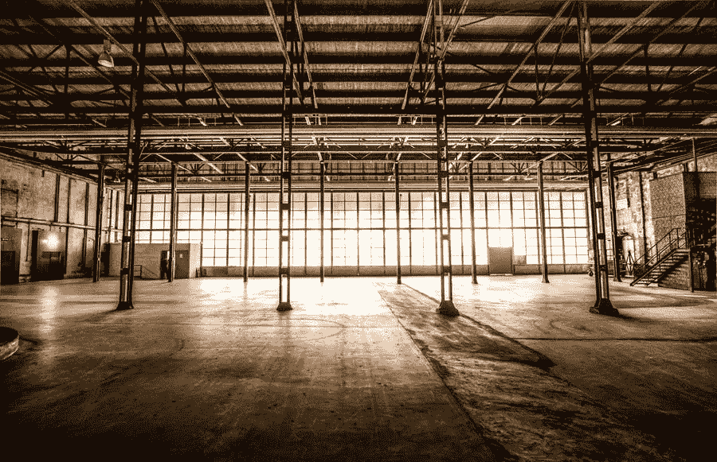

# 提高制造效率的初学者指南

> 原文：<https://medium.com/visualmodo/beginners-guide-to-improve-manufacturing-efficiency-269099893052?source=collection_archive---------0----------------------->

有几种简单而安全的方法可以在不牺牲产品质量的情况下提高生产效率。在这篇文章中，我们将分享一个初学者指南，以提高生产效率。

如果你有一家制造企业，你无疑希望提高生产率，最大限度地减少支出，最大限度地提高利润。如果你提高生产运作的效率，这些目标是可以实现的。

许多公司认为，提高效率意味着大幅削减开支，这会导致产品质量下降。然而，有几种简单而安全的技术可以在不损失产品质量的情况下提高工厂的生产效率。

这里有一些你可以用来提高制造公司效率的策略。

# 评估和优化您当前的工作流程

如果不审视你目前的工作流程，你会发现很难发现制造过程中的改进机会。一旦您完成了以下三个关键部分，您将对所需的调整有很好的理解。

为了收集关于你现在的[员工](https://visualmodo.com/7-steps-to-building-a-strong-bond-with-your-employees/)表现的信息，你需要做出一些决定。

*   他们是否具备执行他们正在从事的活动所需的能力？
*   他们有可能已经实现了他们设定的坚定目标吗？
*   完成每项任务所需的时间。
*   你能让这个过程所需的时间变得更快吗？

# 提高生产效率的程序指南

为了确保生产中的一切都按计划进行，有必要了解每个步骤是否已经完成。最关键的部分是发现你的困难点和瓶颈在哪里。

在你开始改变你的过程之前，重要的是首先要构建一个系统，然后将结果与你的期望和过去的情况进行比较。它将使您全面了解应该实施哪些修改。OEE 可以帮助您完成这些制造操作。

# 技术和设备

对你正在使用的所有技术和设备进行一次彻底的检查。所有的设备都工作正常吗？您所依赖的技术是否足以满足您目前的业务需求？提高产量有多简单？

# 投资于员工发展

员工培训是一项持续的活动。某些形式的培训，特别是在工业中，是强制性的，例如对所有使用安全设备的工作人员进行安全管理培训。

如果你向你的员工传授新技术和新设备，使他们的价值最大化，那将是最好的。员工培训的确是一个很好的留住人才的策略，因为每个员工都希望有成长的机会。

与普遍看法相反，培训和指导不应局限于技术和设备。如果每个人都了解公司的规则和适当的沟通方法，你的制造公司将会更有效率地运作。

# 维护您的设备

不管你的员工有多能干，如果你的制造工厂里的工具过时了，甚至出了故障，提高效率将会很困难。

因此，请确保您准备投资于现有设备，以提高生产流程的效率。此外，先进的设备有助于您降低维护成本和提高员工生产率。

# 预防性维护以提高生产效率

即使你选择购买最新的工具，这并不意味着你必须丢弃旧的。如果使用得当，某些工具和设备可能会使用较长时间。此外，新设备必须最大限度地发挥其效用。