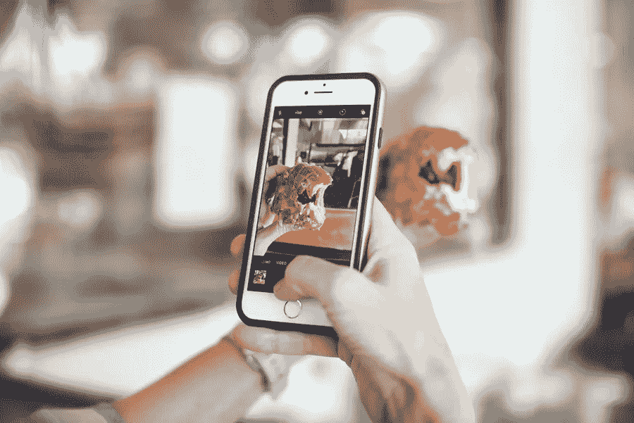

# Instagram 最佳内容

> 原文：<https://medium.com/visualmodo/best-content-for-instagram-326dc5fd3829?source=collection_archive---------0----------------------->

Instagram 是社交媒体领域的巨头之一。这是一个充满活力的空间，你永远不会有沉闷的时刻。事实上，Instagram 的用户群一直在稳步增长，正在缓慢但肯定地接近 10 亿用户。点击这里查看 Instagram 的最佳内容。

作为一名营销人员，不难看出这样一个平台对你的品牌有多么大的好处。这些用户除了好的内容什么都不想要，并且愿意聚集在他们能得到的任何地方。

那么如何在 Instagram 上脱颖而出，建立粉丝呢？你如何影响市场按照你的节奏跳舞？嗯，在这里，就像在其他地方一样，内容是王道。你需要[高质量的](https://visualmodo.com/)内容，用一种你能识别的声音谈论你的品牌，并且足够一致，让你的观众永远不会错过。

这听起来很简单，但是说起来容易做起来难。有时你会遇到创造性的障碍，感觉自己已经没有主意了，更不用说令人难以置信的繁忙的日程安排，似乎没有给我们足够的时间来发挥创造力。如果我们有一个可以使用和重用的简单模板，那就太好了。

对于日程安排，你会发现有很多日程安排应用程序可以用于你的 Instagram 发布。然而，至于内容，我们也许能帮上一点忙。这里有一个广泛的内容创意列表，你可以用它来给你的 Instagram 注入一些活力。

# Instagram 最佳内容

# 你可以发布一个教程

想想在一张图片中你能教给你的观众什么。

例如，如果你是一名美妆博主，你就会知道画出完美的眉毛有多难。问任何一个她喜欢的没有眉毛的女孩，她会告诉你掌握画眉毛和化妆的艺术是多么重要。记住要让它超级吸引人，这样你的读者才会有兴趣去读它。您可以将简单版本放在快照中，然后在评论部分添加更多细节。在那里，你可以为那些喜欢阅读的人写尽可能多的东西。它被称为微博，在 Instagram 上运行得非常好。如果写作不是你的强项，你可以考虑雇佣一种服务来帮你，比如那种[帮你写作业](https://www.aussiewritings.com/)的服务。

# 激发观众的户外精神

我们的大脑可以从这项运动中受益匪浅。每天只做 30 分钟的锻炼就能让你的认知功能更好，焦虑更少，记忆力更强，心情更好。谁不想要这些好处呢？？

另一方面，技术正在进入我们生活的方方面面。对大多数人来说，这意味着他们一天中的大部分时间都是在屏幕前度过的。你可以利用这一点，让他们的屏幕鼓励他们去户外锻炼。怎么会？当然是通过 Instagram 啦！

# 节后照片

谁说你的假期必须在最后一天结束？你可以随时通过在 Instagram 上发布它们来重温它们。简单地分享一些你最激动人心和鼓舞人心的度假地点的照片。这样，您就可以重新调整内容的用途，而不必过多考虑从哪里获取新内容。你也可以重温你最喜欢的记忆。

既然 Instagram 是为了推广每个人都喜欢的生活方式，你应该去做你真正喜欢并让你快乐的事情。

如果你想要永远不会出错的东西，你应该考虑张贴海滩的照片。尤其是海洋图片，非常受欢迎，所以，这是 Instagram 的好内容。

# 放平你的包

这个最近很受欢迎。它也被称为著名的袋子泄漏。查看你包里的东西，不管是整洁的还是凌乱的，并利用它让你的观众稍微了解一下你是谁，以及你包里不能没有的东西。

在这里你可以尽情发挥创造力。你可以拿你的运动包、工作包、手提包等等。你甚至可以去购物，让我们看看你的购物袋！

# 发布你的晨间计划

每个人都知道他们真的需要优先考虑他们的自我保健。因此，当他们看到其他人花时间照顾自己时，他们会受到鼓舞去做同样的事情。

你早上有自己的时间吗？你是专注于照顾自己，还是直接去做一天的活动，比如查看你的 DMs？

告诉你的观众你一天的计划是很棒的。你应该鼓励他们以更大的勇气面对生活。你甚至可以和他们分享你的缺点，激励他们改变。这是利用 Instagram 的内容建立你的社区的好方法..

# 你的早餐

谁不爱吃？事实上，人们使用 Instagram 最多的东西之一就是食物。还有什么比早餐更好的方式来分享我们对食物的热爱呢？早餐不仅仅是美味和不可抗拒的，而且看起来真的很好，尤其是如果你知道如何给你的早餐拍一张正确的照片。

你需要的是好的灯光、好的构图和好的造型，所有这些都是为了拍出完美的照片。如果你在短片中包括你的手，你甚至可以让你的观众更加投入，因为这给你的画面增加了一个人的[元素](https://visualmodo.com/blog/)。

最好的做法是从顶部拍照；鸟瞰之类的东西。不要为爬到椅子上让事情变得有趣而感到羞耻。

# 为你的品牌设计一款鸡尾酒

你最喜欢的鸡尾酒是什么？事实上，你们品牌最喜欢的鸡尾酒是什么？鸡尾酒非常有趣，是结束漫长一周的好方法。你的品牌不仅应该在一周内保持活跃，在重要的周末也应该如此，所以为你的品牌举办一场鸡尾酒会是一个很好的方式，向人们展示你的品牌可以在需要的时候变得轻松起来。

# 张贴鲜花

万一不知道贴什么，花是不会错的。鲜花会给任何感觉带来色彩和新鲜感。你可以把它放在色彩缤纷的背景下，放在时尚的花瓶里，或者摆弄自己的手臂、指甲或配饰。真的，在这种情况下你的创造力是没有极限的。

# 贴一张激励你的人的照片

你有崇拜和敬仰的人吗？为什么不在你的 Instagram 上展示呢？你可以贴一张他们作品的照片，写一点评论，说说为什么他们会让你的灵魂着火。

提及他们做了什么来激励你，以及为什么你尊敬他们。你甚至不需要亲自见到他们。你所要做的就是承认这个人对你的生活有重大影响。这是和你的观众建立关系的好方法。

# 自定义图形

有没有考虑过贴励志语录？这是告诉你的听众你的目标是什么，你的人生目标是什么的好方法。然而，你可以做得更好，让你自己的报价。

有没有什么你常说的话可以变成名言？你认为有什么象征公司的话会被公司的声音说出来吗？

拿起你的纸和笔，把一些东西放在一起，使用你最喜欢的编辑应用程序制作一个很酷的图形，你可以和你的观众分享。

# 先看一眼你的项目

如果你有一个正在进行的项目，但还没有准备好向你的观众全面展示，那么你可以发布一个小快照，创造一些急需的神秘感。神秘有办法真正吸引你的观众。

你可以写一个任务清单，贴一张你计划去的地方的地图，或者任何你想做的事情。

# 问你的听众一个问题

有什么比提问更能让你的听众参与进来呢？你可以提出任何类型的问题，并发布在你的 Instagram story 上，然后你可以分享你得到的答案，让所有观众看到。这是一个让你的听众开始对话的好方法。对于 Instagram 来说，这也是一种很好的内容格式。

# 举行赠送活动

谁不喜欢在翻看手机时发现赠品呢？如果你真的想让你的 Instagram“亮”起来，那么举办一个即兴的赠品会让你的观众兴奋不已。对于 Instagram 来说，推广总是一个很好的内容。

# 充分利用空白

你觉得你的 Instagram 看起来有点太忙了吗？也许你觉得照片太多，结果你的页面看起来很拥挤。这实际上可能会影响你为你的订阅提出想法的能力。

嗯，你可以用一些空白来帮助它变得清晰。您可以拍摄一张与您的配色方案相匹配的普通照片，例如一面墙、一个游泳池或任何其他东西，然后使用它在照片之间创建一些急需的空间。这种东西甚至还有一个标签。

# 最后的想法

Instagram 可以用来做很多事情，包括娱乐、营销、信息等等。只要你让自己的想象力自由驰骋，你就不必局限于寻找创造性的想法。最终，想法会很容易地流向你，你会看到通过在 Instagram 上使用正确的内容，你的参与度会增加。