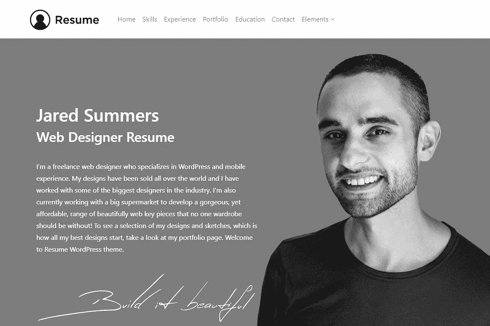
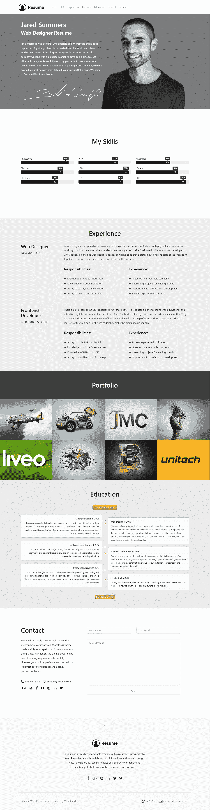

# 最佳简历主题

> 原文：<https://medium.com/visualmodo/best-cv-wordpress-theme-ac3befee0329?source=collection_archive---------0----------------------->

## 简历—简历—名片

CV WordPress 主题是一个用 bootstrap 4 制作的可轻松定制的响应型 CV/resume/v-card/portfolio 主题。其独特和现代的设计，简单的导航，单页布局帮助您毫不费力地组织和漂亮地展示您的技能，经验和投资组合。这是完美的个人和代理组合网站。所以，无论你是设计师、开发者、摄影师、律师、健康专业人士还是小机构；“简历”是你需要让你的作品完美呈现给观众的主题。

# 最佳简历主题

简历高级 WordPress 主题——无需编码即可构建任何网站设计！您可以在几分钟内建立并运行一个设备齐全的网站。简历主题不仅仅是一个模板，它是一个惊人的例子和大量功能的集合。

CV WordPress 主题是一个干净的、现代的、极简的、皇家的、多用途的、单页的 WordPress 主题。它有各种各样令人难以置信的功能，包括价值 150 美元的好东西，你需要以一种非常简单的方式创建一个令人敬畏的网站，节省金钱和时间。无需代码知识即可构建任何网站设计！

# [现场演示](https://theme.visualmodo.com/resume/)

# [现在下载](https://visualmodo.com/theme/resume-wordpress-theme/)

**WordPress 的可视化编辑器(页面生成器)**——WordPress 的拖放式可视化编辑器(价值 45 美元)将为你节省大量的时间来处理你的网站内容。现在，您可以在几分钟内创建复杂的布局！这个页面生成器可以用在你的网站前端，让你的工作更轻松。你所需要做的就是拖放内容，并立即看到结果。

Visual Composer 的终极插件 —扩展 Visual Composer 并为其添加更多功能！这个插件(价值 25 美元，免费)在 WPBakery 提供的内置元素的基础上，在你的可视化编辑器中添加了几个高级元素。包装中的每一个元素都经过精心制作，非常注重细节，目的很简单，就是为您提供终极体验。我们投入了大量的时间和精力来确保所有的元素都是灵活的，这样它们将为您打开无限的可能性，同时保持核心的简单性。

**视觉元素插件** —使用我们的插件元素列表扩展您的页面构建体验和可能性，该插件具有独家的视觉元素插件，可为您的视觉合成器添加令人惊叹的新内容元素。