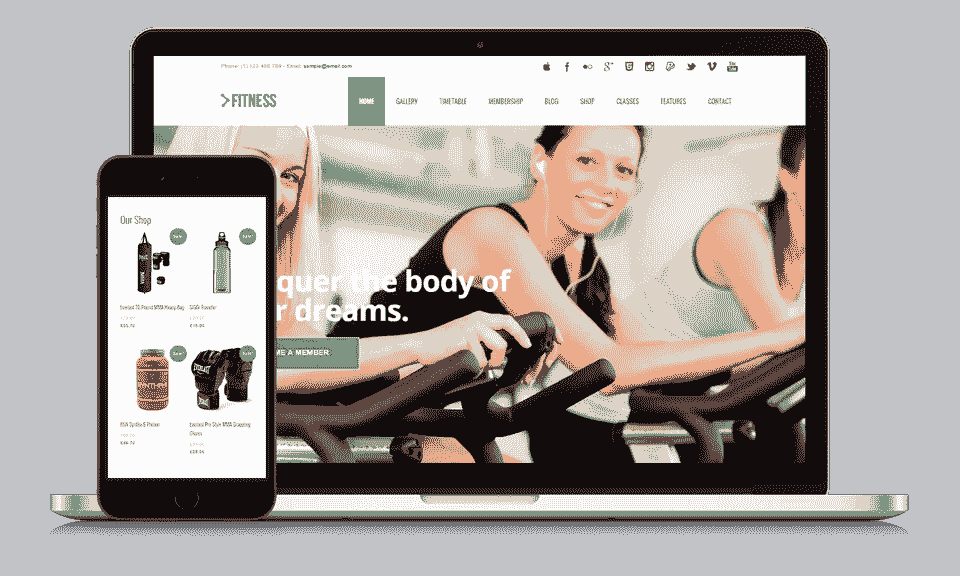
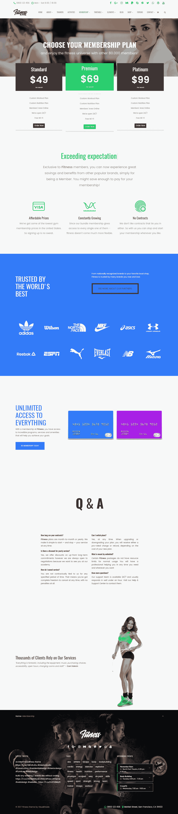
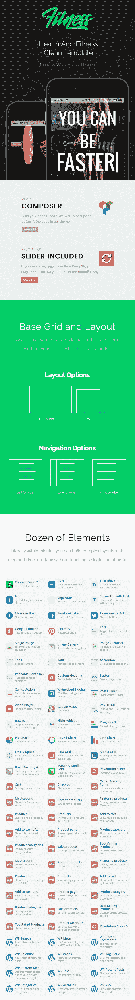

# 最佳健身 WordPress 主题

> 原文：<https://medium.com/visualmodo/best-fitness-wordpress-theme-a7ebb88c6a51?source=collection_archive---------0----------------------->

网站建设者

专为健身房和健身中心网站设计和开发的最佳响应健身 WordPress 主题。这些是通用的和高度可定制的 WordPress 主题，允许你制作你一直想要的独特的和专业的网站。

WordPress 是迄今为止最受欢迎的内容管理系统，有 2 亿或 30%的网站使用它。它很简单，易于使用和设置，并且可以免费用于商业或任何其他目的。感谢围绕它的令人难以置信的社区，你可以用它做任何事情，而不用写你自己的代码。健身主题是一个很好的例子，展示了如何整合时间表管理、训练计划、联系表、教练页面和支付系统，并通过简单的网络界面进行定制。

很可能在你的位置附近有数百或至少数十家健身房、[健身中心和健身团体，所以你需要脱颖而出。创建一个独特而专业的网站可能对你的商业成功起着至关重要的作用。让你的网站搜索引擎优化友好，谷歌会做剩下的工作，把你的业务展现在正确的人面前。](https://visualmodo.com/theme/fitness-wordpress-theme/)

# 健身 WordPress 主题

**一键式演示内容导入**——WordPress 主题最有用的功能之一。你会喜欢在与精彩的主题演示页面相同的起点上开始网站开发过程，这样你就可以快速设计出你梦想中的网站。您可以充分利用我们精心制作的演示内容，只需点击一下鼠标，就可以创建一个现成的网站！

**用于 WordPress 的可视化编辑器(页面生成器)** —用于 WordPress 的拖放式可视化编辑器(价值 34 美元)页面生成器将为您节省大量处理网站内容的时间。现在，您可以在几分钟内创建复杂的布局！这个页面生成器可以用在你的网站前端，让你的工作更轻松。你只需要拖拽内容，马上就能看到结果，[查看更多](https://vc.wpbakery.com/)！

**Visual Composer 的终极插件** —扩展 Visual Composer 并为其添加更多功能！这个插件(免费价值 18 美元)在 WPBakery 提供的内置元素的基础上，在你的可视化编辑器中添加了几个高级元素。包装中的每一个元素都经过精心制作，非常注重细节，目的很简单，就是为您提供终极体验。我们投入了大量的时间和精力来确保所有的元素都是灵活的，这样它们将为你打开无限的可能性，同时保持核心的简单性，[查看更多](http://www.mojomarketplace.com/item/fitness-wordpress-theme)。

**视觉元素插件** **—** 使用我们的插件元素列表扩展您的页面构建体验和可能性，该插件具有独家的视觉元素插件，可为您的视觉编辑器添加令人惊叹的新内容元素。

响应迅速**—我们知道，一旦我们生活在一个移动的世界中，响应速度是非常重要的。你的网站在所有设备上都应该是可访问的，这是绝对必要的。然而，我们觉得响应式设计是我们想为你做得更好的东西。对网络来说更好。确保我们的主题完全响应！**

WordPress 的时间表响应日程表是一个强大且易于使用的日程表插件。它将帮助您创建一个以分钟为单位的活动时间表视图。这是完美的体育课，学校或幼儿园班，医疗部门，夜总会，课程计划，饮食计划等。它带有事件管理器，事件发生短码，时间表短码生成器和即将到来的事件部件。你可以免费购买健身 WordPress 主题获得这个插件(价值 22 美元)。

