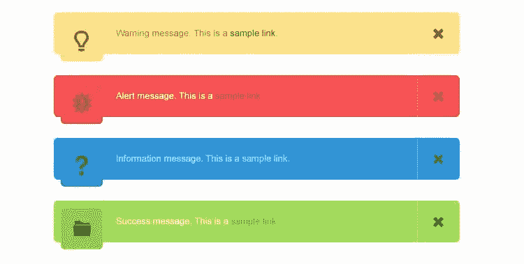
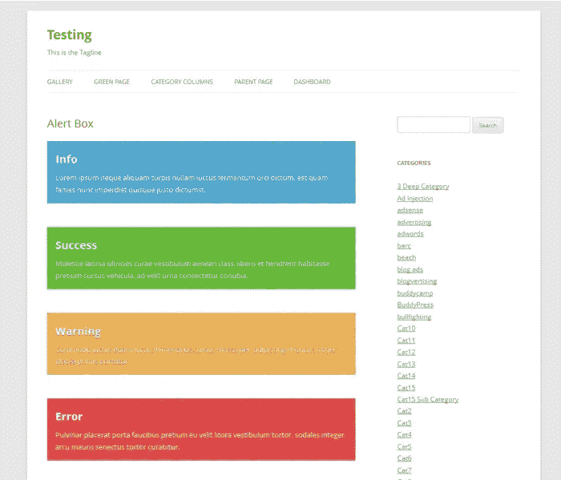
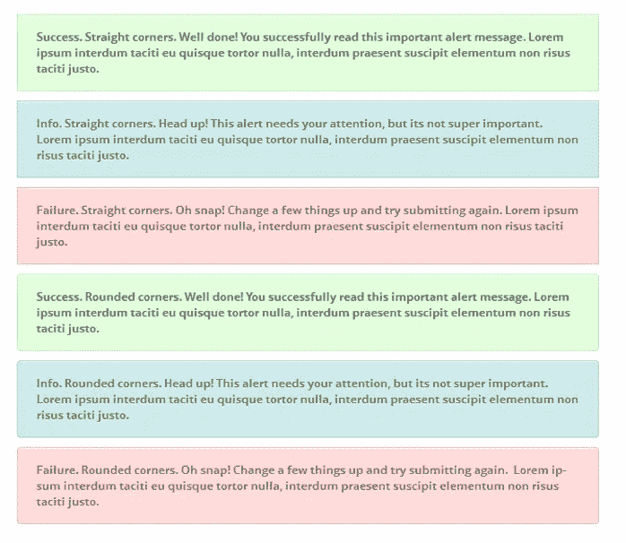
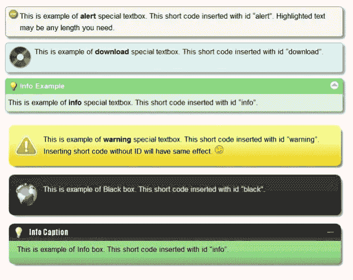

# 最佳免费提醒通知 WordPress 插件

> 原文：<https://medium.com/visualmodo/best-free-alert-notices-wordpress-plugins-d479ccf1c7bc?source=collection_archive---------0----------------------->

提醒通知框 WordPress 插件允许你创建漂亮的自定义提醒，出现在你选择的页面或帖子上。有了这个插件，你可以让你的站点访问者注意到一些特定的区域或信息。

抓住你的读者，让他们关注重要的内容。你有你的访客真正应该注意的信息吗？如果是这样的话，那么一个警告框可能是正确的做法。警告框插件可以让你很容易地把内容放在一个彩色的盒子里。在大多数网站上，只要你不过度使用，这些框会很突出。

下面我们收集了五个我们能找到的更好的免费软件。每一个都有不同的风格和不同的功能，因此您自己的特殊需求将决定哪一个可能适合您。在 WordPress 比在现实生活中更容易吸引读者的注意力。只需使用警告框。

# 最佳免费提醒通知 WordPress 插件

# 1.EMC2 警报箱

[EMC2](https://wordpress.org/plugins/emc2-alert-boxes/) 警告框[插件](https://visualmodo.com/)给你四种不同的颜色和固定的顶部和底部位置(除了把框放在柱子的任何地方)。

# 2.响应式警示箱

[响应式警示盒](https://wordpress.org/plugins/responsive-attention-box/)有三种颜色可供选择，但它也能让你选择直边或圆角。这个插件上的颜色，不像上面那个，是纯色的。

你可以在插件页面的[截图](https://visualmodo.com/)中看到每种颜色。直边框在顶部，圆角框在底部。差别是细微的，但是它可以帮助你更好地匹配你的警告框和你的主题设计。

# 3.特殊文本框

特殊文本框插件不仅仅是一个简单的警告框插件。这是一个完整的系统，既可以使用预定义的文本框，也可以创建自己的文本框。

这个插件的真正威力来自于它的设置。然而，对于普通用户来说，这个插件也有点复杂。如前所述，该插件还可以让你从头开始创建自己的风格。然后，它将这些存储在数据库中。这是该部分的局部视图。

# 4.忍者公告精简版

Ninja Announcements Lite 插件没有提供太多的选项或者太多的控制，但是它可以让你安排你的提醒来来去去，所以在这里值得一提，以防你碰巧需要这个功能。

从风格上来说，[插件](https://visualmodo.com/)会让你在几个不同的地方放置一个警告，但在精简版中，你似乎被限制在黄色背景中(见页面顶部)。这里有一个让这个插件区别于这个类别中大多数其他插件的设置。

# 警示框插件可以拉双功能

虽然您通常会看到这种盒子中有一小段文本，因为它们使用短代码，但在大多数情况下，重要的是要记住，您可以在这些盒子中放入任何您喜欢的内容。例如，你可以把整篇文章放在一个盒子里。

因此，如果你只是想让你的帖子生动一点，你确实不想过度使用警告框，但是这些[插件](https://visualmodo.com/)也可以帮你做到这一点。