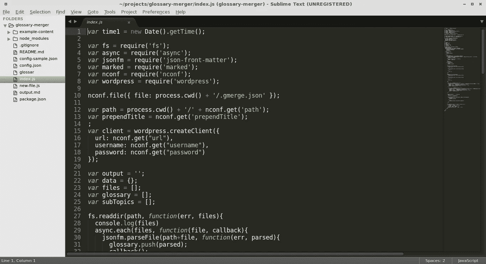
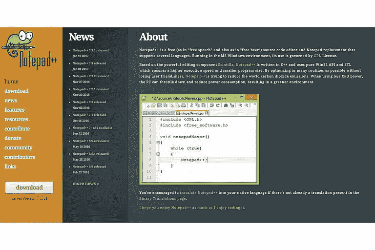
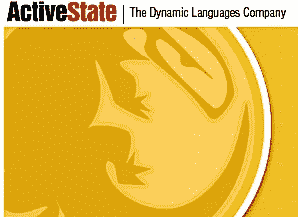
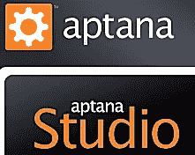

# 最佳 Windows 免费 HTML 编辑器

> 原文：<https://medium.com/visualmodo/best-free-html-editors-for-windows-58fe7e59dba9?source=collection_archive---------0----------------------->

## 查看 Windows 的最佳免费 HTML 编辑器列表，这样您就可以下载并以任何简单、直观和免费的方式使用您的代码来构建您的网站

## 最佳 Windows 免费 HTML 编辑器

## 崇高的文本

[https://www.sublimetext.com/2](https://www.sublimetext.com/2)

# 记事本++

记事本++是我最喜欢的免费 HTML [编辑器](https://visualmodo.com/)。这是一个更强大的记事本软件版本，你会发现在 Windows 中默认可用。在这种情况下，这是一个仅适用于 Windows 的选项。它包括行号、颜色编码、提示和其他有用的工具，这些都是标准记事本程序所没有的。这些增加使得 Notepad++成为网页设计师和前端[开发者](https://visualmodo.com/)的理想选择。

可以从公司网站免费下载[。](https://notepad-plus-plus.org/)[更多](https://www.thoughtco.com/run-batch-files-from-visual-studio-3424204)

# 科莫多编辑

科莫多编辑。

有两个版本的 Komodo 可用— [Komodo Edit](https://www.activestate.com/komodo-edit) 和 Komodo IDE。Komodo Edit 是开源的，可以免费下载。它是 IDE 的精简版。

科莫多编辑是我最喜欢的文本网页编辑器。它包含了很多 HTML 和 CSS 开发的优秀特性。此外，您可以获得扩展以添加语言支持或其他有用的功能，如特殊字符。

作为最好的 HTML 编辑器，Komodo 并不出众，但是它的价格非常划算，尤其是当你用它真正擅长的 XML 构建时。我每天都用 [Komodo Edit](https://www.activestate.com/komodo-edit) 来编辑 XML，我也经常用它来编辑基本的 HTML。没有这个编辑器，我会不知所措。[更多](https://www.thoughtco.com/komodo-edit-review-3471433)

# 黯然失色

月食。

[Eclipse](https://marketplace.eclipse.org/content/default-text-editor) (最新版本被戏称为“Eclipse Mars”)是一个复杂的开发环境，非常适合在各种平台上用不同语言进行大量编码的人。它是以插件的形式构建的，所以如果你需要编辑一些东西，你只需要找到合适的插件就可以开始工作了。

如果您正在创建复杂的 web 应用程序，Eclipse 有许多特性可以帮助您更容易地构建应用程序。有 Java、JavaScript 和 PHP 插件，还有一个面向移动开发者的插件。

# 咖啡杯免费 HTML 编辑器

咖啡杯免费 HTML 编辑器。J·凯尔宁截屏

CoffeeCup 免费 HTML 有两个版本——一个免费版本和一个可供购买的完整版本。免费版本是一个好产品，但要知道这个平台提供的许多功能确实需要你购买完整版本。

CoffeeCup 现在还提供一个名为“响应式魔法”的升级，支持[响应式网页设计](https://www.thoughtco.com/responsive-vs-adaptive-web-design-4010591)。这个版本可以添加到编辑器的“完整”版本的包中。

需要注意的一点是:许多网站将这个编辑器列为免费的所见即所得编辑器，但当我测试它时，它需要购买 CoffeeCup 可视化编辑器才能获得所见即所得支持。免费版只是一个非常好的文本编辑器。

这个编辑器的得分和 Eclipse 和 Komodo Edit 一样高。它排名第四，因为它对网络开发者的评价不高。然而，如果你是网页设计和开发的初学者，或者你是一个小企业主，这个工具比 Komodo Edit 或 Eclipse 有更多适合你的特性。[更多](https://www.thoughtco.com/coffeecup-free-html-editor-profile-3467555)

# Aptana 工作室

Aptana Studio 提供了一种有趣的网页开发方式。Aptana 没有关注 HTML，而是关注 JavaScript 和其他元素，这些元素允许您创建丰富的互联网应用程序。这可能不会使它最适合简单的 web 设计需求，但如果您更多地关注 web 应用程序开发，Aptana 中提供的工具可能会非常适合。

我对 Aptana 的一个担心是该公司在过去几年中缺乏更新。他们的网站，以及他们的脸书和 Twitter 页面，宣布于 2014 年 7 月 31 日发布 3.6.0 版本，但从那时起就没有任何公告。

虽然软件本身在最初的研究中测试很好(它最初被放在这个列表的第二位)，但必须考虑到当前更新的缺乏。[更多](https://www.thoughtco.com/best-free-html-editors-for-windows-3471313)

# NetBeans

NetBeans。J·凯尔宁截屏

[NetBeans IDE](http://netbeans.org/) 是一个 Java IDE，可以帮助您构建健壮的 Web 应用程序。

像大多数 ide 一样，它有一个陡峭的学习曲线，因为它不像网页编辑那样工作。然而，一旦你习惯了，你会发现它非常有用。

IDE 中包含的版本控制功能对于在大型开发环境中工作的人特别有用，开发人员协作功能也是如此。如果你写 Java 和[网页](https://www.thoughtco.com/how-to-build-a-web-page-3466384)这是一个伟大的工具。

# Microsoft Visual Studio 社区

Visual Studio。截屏由 J·凯尔宁提供

[微软 Visual Studio 社区](https://www.visualstudio.com/vs/visual-studio-express/)是一个可视化集成开发环境，帮助 web 开发人员和其他程序员开始为 Web、移动设备和桌面创建应用程序。以前，您可能使用过 Visual Studio Express，但这是该软件的最新版本。他们为专业和企业用户提供免费下载和付费版本(包括免费试用)

# 蓝色格里芬

蓝色格里芬。J·凯尔宁截屏——蓝色格里芬提供

BlueGriffon 是网页编辑器系列中最新的一款，从 Nvu 开始，发展到 Kompozer，现在在 BlueGriffon 达到顶峰。它由 Gecko 提供支持，Gecko 是 Firefox 的渲染引擎，因此它很好地展示了工作如何在符合标准的浏览器中进行渲染。

BlueGriffon 适用于 Windows、Macintosh 和 Linux，并有多种语言版本。

这是唯一一个真正的 WYSIWYG(所见即所得)编辑器，因此它对许多初学者和小企业主来说更有吸引力，他们需要一种更加可视化的工作方式，而不是纯粹以代码为中心的界面。

# 蓝鱼

蓝鱼。J·凯尔宁截屏

[Bluefish](http://bluefish.openoffice.nl/index.html) 是一个全功能的 HTML 编辑器，可以在多种平台上运行，包括 Linux、MacOS-X、Windows 等等。

最新版本(2.2.7)修复了以前版本中发现的一些错误。

值得注意的是，从 2.0 版本开始就有了对代码敏感的拼写检查，许多不同语言(HTML、PHP、CSS 等)的自动完成。)、片段、项目管理和自动保存。

Bluefish 主要是一个代码编辑器，而不是专门的 Web 编辑器。这意味着它对网页开发者来说有很大的灵活性，不仅仅是 HTML，然而，如果你天生是一个设计师，你想要更多的以网页为中心或所见即所得的界面，Bluefish 可能不适合你。

# Emacs 配置文件

Emacs。J·凯尔宁截屏

大多数 Linux 系统上都有 Emacs ,即使你没有标准软件，它也能让你轻松编辑页面。

Emacs 比其他一些编辑器复杂得多，因此提供了更多的功能，但我发现它更难使用。

功能亮点: [XML 支持](https://www.thoughtco.com/who-uses-xml-3471378)，脚本支持，高级 CSS 支持和一个内置的验证器，以及彩色编码的 HTML 编辑。

这个编辑器的最新版本是 2016 年 9 月发布的 25.1，对于那些不习惯在文本编辑器中编写普通 HTML 的人来说，这可能是一个威胁，但如果你是并且你的主机提供了 Emacs，这是一个非常强大的工具。

如果你不想玩代码，你可以使用我们的 [WordPress 主题](https://visualmodo.com/wordpress-themes/)来轻松地构建和编辑你的网站。

# 你最喜欢的 HTML 编辑器是什么？写检讨！

你有一个你非常喜欢或者非常讨厌的网页编辑器吗？写一篇关于你的 HTML 编辑器的评论，让别人知道你认为哪个编辑器是最好的。