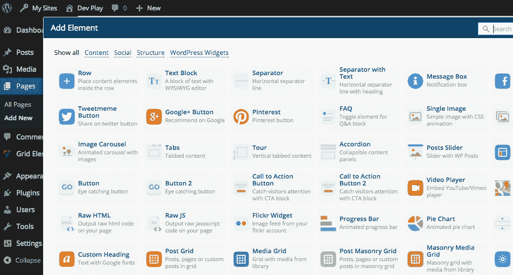
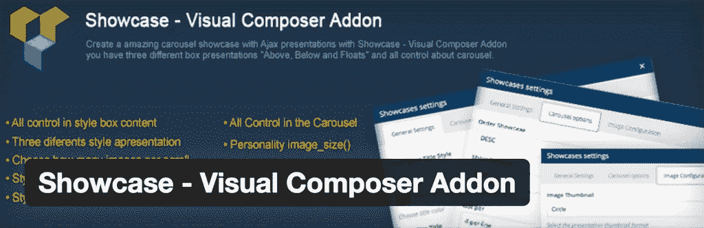
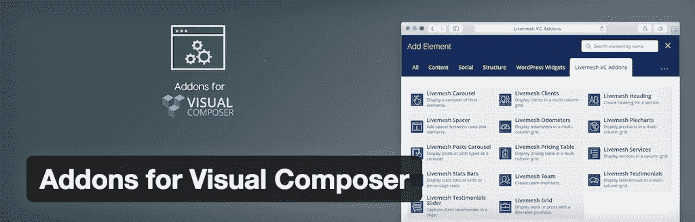
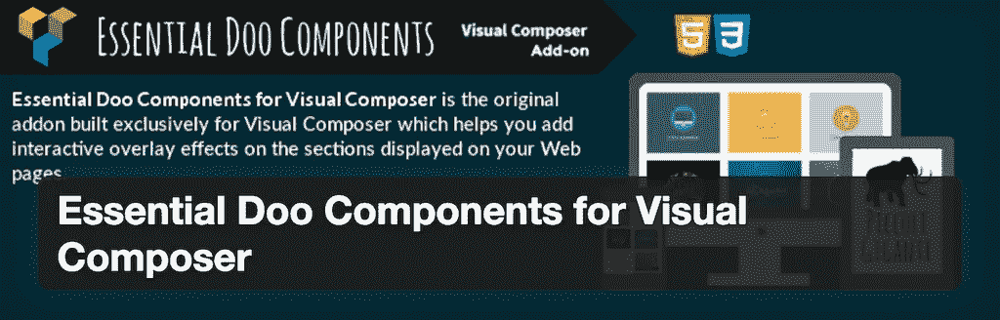
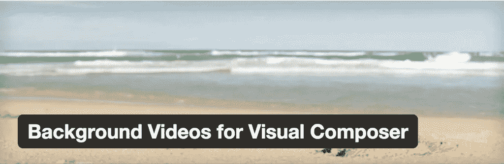
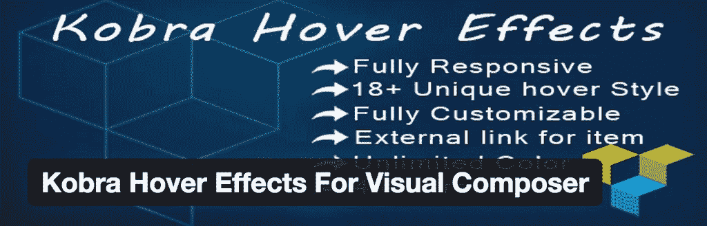
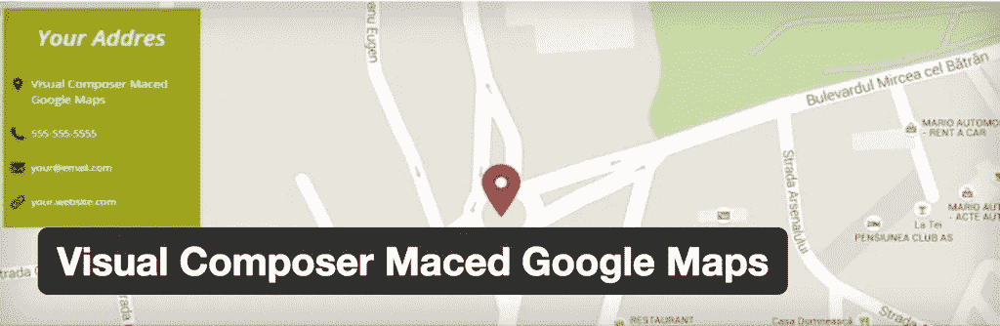
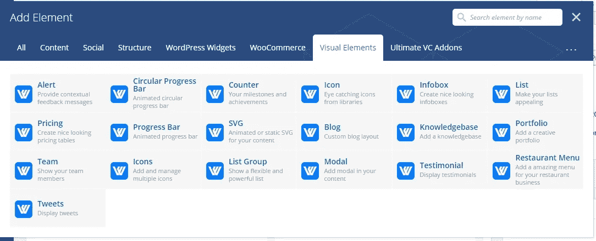

# 最佳免费视觉作曲家插件

> 原文：<https://medium.com/visualmodo/best-free-visual-composer-add-ons-wordpress-plugins-901aa25fd89a?source=collection_archive---------0----------------------->

Visual Composer 是第一个支持扩展/插件的用于构建页面的插件。[视觉作曲家](http://visualcomposer.io/)自 2011 年初插件在高端市场上正式发布以来越来越受欢迎。尽管现在有超过 500，000+的网站在使用 Visual Composer，但这个插件是高级的这一事实意味着它有一个价格标签，即使在那时，在发表这篇文章时也只有 34 美元。如果你想用新的视角优化你的 WordPress 页面，这是一个值得投资的价格。Visual Composer 用户能够掌控自己的 WordPress 页面和帖子设计，能够使用专门构建的功能来创建定制的网站设计，而无需任何先前的编码经验。有了从网站前端编辑页面的能力，您突然获得了难以匹敌的实时编辑能力。

所有的 Visualmodo WordPress 主题都附带了免费的可视化编辑器插件。

除了 Visual Composers core 中的现代设计标准之外，您还可以放心，使用 Visual Composer 构建的任何设计在所有现代设备上都同样出色，因为 Visual Composer 允许您在编辑面板中针对不同的浏览器、智能手机和表格测试您的设计。所有这些都是为了节省时间，同时提高页面设计的效率。

内置的直观用户界面(UI)是对有经验和不太有经验的 WordPress 博客作者的完美补充，他们只是想在自己的网站上构建更好、更有吸引力、更具转换性的网页设计，而不需要花费巨额成本聘请第三方开发者。模板保存等功能允许您创建模板并保存它们以供以后在其他页面中使用，或者在同一页面但在设计的其他地方使用，再次减少了创建令人惊叹的设计所需的时间。那些有搜索引擎意识的人不必担心错过任何搜索优化的机会，Visual Composer 是为 WordPress 打造的最可靠、最著名的[搜索引擎优化插件。](https://colorlib.com/wp/seo-optimized-wordpress-themes/)

# 免费的可视化编辑器扩展

虽然我们的大多数扩展和插件都是优质的，这意味着它们需要金钱投资，但是一些 WordPress 开发者已经在 WordPress 插件数据库中免费发布了他们的可视化编辑器插件。有的累计下载量高达数万次。我们在 Colorlib 使用 Visual Composer，我们非常喜欢这个平台来编辑我们的页面，并创建让访问者保持娱乐、参与和自愿探索我们所提供的更多内容的设计。

# Showcase —可视化作曲家插件

展示内容的展示方式已经成为电子商务平台和摄影师的标准，他们希望以面向展示的风格展示自己的作品。有了 Visual Composer 的 Showcase 插件，你将拥有所有合适的工具来构建你自己的包含照片和照片描述的 Showcase。但是，不要让这困扰你。照片可以是任何东西，可以是产品样本，也可以是你最近拍的照片，同样，你也可以把你的描述修改成你喜欢的任何东西，如果需要的话，甚至可以是一个“购买”按钮。该插件利用 AJAX 实现三种不同风格的演示。

[下载](https://wordpress.org/plugins/showcase-visual-composer-addon/)

# 可视化编辑器的插件

Livemesh 正在扩展 Visual Composer，以包括十几个新功能和设置，这将进一步增强您构建令人惊叹的设计的体验。在这个插件包中，我们最喜欢的一些功能是，显示服务描述的自定义元素，显示标题内容的各种风格，列出团队中所有现有成员的“团队成员”小部件，显示你的代理或业务的最佳统计数据的特殊仪表小部件，显示你的技能和百分比经验的简单图表，显示你的客户的小部件，以多种不同设计风格显示你的投资组合项目的小部件，以及大量可供使用的网格。如果你已经是一个 VC 的用户，得到这个是有意义的。

[下载](https://wordpress.org/plugins/addons-for-visual-composer/)

# Visual Composer 的基本 Doo 组件

Essential Doo Components 是第一批为 VC 构建的插件之一，它通过为任何可视内容添加一个名为“覆盖”的特性来帮助扩展功能。无论是图片还是视频，基本的 Doo 组件都可以轻松地创建单独的网格元素，这些元素覆盖着令人兴奋和吸引人的定制设计效果。有 40 多种独特的设计可供选择，直接安装基本的 Doo 组件是显而易见的！更重要的是，你甚至不需要安装 Visual Composer(尽管它在 VC 中工作得很好)，因为你可以通过短代码使用这个插件，并且仍然受益于它的许多特性。伟大的代码库，建立在搜索引擎优化的基础上，动画流畅快速，为响应式设计而优化，适用于任何公开的主题，所以只要你使用 VC。

[下载](https://wordpress.org/plugins/animated-icon-banner-for-visual-composer/)

# Visual Composer 的背景视频

背景视频第一次被引入网页设计时，这在当时看起来是一个愚蠢的想法。当视频文件会显著降低网站速度时，有哪个头脑正常的人会想在自己的网站上添加视频文件呢？起初，这个想法是只有特殊类型的网站才会使用的东西，但现在我们看到更多的小企业和初创公司利用视频背景作为网站介绍。使用背景视频，您将能够选择正在制作的任何 VC 行，并向它们添加背景视频。最值得注意的是，它可能会成为标题行，您会希望用一些整洁的背景视频来增添趣味。

[下载](https://wordpress.org/plugins/background-videos-for-visual-composer/)

# 适用于 Visual Composer 的 Kobra 悬停效果

图像上的悬停效果是吸引注意力的好方法，可以进一步吸引你的访客。对于作品集和画廊性质的网站来说，这是一个非常好的功能，因为有了悬停效果，每当有人悬停在你的一张照片上时，你就可以通过一条消息来做更多的动作，例如阅读更多关于用户正在查看的照片的信息，或者对照片进行简明详细的描述。kobra Hover Effects For Visual Composer 是一个面向 VC 用户的免费 WordPress 插件，它使用原生 CSS3 动画效果在 WordPress 图片上添加悬停效果。使用它与 VC 和获得一个额外的设置输入形式，你可以指定你想使用的悬停效果的种类。

[下载](https://wordpress.org/plugins/kobra-hover-effects-for-visual-composer/)

# 视觉作曲家破解了谷歌地图

一个非常简单的解决方案，通过使用 Visual Composer 在您的网站上创建令人惊叹的谷歌地图位置。该插件添加了一个简单的小部件，您可以通过短代码或直接通过 VC 在您的站点上添加一个可定制的 Google Maps 小部件。

[下载](https://wordpress.org/plugins/visual-composer-maced-google-maps/)

# 高级可视合成器扩展和插件

从上面可以看出，Visual Composer 的免费扩展以它们自己的方式很棒，将它们结合在一起可以创造一个真正非凡的设计体验，这将丰富和活跃甚至是最被遗忘的 WordPress 主题。这是我们非常崇拜 VC 的一点，它能够适应任何 WordPress 主题，并允许用户创建一个新的和深刻的体验，这将让其他人质疑这个主题如何看起来如此之好，以及人们需要在哪里让他们的主题变得如此之好。我们现在正在进军溢价扩展领域，以下溢价插件已被下载超过 100，000 次，并在数百万个网站上使用。花点时间彻底调查每一个扩展和插件，看看它们是否适合你的设计策略。

# Visual Composer 的终极插件(Visualmodo WordPress 主题免费)

我们将列出 VC 插件的几个变种，同时记住我们的读者想要独特的功能。Ultimate Addons 是 VC 的领先插件扩展，它集成了几十个伟大的功能，帮助你建立更好、更快的网站设计。插件中包含的元素都是经过精心挑选的，以突出独特性、用户需求以及 UI 和 UX 的可用性。

希望为您或您的企业提供更详细的描述？使用信息框元素创建漂亮的信息框，突出您最重要的业务细节。厌倦了使用传统的 WordPress 列表？为什么不试试信息列表元素，看看你的列表看起来有多壮观。想要为您的图像创建叠加效果，将包含行动号召-很容易，只需使用翻转框元素，您将一切就绪。如何与你的读者和客户讨论你的成就？一个特别建造的时间表(看起来很像脸书所提供的)允许你概述你一生中的成就和重要事件。当你注册终极插件时，互动横幅，滑块，视频背景，以及更多伟大的元素可供选择。

# Visualmodo 的视觉元素

激活可视元素插件后，您将在 Visual Composer 的“添加元素”选项卡上看到一个名为“可视元素”的新选项卡，该选项卡将添加新的页面内容元素，如图标。svg 图标上传，框图标，投资组合，团队，博客，计数，证词，推文，警报，甚至更多。如果你想编辑默认插件页面内容元素样式，你可以导航到你的 WordPress 仪表盘>视觉元素>常规设置< area.

# Which Visual Composer Extension Will You Choose?

WordPress extendability has come a long way since the introduction of APIs and developer specific features. Visual Composer takes the cake as far as plugins go for building and optimized your own page design projects. Hundreds of thousands of users already, and so many more to come as the team behind the plugin continue to build upon requests and feedback of one of the most loyal communities for any WordPress plugin. It was a pleasure to combine together these extensions, to learn more about each and explore the different variations that VC now offers, and we hope that some of these extensions will find their way in your daily plugin calendar too!

Source: [https://visualmodo.com/](https://visualmodo.com/)