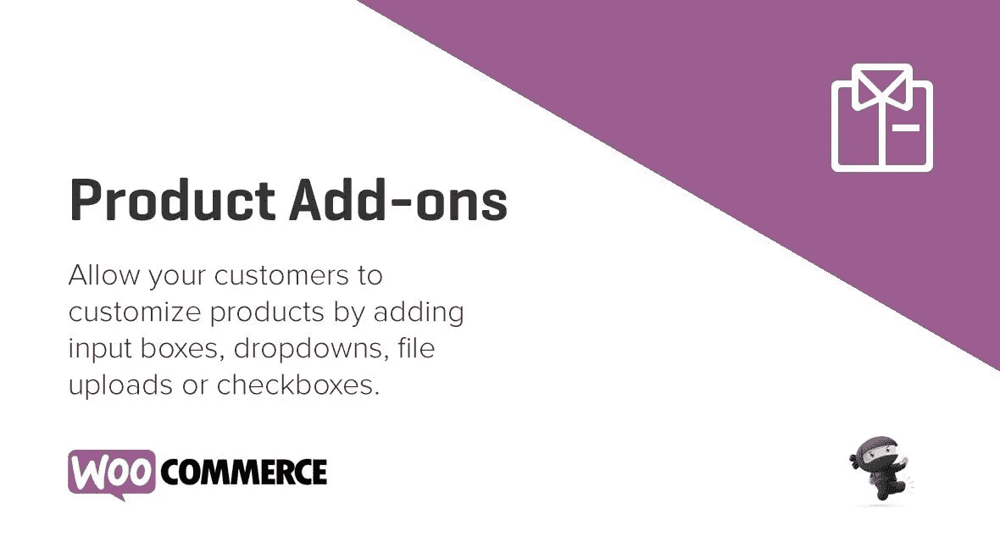
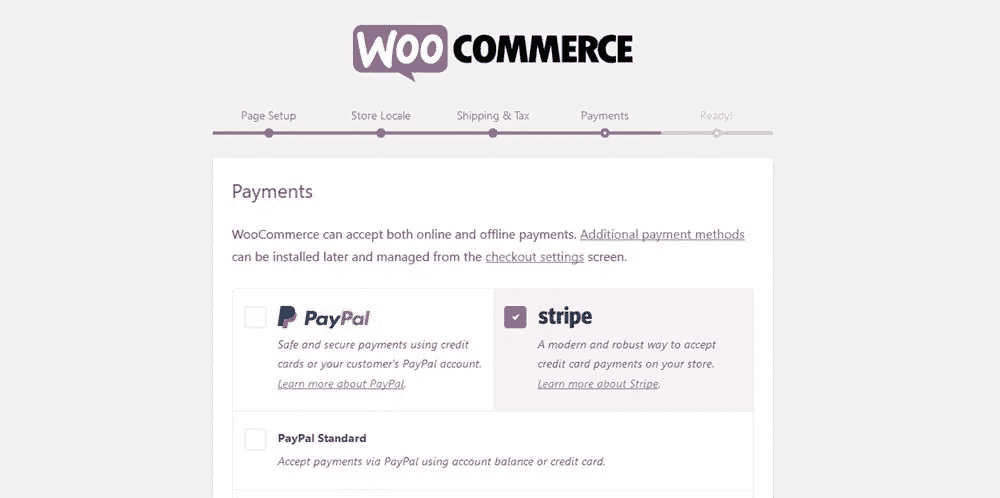
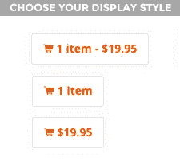
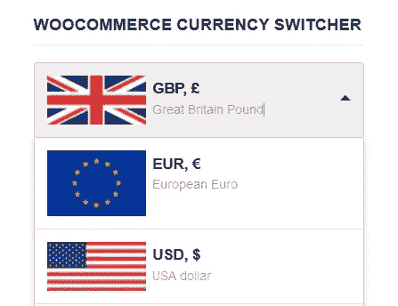

# 最佳免费 WooCommerce 附加插件

> 原文：<https://medium.com/visualmodo/best-free-woocommerce-add-ons-plugins-2ad958a9012b?source=collection_archive---------1----------------------->

WooCommerce 就像 WordPress 一样，有数以千计的扩展和插件。这些插件为您的电子商务商店增加了新功能，并帮助您发展业务。在这篇文章中，我们为你挑选了最好的免费 WooCommerce 插件，你可以马上试用。

# 最佳免费 WooCommerce 附加插件

WooCommerce 下载量超过 1600 万次，是互联网上最受欢迎的电子商务平台。统计数据告诉我们，核心插件是一个方便的工具，但它不能做所有的事情:要真正从 WooCommerce 中获得最大价值，你需要使用扩展和 WooCommerce 附加组件来增强[核心插件](https://wordpress.org/plugins/woocommerce/)。

电子商务能赚大钱，所以大多数扩展都有价格标签。不过幸运的是，并不是每一个 WooCommerce 插件都必须倾家荡产——实际上有很多免费的选择(如果你知道去哪里找的话)。

在本帖中，我们将分享 10 个最好的免费 WooCommerce 扩展、附加组件和插件(注意:我们将在整个过程中交替使用这三个术语)，目的是帮助你改善你的电子商务商店。

如果你想在不花一大笔钱的情况下，进一步提高你的商店的客流量、收入和/或吸引力，以下选项应该适合你。尽情享受吧！

# 1.YITH WooCommerce 变焦放大镜

对于绝大多数产品来说，没有什么页面因素比展示的产品图片对转化率的影响更大了(也许除了价格)。

顾客想看看你的产品是什么样的，他们想检查产品的质量，他们想确定他们更喜欢你的产品而不是竞争对手的。你真的希望客户从一张小小的、几乎无法辨认的照片中获得所有这些吗？

如果你想响亮而自豪地展示你的图像，我推荐 [YITH WooCommerce 缩放放大镜插件](https://wordpress.org/plugins/yith-woocommerce-zoom-magnifier/)。当访问者将鼠标悬停在你的图片上时，他们会看到一个放大的产品弹出窗口。您可以配置此弹出窗口的尺寸，以及最佳查看的缩放级别。

所以，对你的产品有信心，自豪地展示它们——你可以期待转化率的大幅提升。

# 2.WooCommerce 表运费由芒果小时

大多数网店店主都知道，意外的运费真的会侵蚀利润。如果你想保护你的利润，你可能要收取灵活的运费，取决于一些变量。

有这么多潜在的变量，这个功能通常是为高级插件保留的。然而，由 Mangohour 插件提供的免费 [WooCommerce 表格价格运输提供了基本功能，是一个很好的切入点。](https://wordpress.org/plugins/table-rate-shipping-for-woocommerce/)

首先，你可以根据顾客购物车的重量或小计来设定你的运费——你可以对更贵的重货收取更多费用，或者对超过设定价值的订单提供免费送货。

对于国际店主，您还可以将国家划分为不同的运输区域，然后根据客户的地理位置设置运费。

# 3.条纹支付网关

过去，WooCommerce 开箱即用，只支持一个支付网关:PayPal Standard。然而，对于大多数严肃的店主来说，这种网关几乎是不可取的，因为为了付款，顾客被转移到外部 PayPal 网站。

因此，大多数电子商务商店都安装了一个支付网关，方便现场的卡支付*——通常是 Stripe 或 PayPal Pro。如果你选择 Stripe，我有个好消息:官方的 WooCommerce [Stripe 支付网关](https://woocommerce.com/products/stripe/)完全免费。*

现在，在过去，你必须像其他插件一样下载并安装这个扩展。然而，由于 Stripe 支付网关和 PayPal Pro 大受欢迎，WooCommerce 简化了安装过程。

你现在可以在 WooCommerce 安装向导中点击一个按钮来安装 Stripe gateway。

将你的商店与 Stripe API 同步后，你将能够接受 Visa、MasterCard 和一系列其他卡。

一个缺点是 Stripe 不是全球通用的。迄今为止，Stripe 在 10 个国家工作(另有 15 个国家在测试中)，所以在提交之前，请确保您的国家在列表上[——美国、英国和加拿大已经得到支持。](https://stripe.com/global)

此外，如果 Stripe 不是你的菜，WooCommerce 官方扩展商店还有 20 多个其他免费支付网关。这个令人印象深刻的名单包括前面提到的 [PayPal Pro](https://woocommerce.com/products/woocommerce-gateway-paypal-powered-by-braintree/) ，加上[亚马逊支付](https://woocommerce.com/products/pay-with-amazon/)和 [PayFast](https://woocommerce.com/products/payfast-payment-gateway/) 等等。

# 4.WooCommerce 直接结账

如果你要求你的访问者跳过太多的关卡，他们中的一些人会直接弃船——这是一个瞬间失去的转变机会。

现在，默认的 WooCommerce 结账流程并不太宽松:店面>产品页面>购物车>结账。即便如此，仍有机会简化结账流程。进入 [WooCommerce 直接结账](https://wordpress.org/plugins/woocommerce-direct-checkout/)。

该插件让用户完全跳过购物车，这意味着典型的客户旅程将看起来像这样:店面>产品页面>结账。通过减少一个环的数量，WooCommerce Direct Checkout 可以显著提高转化率。

而且，如果结账过程对你来说还不够*和*，插件还可以直接在商店页面上添加*结账*按钮。这意味着知道自己在找什么的访问者也可以跳过产品页面。

最重要的是，插件可以在两分钟内下载、安装和配置。设置屏幕和它创建的结账程序一样高效！

# 5.WooCommerce 菜单车

WooCommerce Menu Cart 是另一个旨在优化结账流程的插件。这个插件在你的菜单上增加了一个购物车按钮，使得你可以从你网站的任何一个页面超级访问它。

[购物](https://visualmodo.com/)购物车按钮与菜单完美契合，可根据您的喜好进行完全配置。这包括在菜单中显示项目数量和/或小计的选项、十个购物车图标的选择以及菜单对齐。

# 6.WooCommerce 结帐字段编辑器

我们已经介绍了一些插件，它们可以让你改进默认的 WooCommerce 结账流程。如果你想最终控制你的结帐，WooCommerce 结帐字段编辑器是适合你的插件。它允许您自定义显示在结帐屏幕上的每个字段。

虽然可能有更高级的插件——例如，[woo commerce check out Manager](https://wordpress.org/plugins/woocommerce-checkout-manager/)有更多的功能——但这个插件只把基本功能塞进了一个高度可用的包中。(顺便说一句，可用性是 WooCommerce Checkout Manager 最大的败笔，它的功能太多了。)

WooCommerce Checkout Field Editor 插件允许你在结账时添加文本或下拉菜单字段。一个明显的缺点是缺少高级字段——例如，日历日期选择器字段不会出错。

然后，您可以自定义标签和占位符文本，并指定该字段是否为必填字段。您也可以使用插件的拖放来重新排列字段的顺序。

该插件甚至可以让你定制默认的 WooCommerce 结帐字段。然而，不要做得太过火，因为一些字段是支付网关以某种格式要求的，所以你可能会导致你的结帐中断。

不过不用担心，因为 WooCommerce Checkout Field Editor 有一个重要的保护功能:一个“*重置为默认值*按钮，以防万一。

# 7.WooCommerce 产品礼品包装

对大多数商店来说，节假日是一年中最繁忙的时期。如果你想在一年一度的购物狂潮中分一杯羹，你最好迎合那些想买礼物的人。虽然你的产品“T2”的礼品价值“T3”将取决于你的定位，但增加一个礼品包装选项是一个简单的便利，足以在一年中特别紧张的时候说服一些送礼者。

听起来不错？然后你需要 [WooCommerce 产品礼品包装插件](https://wordpress.org/plugins/woocommerce-product-gift-wrap/)。该插件在 WooCommerce 设置界面中添加了几个简单的字段:启用礼品包装、默认礼品包装成本和礼品包装信息。这些设置也可以在单个产品页面上手动覆盖。

配置完成后，该插件会在您的产品页面中添加一个简单的礼品包装选项，如下所示:

# 8.WooCommerce CSV 进口商

经营一家网上商店是艰难的。有时候小任务堆积起来，让你觉得一天中没有足够的时间来处理所有的事情。

举个例子，假设你的供应商全面提高批发价格。这是大多数电子商务商店至少每年都会面临的情况。现在怎么办？你需要更新你自己的价格来保护利润，但是如果你库存了很多[产品](https://visualmodo.com/)，手动更新价格会花费很长时间。

为了节省你的时间和精力，我强烈推荐免费的 [WooCommerce CSV Importer 插件](https://wordpress.org/plugins/woocommerce-csvimport/)。只需上传一个格式正确的 CSV 文件，您的产品就会自动更新—一次测试多达 10，000 个产品。

上传 CSV 电子表格后，您需要配置每列所代表的内容，使您能够从一个文件中管理每个产品的所有方面，包括产品名称、图像、库存水平、价格、纳税状态和逃课。然后插件会将你的数据应用到每个产品上。很好很容易。

# 9.电子商务货币切换器

网上购物的兴起意味着你不起眼的电子商务商店有可能迎合真正的全球客户群。然而，在你被成群结队的国际客户的梦想冲昏头脑之前，你必须首先处理实际问题。

首先，你的网站需要能够进行货币兑换。毕竟，购物者不太可能在没有看到产品以当地货币标价的情况下购买。

也许令人惊讶的是，在官方存储库上似乎真的缺乏货币转换插件。然而，因为这是超级有用和利润提升的功能，我们正在用可用的东西来凑合——这个列表真的需要这个类别的插件。 [WooCommerce 货币切换器](https://wordpress.org/plugins/woocommerce-currency-switcher/)是这项工作最好的免费插件——尽管它有几个明显的局限性。首先，这个免费版本一次只允许两种货币。

乍一看，这似乎是限制性的，但其实不必如此。我的建议是使用您主要市场的货币，然后为国际客户使用全球货币，如美元或欧元。(或者你可以购买插件的高级版本来解锁无限的货币！)

第二，虽然插件支持你选择的国家的国旗，你必须手动上传国旗到你的媒体库。如果你能忍受这些限制，这个插件确实有很多可取之处。

首先，它直接从雅虎财经获取实时汇率，所以你可以相信它们是准确的。WooCommerce Currency Switcher 还附带了三个专用的小部件:一个在整个网站范围内切换货币，另一个充当兑换率计算器工具，最后一个显示最新的汇率。

最后，这个 WooCommerce 附加插件还使用地理定位来检测和显示基于 IP 地址的访问者的本地货币。

# 10.WooCommerce 邮件地址

你知道吗，*获得*一个新客户比*留住*一个现有客户的成本要高得多。根据来源的不同，获取客户的成本可能会高出 3 到 30 倍。建立现有客户数据库最简单的方法是通过收集电子邮件列表中的电子邮件地址。WooCommerce MailChimp 插件可能是最适合这项工作的免费插件(当然，如果你使用 MailChimp 进行电子邮件营销的话)。

该插件会自动为您的客户订阅邮件列表——或者，如果您愿意，它会通过勾选复选框，让他们在结账屏幕上选择订阅。记住:你现有的客户是你最好的朋友。善待他们，他们可能会在未来几年里一直是你的顾客。

# 最后的想法

这就完成了我们对顶级免费 WooCommerce 附加插件的概述。也就是说，值得记住的是，对于像 WooCommerce 这样复杂而强大的插件，这十个列表实际上只是触及了表面——实际上还有很多其他有用的功能，遗憾的是，这些功能没有被包括在内(或者太小众了)。

知道任何其他伟大的免费 WooCommerce 插件吗？想法？