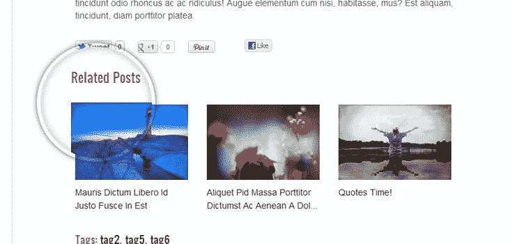
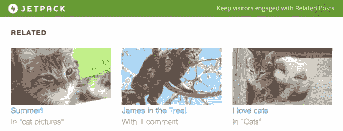
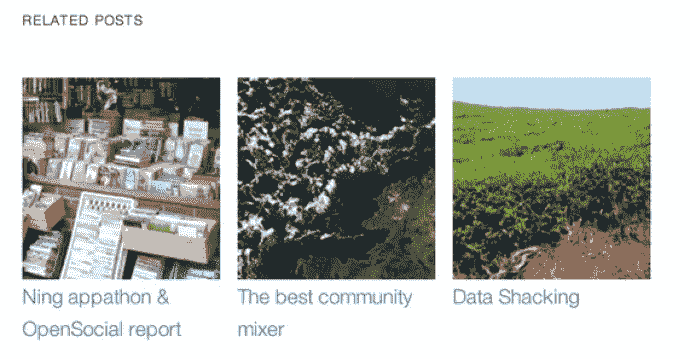
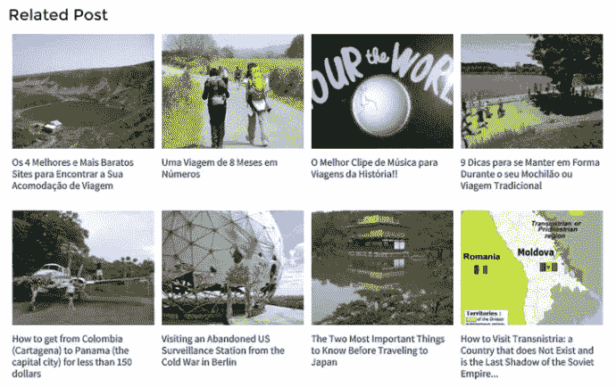

# 最佳免费 WordPress 相关帖子插件

> 原文：<https://medium.com/visualmodo/best-free-wordpress-related-posts-plugins-81802ebdaa47?source=collection_archive---------0----------------------->

增加页面浏览量，提高参与度，降低跳出率是任何博客作者的首要任务。大多数博客作者使用一种简单的方法来实现这些目标——展示相关的帖子。如果你的访问者在看完一篇文章后就离开了网站，你需要使用 WordPress 相关的文章插件来让他们停留更长时间。

使用相关文章插件会在文章底部或侧边栏显示相关文章的链接。这将鼓励访问者在你的网站上停留更长时间。今天我将分享一个 WordPress 插件的 7 个最佳相关帖子的列表。先来核对一下名单[第一个](https://visualmodo.com/)。

所有的 [Visualmodo WordPress 主题](https://visualmodo.com/)都是兼容的，并且为这个插件优化了更好的使用和性能，所以尽情享受吧！

# 最佳免费 WordPress 相关帖子插件

# 另一个相关的帖子插件(YARPP)

另一个相关帖子插件(YARPP)可能是 WordPress 使用最广泛的相关帖子插件。这个强大的插件支持文章、页面、自定义文章类型，并在你的博客文章后显示最合适的内容。

高级模板功能允许您完全控制结果。由于插件支持 WordPress Multisite，你也可以在你的网络网站上显示相关的文章。这个插件在所有的通用语言中都有。

特征

*   缩略图或列表视图
*   支持不同类型的内容
*   附带各种显示相关内容的样式
*   相关帖子可以显示在 RSS 提要中

[下载](https://wordpress.org/plugins-wp/yet-another-related-posts-plugin/)

# Jetpack 相关帖子

Jetpack 是一个非常流行的多用途 WordPress 插件，它也有一个相关的文章功能。一旦你启用了这个功能，它会扫描你现有的帖子，并在你的帖子后显示最匹配的内容。您可以选择显示相关帖子的标题和大布局。

该插件的伟大之处在于它在云上执行所有的分析和处理。这意味着您的服务器不会承受任何额外的负载。

特征

*   用于处理和服务相关帖子的独特云系统
*   自动裁剪图像以实现一致的显示
*   用于显示相关帖子的强大定制选项

[下载](https://wordpress.org/plugins-wp/jetpack/)

# 上下文相关的帖子

上下文相关文章是另一个流行的插件，用于在你的 WordPress 博客中显示相关文章。使用这个插件非常简单——你只需要安装并激活它，插件就会自动开始显示相关的帖子。您可以选择显示帖子、页面、自定义帖子类型、附件等中的相关帖子。

由于插件附带了几个自定义的小部件，所以可以在页面的不同位置显示相关的帖子。也可以使用自定义的短代码在任何你想要的地方显示相关的文章。

从相关帖子中排除特定的帖子或页面是该插件的一个显著特征。可以通过应用定制 CSS 来定制相关文章的样式。

特征

*   用于降低服务器负载的高级缓存技术
*   支持包括附件在内的各种内容类型
*   定制小部件和短代码，实现灵活的显示选项

[下载](https://wordpress.org/plugins-wp/contextual-related-posts/)

# WordPress 相关帖子

这是另一个广泛使用的插件，用于显示与你的内容相关的帖子。WordPress 相关文章允许你自动显示相关文章或者手动选择。您可以提供一个自定义文本作为标题，并选择应该显示多少篇文章。它还带有一些定制选项。

有 7 个现成的主题供你选择。也可以选择一个简单的样式，并通过使用自定义 CSS 来应用您自己的样式。其他样式选项包括显示缩略图、评论数量、日期、摘录、类别等。您可以为没有特色图片的帖子上传默认缩略图。如果你想从相关的帖子中排除特定的类别，那也是[可能的](https://visualmodo.com/)。

该插件还自带网络。您可以将您的文章上传到本网，并被包含在其他类似网站的帖子的相关帖子部分。

特征

*   即时造型的几个现成主题
*   高级定制选项
*   用于在其他网站上展示的特殊网络

[下载](https://wordpress.org/plugins-wp/wordpress-23-related-posts-plugin/)

# Yozu 相关帖子

Yozu 相关帖子是在 WordPress 站点显示相关帖子的另一个流行选择。这个插件支持所有内容类型，包括文章、页面、附件等。该插件使用高级缓存技术来优化服务器上的负载。它还允许您手动添加相关帖子。

您可以选择要显示的顶部文本和相关帖子的数量。禁用主页和归档页面上的帖子有不同的选项。您可以为相关文章设置默认图像。您还可以找到选择订购方式和订购类型的选项。

有 4 个现成的风格来显示相关的职位。您还会发现各种定制选项，用于选择缩略图大小、背景大小、图像类型、边距、填充、悬停等。关于文字，你可以选择大小，标题长度，颜色等。

由于插件具有完全的 RTL 兼容性，你可以用它来显示任何支持语言的相关文章。

特征

*   通过缓存支持多种内容类型
*   提供大量定制选项
*   附带对非英语语言的完全 RTL 支持

[下载](https://wordpress.org/plugins-wp/yuzo-related-post/)

# 结论

使用一个相关的文章插件对于增强你的阅读体验是必不可少的。现在你已经有了 WordPress 最相关的帖子插件列表，你还在等什么？选择其中一个插件，今天就开始展示相关帖子。

对于那些想要我的建议的人，我强烈推荐 [Jetpack](https://wordpress.org/plugins-wp/jetpack/) 或 [Shareaholic](https://wordpress.org/plugins-wp/shareaholic/) 。如果你有预算，相关职位专业版可能是显示相关职位的最佳选择。如果你觉得这篇文章很有用，请随意与他人分享，这样他们也可以了解这些很棒的插件。