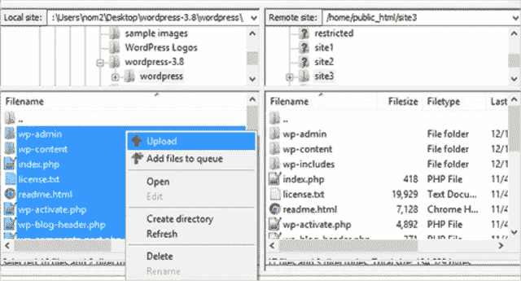
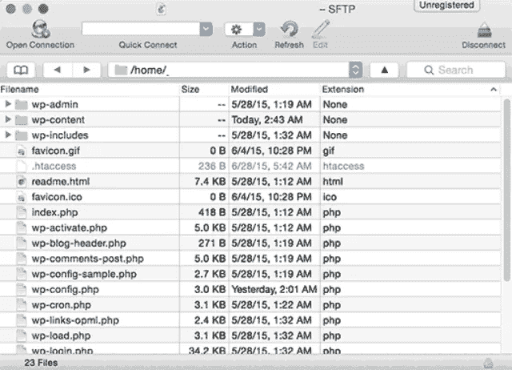
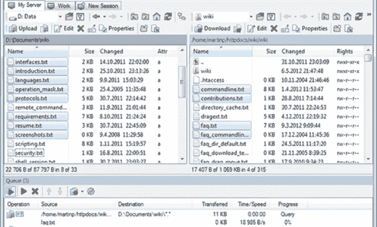

# 最佳 FTP 客户端软件

> 原文：<https://medium.com/visualmodo/best-ftp-client-softwares-6d3328ad4f9f?source=collection_archive---------0----------------------->

对于 WordPress

为什么你需要 FTP 客户端程序？很多时候，你需要对你的 [WordPress](https://visualmodo.com/) 文件进行修改或更新。因为所有的文件都保存在网络服务器上，你需要连接到服务器来访问你的文件。有两种不同的方法可以将文件存储在服务器上，并进行必要的更改:

*   您可以使用 web 主机控制面板中的“文件管理器”选项来获取文件。
*   或者，您可以使用 FTP(即文件传输协议)客户端上传和下载存储在服务器上的文件。

大多数 [WordPress](https://visualmodo.com/) 用户更喜欢使用 FTP 客户端来访问他们的 WordPress 文件，当他们不能访问他们的网站编辑器时。如果您也对使用 FTP 客户端来访问 web 服务器上的文件感兴趣，那么下面列出了一些值得探索的最佳 FTP 客户端:

# WordPress 最佳 FTP 客户端软件

# 1.[菲力西拉](https://filezilla-project.org/)

FileZilla 是一款免费且最受欢迎的开源 FTP 解决方案，可用于上传和下载 WordPress 网站的文件，适用于 Mac OS X、Windows 和 Linux 等主要平台。事实上，它是最稳定的 FTP 解决方案，可以在所有版本的 Windows 上运行良好。

尽管是一个免费使用的 FTP 客户端，FileZilla 提供了许多有用的功能，如跨平台支持、远程文件编辑、多语言支持等等。

还有呢？它有一个用户友好且易于使用的界面，使得上传/下载和管理你的 WordPress 站点文件和文件夹变得容易。最后，它有助于使用 SSL/TLS 保护文件传输。

# 2.智能 FTP

SmartFTP 是一个 FTP 客户端，为 Windows 10 提供支持，并帮助在本地计算机和 web 服务器之间传输文件。它支持许多文件传输协议，例如 FTPS、SSH、SFTP 和 WebDAV，仅举几个重要的例子。

这个 FTP 软件装载了大量的基本功能和高级功能。最重要的是，它是一个强大的工具，有助于提供安全高效的文件传输服务。此外，它还可以用于发布和维护等目的。

# 3.赛博鸭

大多数 FTP 的一个主要问题是，您需要正确输入登录凭证，但即使是一个小错误也会让您一遍又一遍地填写凭证才能连接。然而，Cyberduck FTP 可以帮助克服这样的问题，因为它附带了一个书签工具，使您的 FTP 凭据变得方便。

Cyberduck 也是一款免费的 FTP 客户端，非常适合 Mac 和 Windows 平台。就像 FileZilla 一样，即使 Cyberduck 也集成了用户友好的界面，只是它有助于连接到不同的服务器，如 WebDAV、FTP 和 SFTP。最重要的是，它允许在云中分发内容。

# 4.LFTP

如果你正在为 Linux 平台寻找一个可靠和复杂的 FTP 解决方案，那么 LFTP 正是你要找的。这个开源应用程序自带命令行界面，支持多种协议，包括 FTP、SFTP、HTTP、HTTPS 等。

使用 LFTP，您不需要担心处理非致命错误。这是因为一旦发生错误，每个操作都会自动重试。例如，在下载过程中断的情况下，它将从停止的同一点自动重启。

这个文件传输程序对于 ip 地址经常改变的动态 IP 机器很有用。事实上，对于互联网连接不好的网站来说，这是一个理想的 FTP 解决方案。

# 5.WinSCP

WinSCP(也称为 Windows 安全副本)是一个开源的 FTP 客户端，提供与 Windows 的集成。它还支持 SFTP，WebDAV 和 SCP 协议。这个文件传输程序基本上有助于在本地和远程计算机之间进行安全的文件传输。

虽然，WinSCP 界面上太多选项的可用性会使你认为这个 FTP 客户端很复杂，但是，学习起来实际上要简单得多。WinSCP 具有丰富的功能，如集成文本编辑器、批处理文件脚本、半或完全目录同步等。

WinSCP 与其他 FTP 客户端的区别在于，它可以帮助上传文件，同时保留连接的原始日期或时间戳。

# 6.NcFTP

NcFTP 是 UNIX 中的文件传输程序。不管是不是命令行界面，NcFTP 都被全世界的人使用。事实上，与其他 FTP 软件相比，它已经成为最可靠、最稳定的软件之一。

这个 FTP 客户端可以运行在几个主要平台上，如 Mac OS X，Linux 和 Windows。它是用作商业 FTP 服务器的绝佳选择，因为它有助于为全球生产服务器提供快速、灵活和安全的文件传输服务。

# 结论

如果您无法访问您的网站编辑器，那么您将无法编辑和更改核心文件。如果是这样的话，那么使用 FTP 程序可以帮助你轻松实现这样的目标。在这篇文章中，我分享了六个最好的 FTP 客户端，可以用来修改网站文件。