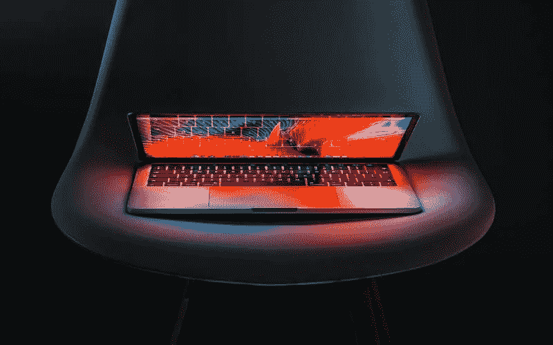

# 博客和博客作者的最佳笔记本电脑

> 原文：<https://medium.com/visualmodo/best-laptops-for-blogging-and-bloggers-f33e08f23428?source=collection_archive---------0----------------------->

作为一名内容创作者，无论是创作文章还是制作视频，拥有最好的笔记本电脑来写博客都是必不可少的，我们创建了这个列表来帮助你。你可能会说为什么是笔记本电脑，为什么不是台式机？嗯，很简单。写博客是自由的象征，你是自己的老板，你不必为了完成任务而呆在一个地方。台式电脑的便携性也不像笔记本电脑那样。

在这篇文章中，我将分享一些最好的博客和博客写手的笔记本电脑，让你的博客之旅更上一层楼。作为一名网站管理员和作家，我们花几个小时研究我们的主题，利用 Photoshop 编辑照片和视频，一台强大的机器可以比一台旧的、过时的、资源较少的机器更轻松地处理这些任务。

# 写博客用的笔记本电脑

# 惠普 ProBook 470(589 美元)

惠普是这个行业中我尊敬的公司之一。他们总是生产[高质量的](https://visualmodo.com/blog/)产品。这台笔记本电脑本身就是一头野兽。
这款笔记本电脑的主要优点是电池寿命长。这是另一款类似 MacBook Pro 的高端笔记本电脑。它有极好的规格，所以它将在你做的所有活动中帮助你。

如果你不喜欢苹果系统，还想要一台高品质的笔记本电脑，我会推荐给你。这几天这款笔记本电脑有一些高折扣，因为惠普正在准备发布他们的新版本。这让它更有价值。

基本型号规格:

*   第八代英特尔酷睿 i3 处理器
*   4 GB 内存；500 GB 硬盘存储
*   17.3 英寸高清显示屏(1600×900)
*   NVIDIA GeForce 930MX (2 GB DDR3 专用，可切换)

# 华硕 Zen book UX 330 ua(672 美元)

华硕是这一领域发展最快的公司之一。这款笔记本电脑是为了与 MacBook 竞争而设计的。它非常纤薄，高度便携，看起来很时尚，非常适合注重时尚的博主。

如果你对苹果系统了解不深，又想在省钱的同时得到一台非常好的笔记本电脑，那么这款笔记本电脑绝对不会错。规格:

*   13.3 英寸防眩光 FHD 1920 x 1080 显示屏，170 度宽视角，预装 Windows 10
*   最新第八代英特尔 i5–8250 u 1.6 GHz 处理器(6M 高速缓存，睿频加速至 3.4GHz)，高速存储和内存，配备 256GB SATA 3 M.2 固态硬盘和 8GB LPDDR3 RAM
*   通过微型 HDMI/USB 3.1 Type C、802.11ac WiFi 和 SD 读卡器实现广泛的连接
*   时尚轻巧的 2.6 磅铝制机身，携带舒适
*   内置指纹识别器，可通过 Windows Hello 功能一键登录

# 苹果 MacBook Pro(1299 美元)

苹果因其硬件质量、支持和软件系统的简单性而闻名。MacBook Pro 是他们的高端笔记本电脑，具有高规格，使您的笔记本电脑速度惊人。购买这款笔记本电脑，保证您拥有一台即使在 5 年后也能保持如此快的速度的笔记本电脑。

我使用这款笔记本电脑，并推荐给像我一样的博主。自从换了苹果，我就没有回头过。我的体验好了很多，我的笔记本电脑续航时间更长，我的工作效率也大幅提升。

唯一的缺点是价格昂贵。基本款起价 1300 美元。如果价格对您来说不成问题，那么就去购买基本型号规格:

*   2.3GHz 双核英特尔酷睿 i5 处理器，睿频加速高达 3.6GHz
*   8GB 2133MHz LPDDR3 内存
*   128GB 固态硬盘存储
*   英特尔虹膜加图形 640
*   两个雷电 3 港口

# 苹果 MacBook Air(999 美元)

MacBook Air 刚发布的时候，在业内一炮而红。对于大多数用户来说，它是完美的笔记本电脑。重量轻，非常适合日常使用，如网上冲浪等，而且它装有苹果软件。

如果你不需要像视频编辑这样需要高处理能力的活动，并且你喜欢苹果系统，那么这款笔记本电脑就是你的选择。它非常适合那些不想为 MacBook Pro 支付高价，但仍然想要一台好的笔记本电脑来提高工作效率的初学者。

唯一的缺点是，对于这个价格，你可以从其他笔记本电脑品牌获得非常高的规格。但是如果你真的不想要它们，并且这款笔记本电脑符合你的预算，那就去买吧。你永远不会回头。

基本型号规格:

*   1.8GHz 双核英特尔酷睿 i5 处理器
*   睿频加速至 2.9GHz
*   8GB 1600MHz LPDDR3 内存
*   128GB 固态硬盘存储
*   英特尔高清显卡 6000

# 苹果 MacBook(860 美元)

另一款介于 MacBook Air 和 MacBook Pro 之间的苹果产品。苹果 MacBook 是一款超轻的笔记本电脑。它非常薄，超便携。这是这款笔记本电脑的主要优势。如果您正在寻找一款功能强大的超便携笔记本电脑，那么这款笔记本电脑正适合您。

唯一的问题是，考虑到你得到的规格，它的价格非常高，但这是获得额外便携性的成本。
如果便携性对你来说不是那么重要，那么就不要为这款笔记本电脑费心了。如果你不需要额外的能量，就去透透气，或者选择专业的。

基本型号规格:

*   1.2GHz 双核第七代英特尔酷睿 m3 处理器
*   睿频加速至 3.0GHz
*   8GB 1866MHz LPDDR3 内存
*   256GB 固态硬盘存储 1
*   英特尔高清显卡 615

# 联想 ThinkPad(619 美元)

你是否梦想过有一种方法可以让你在笔记本电脑上打字，就像你在纸上写字一样，而不是在键盘上打字？如果是这样，那么 ThinkPad 就是你的笔记本电脑。如果你仍然喜欢手写，或者你喜欢做思维导图，或者画插图或图片，那就太好了。ThinkPad 让这变得非常容易。

而且定价也不是超高。它的起价为 619 美元，拥有出色的处理能力。规格:

*   英特尔酷睿 i5–6200 u 处理器(2.3GHz — 2.8GHz，3M 高速缓存)
*   14 英寸高清屏幕(1366×768)
*   显卡:英特尔高清 520
*   8GB 内存
*   240GB 固态硬盘

# 戴尔 XPS 15(1199 美元)

如果您正在寻找 1000 美元以上的笔记本电脑，并且想要高性能、便携性好的笔记本电脑，那么 XPS 15 就是您要找的笔记本电脑。

MacBook Air 的问题在于，就其规格而言，它的定价太高了。这就是戴尔 XPS 15 的用武之地。如果你不想要苹果生态系统，并且你正在寻找一台屏幕非常好的高质量笔记本电脑，那么这款笔记本电脑不会错。而且还是一款轻薄便携的笔记本电脑。

规格:

*   第八代英特尔酷睿 i7–8750h 处理器 9MB 高速缓存，最高 4.1 GHz
*   16GB 2666MHz DDR4，2x8GB
*   512 GB M.2 2280 [PCIe]固态硬盘
*   15.6 英寸 FHD 1920 x 1080，无限边缘防眩光

# 华硕 vivo book e 403 na(258.80 美元)

如果你正在寻找一款超级实惠、质量好的笔记本电脑，那么华硕是你应该看看的公司。

VivoBook 也不例外。它的价格非常物有所值。不厚，而且很轻便。它的便携性很好。规格较低，但考虑到价格，它一点也不差。如果你只是想开始使用，并且计划在一年左右后更换它，就选择这台笔记本电脑。

规格:

*   强大的第八代英特尔酷睿 i5–8250 u 1.6 GHz(睿频加速至 3.4GHz)处理器
*   14.2 英寸宽、0.8 英寸薄的便携式尺寸，0.3 英寸纳米边缘边框，屏幕与机身的比例高达 80%
*   15.6 英寸防眩光全高清显示屏，配有华硕出色的软件增强功能
*   8GB DDR4 内存
*   1TB 硬盘

# 微软 Surface Pro(799 美元)

微软想在笔记本电脑领域与苹果竞争，但他们不想仅仅是创造另一种笔记本电脑。这就是他们制造混合笔记本电脑的原因。Surface Pro 是一款运行 Windows 12 的 12.9 英寸平板电脑。您可以购买键盘和手写笔来获得完整的套装。如果你想在屏幕上写字，你不会找到更好的解决方案。如果你想在键盘上写字，他们的键盘不错。

动力也不错，但是价格不低。128 Gb 存储空间的起价为 799 美元，不含其他配件。如果你打算拥有更高的处理能力、更大的存储空间，并增加键盘和触控笔，那么你必须考虑 1300-1500 美元的价格范围。

如果你想要二合一笔记本电脑，surface pro 不会让你失望。如果您没有，那么您可以选择列表中的其他笔记本电脑，规格:

*   第七代英特尔酷睿 M 处理器
*   128 GB 存储空间
*   4 GB 内存
*   长达 13.5 小时的视频播放

# 10:宏碁 Aspire R 15 二合一笔记本电脑(799.99 美元)

自 Surface Pro 发布以来，混合动力行业出现了爆炸式增长，宏碁 Aspire R 是其中的佼佼者。它与 Surface 的不同之处在于，你不能拆卸键盘，但你可以 360°旋转屏幕，以便获得平板电脑的体验。

规格非常高，与 Surface Pro 相比价格较低。你不需要购买配件，也不能使用手写笔，这对许多人来说都不是一个问题。规格:

*   第七代英特尔酷睿 i7–7500 u 处理器(最高 3.5GHz)
*   15.6 英寸全高清(1920 x 1080)多点触控宽屏 LED 背光 IPS 显示屏
*   NVIDIA GeForce 940MX，带 2GB 专用 GDDR5 VRAM
*   12GB DDR4 内存
*   256GB 固态硬盘
*   长达 9 小时的电池续航时间

# 三星 chrome book 3(155 美元)

Chromebooks 在过去几年变得流行起来。与 Windows 相比，该系统是有限的，但这意味着您不需要很高的处理能力就可以运行。如果你只是在网上冲浪，不介意额外的简单性，并且你的预算有限，那么它是完美的。

在过去的几年中，已经有许多 Chromebook 问世，但最出色的是三星 Chromebook 3。三星改进了他们的 Chromebook，以最好的价格提供最好的质量。它的价格很低，只有 219 美元。规格:

*   11.6 英寸(1366 x 768)，16:9
*   英特尔赛扬处理器 N3060，1.6 GHz 至 2.48 GHz
*   4 GB 内存。
*   谷歌 Chrome 系统

# 总结:最好的笔记本电脑

选择合适的笔记本电脑可能是一个令人困惑的过程，但这就是为什么创建这个职位。如果你想使用苹果系统，那么你有三个选择。

*   选择 MacBook Pro 以获得最佳性能。
*   空气，如果你不需要额外的力量。
*   如果你想要额外的便携性。

超级便宜的笔记本电脑，那你可以配华硕 VivoBook。对于持久耐用的电池，HP ProBook 是您的最佳选择。如果你喜欢写作而不是打字，那么根据你的预算在联想 ThinkPad 和 Surface Pro 之间进行选择。如果你想要一台非苹果的高品质笔记本电脑，那么考虑 Surface Pro。请在下面的评论中告诉我，你最终决定选择哪一个。还有，你现在用的是哪台笔记本电脑，性能如何？