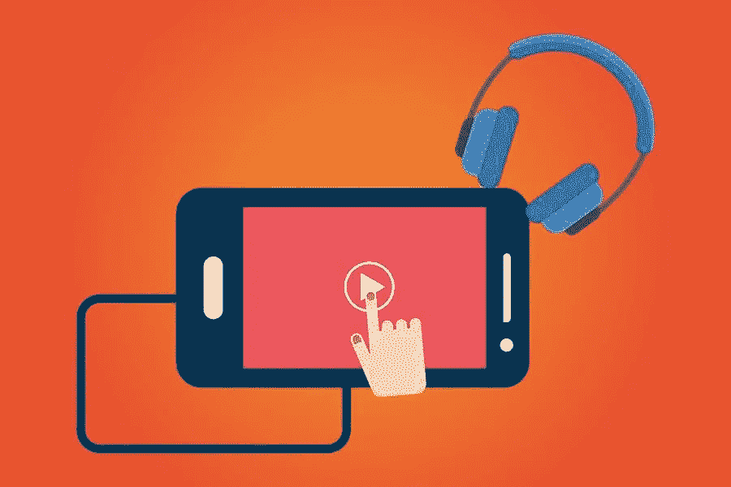

# 2021 年最佳 Mp4 到 Mp3 转换软件

> 原文：<https://medium.com/visualmodo/best-mp4-to-mp3-softwaresoftware-in-2021-223a922b6dec?source=collection_archive---------0----------------------->

曾经有一段时间，转换视频和音频文件似乎太复杂。我们必须按照准确的指示，如何才能从转换过程中获得最佳质量。但是今天，程序是革命性的，我们可以在几秒钟内实现从 mp4 到 mp3 在线转换器所需的质量。只需要一点知识，到处点击几下，你的文件就可以下载了。在这篇文章中，你会看到 2021 年你必须尝试的最好的 mp4 到 mp3 转换器的列表。

# evano——专业人士使用它！

Evano 不仅使转换视频变得容易，还能让你改变它的特性。你可以在没有任何专业帮助的情况下，用这个在线工具编辑视频。这个程序引起了专业人士的兴趣，因为它可以让你将所有类型的文件转换成超过 25 种不同的格式。如果您的文件存储在云服务器上，您可以提供指向它们的链接，或者如果它们在您的电脑上，您可以上传它们。之后，您将可以访问下面讨论的不同设置。

# 更改偏好设置的视频设置

“设置”标签下有各种选项，在这些选项的帮助下，您可以更改要转换的视频的质量，选择不同的帧速率，更改其尺寸，以及改变其恒定质量。在这个标签中还有其他的设置，但是只有有知识的人才能接触它们。否则，你将会下载一个完全混乱的文件。

# 音乐发烧友的音频设置

将视频转换成音频是音乐爱好者的首选。如果他们在转换视频文件之前调整设置，就可以享受高质量的音频。在 Evano 中，你可以改变编解码器，改变它的频率，最重要的是，它的比特率。如果你喜欢一个视频，但是你很难理解它的内容，不要担心；Evano 还为您提供了一个放大声音的选项。

# Evano 是免费的 Mp4 转 Mp3 转换软件吗？

您可以在指定的范围内使用它的功能。Evano 是专业用的；因此，它有一些限制的数量和类型的文件，你可以转换一个免费的帐户。一天只能转换 5 次文件，应该不会超过 100MBs。你一个月不能转换超过 20 个文件，如果你想的话，你必须选择他们的高级计划。但是如果你把网站用于编辑目的，这一切都是值得的。

# on tiva——YouTube 下载器

Ontiva 是一个 YouTube 转换器，可以将视频转换成 Mp3、Wav、OGG 和 Mp4 四种不同的格式。这些是互联网上最常用的扩展，视频编辑更喜欢使用 Wav 格式的音频文件，因为它的无损性质。除此之外，你还可以直接在搜索栏中搜索 YouTube 视频。它将显示 YT 匹配您的关键字的所有结果，并提供转换或下载选项。您还可以:

*   剪切视频，并下载选定的时长。
*   保存视频的缩略图。
*   选择下载视频的格式。
*   从它们中提取 mp3、Wav 等格式的音频。
*   选择视频的一部分以下载音频。
*   从视频中创建 Gif。

当您从 YouTube 视频中减去音频时，请确保为 mp3 选择较高的位速率。比特率越高，音质越好。在比特率较低的情况下，如 64kbps，文件会丢失大部分信息，严重影响质量。有时这种损失几乎看不出来，人们这样做也是为了减小文件大小。如果存储对你来说不是问题，你应该下载 Wav 格式的音频以获得最好的质量。

# Ontiva Premium Mp4 到 Mp3 转换器软件

Ontiva 也像 Evano 一样有一些限制，但如果你不定期下载视频，那么免费帐户可以为你服务。如果你在 Ontiva 上注册，你将[能够每天下载](https://visualmodo.com/how-to-download-wordpress/) 5 个视频，分辨率为 720p，时长为 30 分钟。它不多，但你可以保存一些重要的视频，最重要的是，你可以从歌曲中提取你最喜欢的格式的音频，质量上乘。