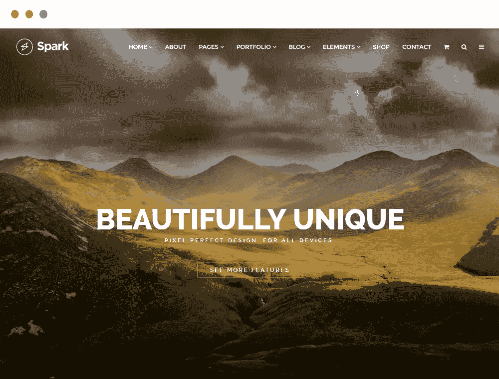
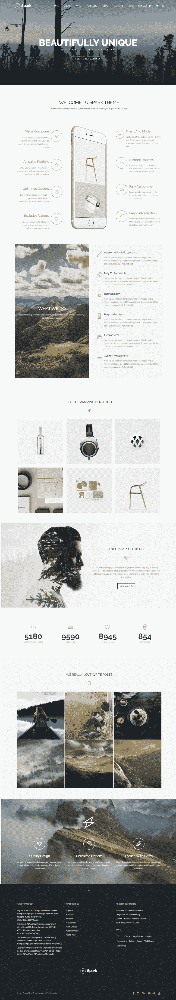

# 最佳摄影主题

> 原文：<https://medium.com/visualmodo/best-photography-wordpress-theme-b8878b9403d6?source=collection_archive---------0----------------------->

照片和作品集网站生成器

查看 WordPress 的最佳摄影主题，这样你的照片网站就会建立起来。你的照片无疑是引人注目的和迷人的，但是为了让它们在网上达到最大的影响力，你的网站必须有一个公正的设计。然而，由于有太多的主题可供选择，你可能会发现自己在追逐自己的尾巴，寻找合适的主题。

# 摄影主题

作为一名摄影师，为自己的需求选择一个特定的主题是理想的解决方案——你将寻找美化而不是压制你的图像的设计和排版，有大量的滑块选项和无数的定制选项。帮助就在眼前！下面，我们收集了最好的主题来展示你的摄影作品集——所以，在这个作品集里，你一定会找到合适的。

# [主题现场试玩](http://theme.visualmodo.com/spark/) [立即下载](https://visualmodo.com/theme/spark-wordpress-theme/)

**Spark Photography WordPress 主题**无需编码即可构建任何网站设计！您可以在几分钟内建立并运行一个设备齐全的网站。Spark WordPress 主题不仅仅是一个模板，它是一个拥有大量功能的惊人例子的集合。Spark WordPress 主题是一个干净的、现代的、极简的、皇家的、多用途的和摄影的 WordPress 主题。它有各种各样令人难以置信的功能，包括价值 150 美元的好东西，你需要以一种非常简单的方式创建一个令人敬畏的网站，节省金钱和时间。无需代码知识即可构建任何网站设计！

一键演示内容导入——WordPress 主题最有用的功能之一。你会喜欢在与精彩的主题演示页面相同的起点上开始网站开发过程，这样你就可以快速设计出你梦想中的网站。您可以充分利用我们精心制作的演示内容，只需点击一下鼠标，就可以创建一个现成的网站！