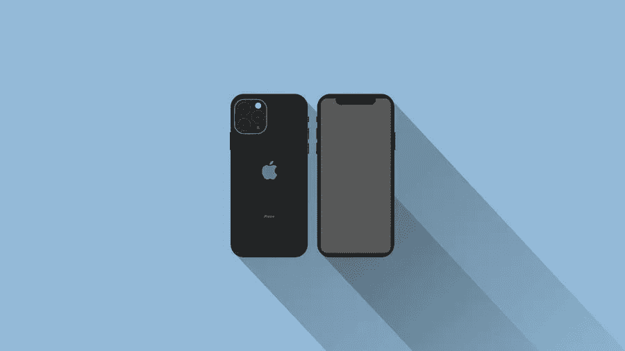

# 将你的 WP 网站变成移动应用的最佳插件

> 原文：<https://medium.com/visualmodo/best-plugins-to-turn-your-wp-website-into-a-mobile-app-5aec14c0cd82?source=collection_archive---------0----------------------->

在今天这个时代，你可能很难找到一个没有响应的 WordPress 主题。更重要的是，在一个拥有 35 亿智能手机用户的世界里，一个不适应移动世界的网站在观众或搜索引擎面前毫无胜算。然而，不管你的主题有多响应，拥有一个应用程序作为你网站的移动版本是一个好主意。在这篇文章中，我们将会看到一个最好的插件列表，这些插件可以把你的 WordPress (WP)网站变成一个移动应用，从而让你的网站从这场革命中受益。

应用程序速度更快，可以访问设备的原生功能，如通知或位置(这是为用户提供个性化体验的最重要的信息)。

尽管如此，并不是每个人都有预算或技能来从头开发一个移动应用程序。幸运的是，如果你在 WordPress 上运行网站，你可能不需要这么做。有几个插件可以帮助[将网站](https://visualmodo.com/how-to-migrate-a-wordpress-website-to-any-destination-using-wpvivid-backup-plugin/)转换成移动应用程序，而无需额外的成本或麻烦。

# 将 WordPress 变成移动应用的顶级插件

但是在我们讨论一些最流行的插件之前，这些插件在将你的网站转换成移动应用时会有所帮助，我们想强调的是，它们仍然需要一些中级到高级的 WordPress 技能。所以，如果你刚刚开始，最好坚持一个响应主题，或者在你把插件应用到一个真实的网站之前进行一些测试。

# AppPresser

这是一个面向使用 WordPress 网站的移动应用开发者的平台。根据他们的说法，如果你知道如何建立一个 WordPress 网站，那么这些都是你使用他们的系统建立一个应用程序所需要的技能。因此，把你的 WP 网站变成移动应用的好方法。

因此，你可以从一个博客、一个电子商务网站、一个登陆页面等等构建一个应用程序(只要它们是用 WP 构建的)。此外，由此产生的应用程序将在 Android 和 iOS 上运行，这为更广泛的受众提供了访问途径。

事实上，如果你想知道应用程序是如何赚钱的，主要的秘密就在它们的触手可及之处。应用程序比移动浏览器更容易使用，并且可以很容易地与操作系统的各种功能集成。

# MobiLoud 插件将 WP 网站变成移动应用

说到更好的移动货币化，这个插件承诺转换你的网站，不需要任何编码技能。更重要的是，它与网站保持同步，所以任何变化也会反映在应用程序中。

该平台支持各种有用的功能，如移动广告支持、推送通知和分析。更重要的是，你真的不需要做很多工作。因为你可以选择让他们的团队准备并向商店提交应用程序。

不过，请记住，MobiLoud 的限制性更强一些。当谈到它支持的网站类型时。因此，该平台可以用于两种类型的站点。新闻和/或博客以及使用 WooCommerce 等插件的电子商务网站。因此，把你的 WP 网站变成移动应用的好方法。

# 安卓应用

这个插件只会帮助你为 Android 设备创建一个应用程序，但它提供第一个月的免费服务。这样你就可以用了，看自己开心不开心。在你提交一份冗长的订阅之前。

它在定制方面也更灵活，但它确实需要更高级的 WP 和编码技能。所以，如果你正在寻找一个插件，可以让你变得更加个性化。加上后面的接口和代码，可能就是这样了。

# 总结一下插件，把 WP 网站变成一个移动应用

在 WP 插件市场快速搜索也可能提供其他结果。但在你做任何决定之前，一定要检查评论和功能。毕竟，所有 WP 网站管理员和开发者学到的一个重要教训是，并非所有插件都值得信任。所以，只要你谨慎行事，你的网站应该没问题。