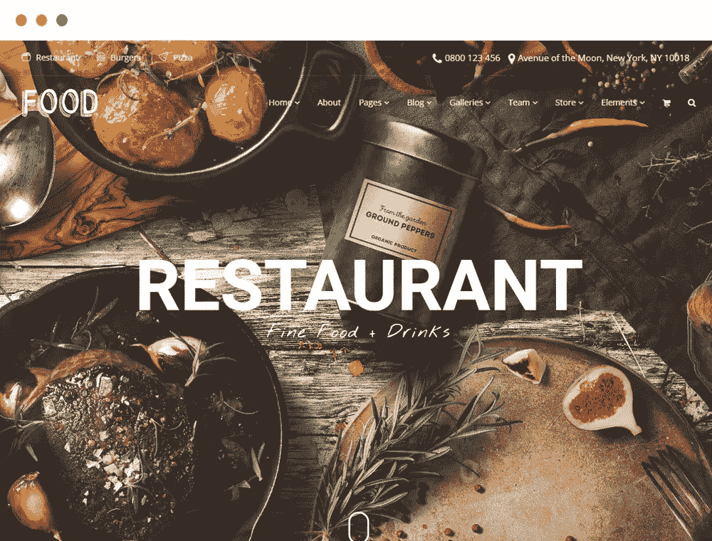
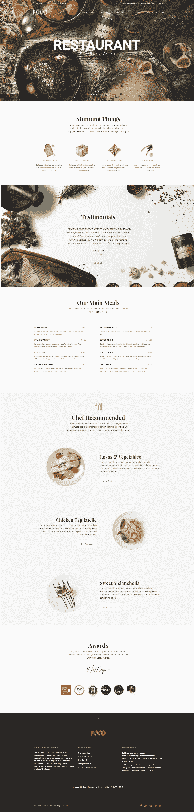

# 最佳餐厅 WordPress 主题

> 原文：<https://medium.com/visualmodo/best-restaurant-wordpress-theme-7451027f880?source=collection_archive---------1----------------------->

食物主题

查看最好的食物、酒吧、酒馆和餐馆 WordPress 主题，轻松快速地建立您的网站。响应迅速，搜索引擎优化优化。

随着餐馆和食品行业的激烈竞争，餐馆很难在这种行业中茁壮成长。实施有效的营销策略对于制造轰动或传播信息是不可或缺的。吸引更多顾客的有效方法之一就是创建一个吸引人的餐馆网站。拥有一个网站对推广你的餐馆至关重要，因为很多人在去实际的地方之前都会查看一下餐馆的业务。

拥有网上业务是接触目标市场的绝佳机会。如果你想创建一个新的网站或者计划重新设计你现有的网站，但是你不知道如何建立一个漂亮而有条理的网站，你可以考虑使用一个定制的餐馆[。许多预先制作的网站模板都捆绑了很棒的主题功能，你可以用它们来在线营销你的餐馆业务。选择一个响应迅速、可移动的模板至关重要，因为如今大多数消费者都是通过手持设备访问网站的。餐馆 WordPress 主题通常包括主题选项和免费插件，允许你以优雅的方式展示你的生意和产品。此外，使用预先制作的网站模板可以节省您大量的时间和精力。如果你正在为你的网站寻找一个好的 WordPress 主题，看看最好的餐馆 WordPress 主题。](https://visualmodo.com/wordpress-themes/)

# [主题现场试玩](http://theme.visualmodo.com/food/) [立即下载](https://visualmodo.com/theme/food-wordpress-theme/)

# 最佳餐厅 WordPress 主题

美食和设计都有可能！如果你想建一家餐馆，我们的 Food WordPress 主题是专门为美食网站风格开发的。糖果店。比萨饼店，冰淇淋店，厨师或任何其他食品网站的设计，这是适合你的主题！