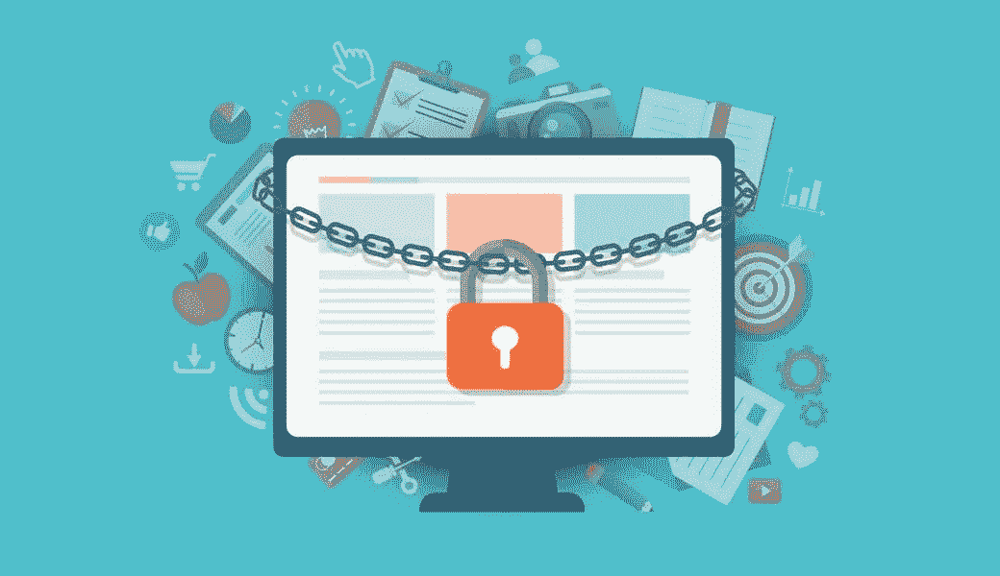
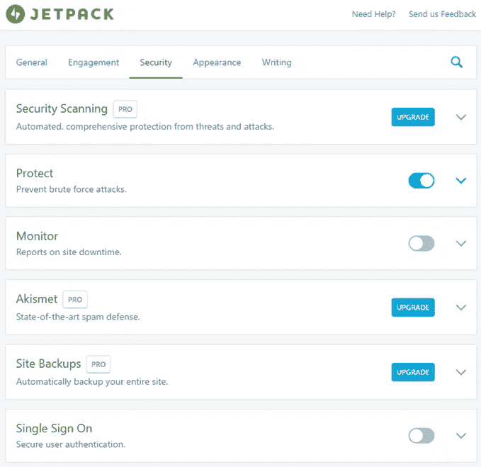
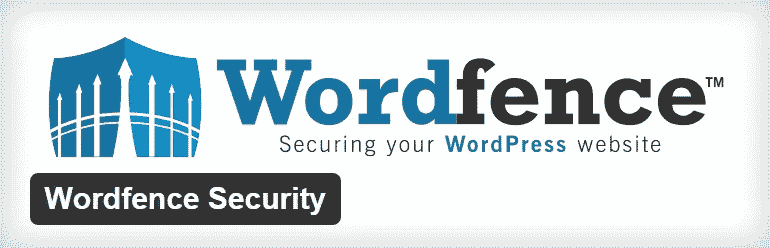
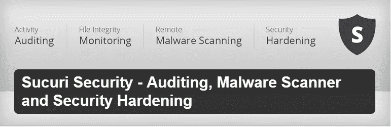

# 最佳安全 WordPress 插件

> 原文：<https://medium.com/visualmodo/best-security-wordpress-plugins-54f5ce1ea6d9?source=collection_archive---------0----------------------->

为了保护您站点

查看最佳 WordPress 安全插件列表 WordPress 是世界上最流行的网络发布平台(CMS ),也是黑客攻击的主要目标，所以我们需要考虑安全措施。

也许你心里有一个疑问，“我的网站是新的，我没有很多流量。那么为什么黑客会黑我的呢？”是的，这是一个重要的问题。不是所有的黑客都想窃取你的数据。有一些黑客会试图黑你的网站作为一个实际的过程。

迷惑？让我澄清一下，一些新的黑客正试图学习黑客技术或试图成为安全专家。他们将尝试黑掉小型且最易受攻击的网站来练习和理解常见的安全问题。

也有一些黑客会试图侵入你的网站发送电子邮件。他们不需要你的数据或文件，他们只是想从你的服务器发送垃圾邮件。

但是我们大多数人都不了解 WordPress 的安全性。对他们来说，好人的世界创造了一些伟大的东西。安全插件是保护你的 WordPress 站点免受黑客攻击的最简单的方法。让我们检查其中的一些。

所有的 [Visualmodo WordPress](https://visualmodo.com/) 主题都是完全兼容的，并为更好的安全和安全插件性能进行了优化。

# 最佳 WordPress 安全插件

# 1.JetPack 安全功能

Jetpack 是最受欢迎的 WordPress 插件，它提供了很多功能来使你的网站更加强大、快速、安全。有这么多其他插件可用于备份和安全，但与 Jetpack 安装，你不需要去寻找另一个插件。

JetPack 有如此多的免费功能，它是由 WordPress 背后的 Automattic 公司开发的，你也可以获得快速更新和支持。你可以信任 jetPack。

以下是 JetPack 的一些很棒的安全特性。

*   备份和安全扫描
*   暴力攻击保护
*   WordPress.com 登录

在 JustLearnWP.com，我们已经使用喷气背包很长时间了。备份对任何网站都非常重要，这一点我们都知道。在使用了很长时间后，我们认为 Jetpack 是最好的 WordPress 安全插件之一。

你可以免费使用这些功能，但对于备份，你必须注册一个负担得起的个人计划，起价为每月 3.50 美元或每年 39 美元。

**喷气背包安全必备**

*   每日备份、一键式恢复、垃圾邮件过滤和 30 天存档。
*   优先支持
*   我们的 WordPress 安全专家提供更快的解决方案。

# 2.[文字围栏安全](https://wordpress.org/plugins/wordfence/)

Wordfence security 是另一个领先的 WordPress 安全插件，下载量超过 450 万次。

它可以通过使用 IP 和域 WHOIS 报告以及恶意 IP 的公共列表来控制整个网络对网站的访问。

此外，它还可以向网络所有者发送安全报告。

wordfire 主页有一个很棒的地图，显示了 WordPress 网站上正在发生的实时攻击，包括它们来自哪里以及被 wordfire 阻止的攻击。

一旦安装了插件，它就可以用来对您的网站进行深度扫描，以检查是否有任何感染。

# 3. [Sucuri 安全](https://wordpress.org/plugins/sucuri-scanner/)–审计、恶意软件扫描和安全强化

Sucuri 也是一个很好的插件，可以保护你的 WordPress 安装网站。

Sucuri 有一些很酷的特性。比如，网站完整性监控、服务器端扫描、WordPress 审计日志、一键式加固、恶意软件清除。

Sucuri 也有提醒功能，它允许你配置电子邮件提醒，即时消息提醒，推特提醒，短信提醒和 RSS 提醒。这是 Sucuri 的一个非常重要的功能，因为它对监控你的网站至关重要。

# 4.[防弹安全](https://wordpress.org/plugins/bulletproof-security/)

防弹安全是广受欢迎的 WordPress 安全插件之一。防弹安全是快速和简单的安全插件，不需要任何配置。

防弹给 WordPress 一些额外的安全层。比如防火墙安全、登录安全、数据库安全等等。

这个插件包括一个维护模式，允许你或特定的 IP 地址访问管理仪表板。

这个 WordPress 安全插件能够在你的 WordPress 站点上发生任何不寻常的活动时向你发送电子邮件通知。

# 5.[反恶意软件安全和暴力防火墙](https://wordpress.org/plugins/gotmls/)

这个免费的插件会自动扫描你的 WordPress 站点的任何类型的漏洞，并自动移除已知的安全威胁和后门脚本。

它帮助你保护你的 WordPress 安装。专业版允许您修补您的 wp-login 和 XMLRPC，以阻止暴力和 DDoS 攻击，并在运行完整扫描时自动下载新的定义更新。

# 6.[WP 安全和防火墙一体化](https://wordpress.org/plugins/all-in-one-wp-security-and-firewall/)

这个很酷的插件给你提供了很多便利，比如用户账户安全，用户登录安全，用户注册安全，数据库安全，文件系统安全。htaccess 和 wp-config.php 文件备份和恢复黑名单功能。

防火墙功能、暴力登录攻击预防、WhoIs 查找、安全扫描器、垃圾评论安全、前端文本复制保护、定期更新和添加新的安全功能等。

虽然这是一个伟大的安全解决方案来保护您的网站。

# 7.[屏蔽安全](https://wordpress.org/plugins/wp-simple-firewall/)

WordPress 简单防火墙实际上是一个简单的安全插件。

但它有可怕的多种功能，以保护您的网站免受病毒，恶意软件，黑客企图，船只和更多的黑客攻击。

它具有管理员访问保护，防火墙保护，暴力保护，垃圾评论过滤，锁定功能等。

# 8. [IThemes Security(前身为更好的 WP Security)](https://wordpress.org/plugins/better-wp-security/)

iThemes Security，被称为更好的 WP 安全，是最流行和广泛使用的 WordPress 安全插件之一。iThemes Security 允许你用 30 多种方法来保护你的 WordPress 站点。

这被认为是保护你的 WordPress 站点的最简单的方法。它检测隐藏在你的网站上的 404 错误，以影响你的搜索引擎优化，你可以更容易地登录到你的网站与明智的链接。

# 最后的话

安装所有这些[安全插件不会保护你的网站免受该死的黑客攻击。](https://visualmodo.com/)

插件可以正常工作，但是作为管理员，你需要做一些基本的工作来保护你的网站。他们中的大多数人总是试图更新 WordPress 版本。

它非常重要，因为当 WordPress 核心团队发布一个新版本的 WordPress 时，他们也发布了以前版本的 bug。

因此，如果你还在使用 WordPress 的前一个版本，它就像是黑客的苹果派。所以请记住，随时更新。这是必要的。