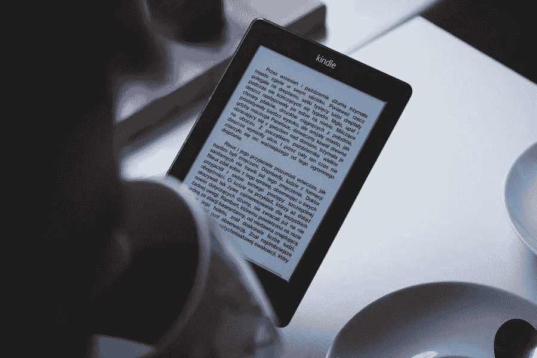

# 成为更好的专业人士的最佳自我发展书籍

> 原文：<https://medium.com/visualmodo/best-self-development-books-to-become-a-better-professional-8e1271a14b6d?source=collection_archive---------0----------------------->

从《思考致富》和《积极思考的力量》等自我发展经典中的美国梦概念，到《现在的力量》和《大胆尝试》等书中的新时代思维和积极心理学，自助文学总是反映社会趋势。
读书-自助-书籍。考虑到这些，有史以来最好的自我发展书籍是什么？哪些书超越了它们所来自的文化和时代，代表了永恒的人生经验和永恒的智慧中的精华？

> "如果你能从中吸取一些东西，任何一本书都是自助指南。"—凯宾·史密斯

以下是我推荐的最好的几本书，无论你多大年纪都可以读:

# 最佳自我发展书籍

# 塔莎·欧里奇的见解

我们过去已经讨论过自我意识对于个人和职业成功的重要性。如果你不相信我们的话，这本书可能会最终说服你向内看。

在书中，塔莎·欧里奇通过数百项研究来分解如何以正确的方式进行内省。也不要被“研究”这个词吓跑，因为 Eurich 还包括大量真实生活中的个人故事，以巩固科学，使其更加平易近人。在哪里购买:价格从 10.98 美元(二手平装本)到 13.20-16.49 美元(Kindle/精装本)不等。

# 斯科特·盖洛威的《四个人》

这本书的标题指的是科技界的“四大巨头”——亚马逊、苹果、脸书和谷歌。在书中，这本书详细分析了这些公司是如何影响我们的生活的，它们是如何蓬勃发展的，以及为什么它们几乎不可能被打倒。

如果你和我们一样有技术头脑，这四本书除了是一本有趣的读物之外，还能教会你很多关于如何成功创业的知识。毕竟，即使是四大在变成巨人之前也是小大卫。在哪里买:你可以找到这本书，起价 11.95 美元(二手平装本)，或者在亚马逊上以 10.21-15.82 美元购买 Kindle/精装版。

# 托尼·罗宾斯不可动摇

为了这本书，托尼·罗宾斯采访了世界上 50 位最成功的经济学家和投资者。其结果是大约 257 页，充满了如何建立和保护你的资产的金融智慧。

可以说，这本书更多地讨论了获得财务稳定，而不是职业发展。然而，我们认为，如果你想在工作中获得真正的成功，你需要掌握财务管理的基础知识，无论你的领域是什么。在哪里购买:亚马逊上的 Kindle/精装版价格从 7.48 美元(二手精装版)到 8.86-11.60 美元不等。

# 蒂姆·费里斯的《导师部落》

你可能已经从蒂姆·费里斯以前的一些书中了解了他，比如《每周 4 小时工作制》。为了这本新书，费里斯研究了习惯，并收集了 100 多位世界顶级表演者的建议。这包括从运动员到企业家和亿万富翁的每一个人。

如果你正在寻找一本在职业发展方面能给你带来巨大回报的书，这本 600 多页的巨著就是你要找的。在哪里购买:亚马逊上的 Kindle/精装版价格从 10.42 美元(二手)到 14.99-16.77 美元不等。

# 乔科·威灵克和叶小开·巴宾的《领导二分法》

有效的领导包括知道什么时候领导，什么时候跟随。这是本书的核心问题，如果你想在职业生涯中步步高升，你需要明白这一点。

伟大的领导者有许多品质，几乎都需要刻意培养。在这本书里，你会找到如何分配工作、领导团队、甚至保持谦逊的建议。在哪里购买:价格从 7.99 美元(二手平装本)开始，到 12.33-12.99 美元的 Kindle/精装版。

# 帕蒂·麦考德的《强大的》——发展书籍

帕蒂·麦考德曾是网飞公司负责招聘的人。考虑到公司的迅速崛起，听听她关于如何招聘和激励合适人员的建议是值得的。

如果你想成为你所在领域的领导者，你需要学习如何建立强大的团队。这意味着雇用聪明的人，管理期望，评估表现，知道如何让人离开，等等。在哪里购买:价格从 11.60 美元(二手精装本)开始，Kindle/精装本的价格高达 13.66-16.82 美元。

# 工作中不一定要疯狂

现代工作场所最糟糕的一面是，它往往会迫使人们拼命工作。这意味着投入很长时间，承担太多项目，不给自己时间休息，等等。

然而，我们认为“聪明地”工作比不停地忙碌要好，作者弗里德和汉森同意我们的观点。在这本书里，他们概述了公司应该如何创造一种培养员工而不是压榨员工的文化。无论你是负责一个团队还是团队的一部分，这本书绝对值得你花时间去读。在哪里购买:价格从 12.80 美元(二手平装本)开始，到 14.99-17.58 美元的 Kindle/精装版。

# 工作的新规则

如果你从事的是与科技密切相关的工作，那么你知道你整个职业生涯都呆在一家公司的日子已经结束了。如今，我们的职业道路不再是线性的，经常发现自己需要重新装备自己的技能也并不稀奇。

新的工作规则深入研究了现代公司如何招聘，以及求职者如何寻找工作。它的目标是帮助你在现代职场中游刃有余，并通过正确的出牌来晋升。在哪里购买:价格从 11.48 美元(二手平装本)开始，到 12.99-17 美元的 Kindle/精装版。

# 雷伊·达里奥的原则——发展书籍

作为一名成功的投资者和企业家，雷伊·达里奥有着令人印象深刻的背景。这意味着当他想给你如何在个人生活和商业上取得成功的建议时，你最好坐下来听(或读)。

这本书的标题指的是达利奥在他的职业生涯中采用的一套原则。他将自己的成功归功于这些原则或规则，在本书中，他以实用的方式展示了所有这些原则或规则。其结果是一本关于职业发展的书，任何人都可以从中受益，尤其是那些处于领导地位的人。

在哪里买:最便宜的地方是在亚马逊上，你可以找到 14.99-18 美元的 Kindle/精装版。

# 斯坦利·麦克里斯特尔将军、杰夫·埃格斯和杰森·曼戈内领导

麦克里斯特尔将军当了几十年的士兵，随着军衔的上升，他经常问自己怎样才能成为一名好的领导人。在这本书里，他试图通过为 13 位历史上的主要人物建立简介来回答这个问题，从华特·迪士尼到罗伯斯庇尔和马丁路德金。

这似乎是一组奇怪的人物在一起的侧写。然而，这本书认为，领导者可以来自非常不同的背景，不必分享相同的风格。如果你幸运的话，你会找到一个与你想要培养的领导风格相似的人，并从他们自己的经历中获得相关的洞察力。

在哪里购买:价格从 13.36 美元(二手精装本)开始，Kindle/精装本的价格高达 15.99-19.49 美元。

# 埃里克·巴克《找错了树》

如果你还没有读过《找错了对象》,我们建议你停下手头的工作去看看。这本书收集了埃里克·贝克的作品，他看了看科学告诉我们如何成为更成功的人和更好的领导者。

在它的页面里，你会发现一些简洁的文章，这些文章总结了一些研究，并把它们分解成可操作的建议。这本书本质上是作者博客中一些最佳内容的更全面版本。它包含了如何处理压力，增加你的信心，在团队中更好地工作等技巧。

在这份名单中的所有书中，《找错人》可能是最折衷的一本书。然而，它包含了很多有用的建议。我们可以放心地向任何试图在工作场所取得进步的人推荐。因此，在更广泛的意义上提高自己。在哪里买:在亚马逊上买这个最便宜。找到售价为 8.44–14.57 美元的 Kindle/精装版本。

# 莫滕·汉森的《伟大的工作》——发展书籍

在工作中“出色”意味着很多事情。可能你是办公室里工作时间最长的人。带来最好结果的人。对许多人来说，出色的工作就是最大限度地提高自己的表现。因此，您可以获得出色的效果，而不会筋疲力尽。

为了这本书，汉森收集了几个成功人士的故事。他们学会了如何聪明地工作并最大限度地提高效率。多亏了这本书的结构。它可以帮助你发现自己的工作风格。以及如何充分利用它。在哪里购买:你可以发现它的价格为 3.83 美元(二手)，Kindle/精装版本的价格在 12.34 到 14.35 美元之间。

# 自我发展书籍总结

既然你已经列出了改善你生活的最鼓舞人心的书，下一步你应该做什么？全部读完吗？当然，最好把它们都读完，但是我们只有这么多的大脑能量来接受所有这些知识。如果我告诉你有一种方法可以提高你的智力呢？